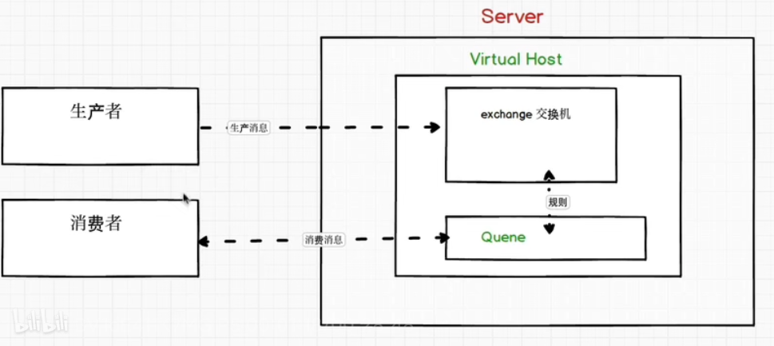
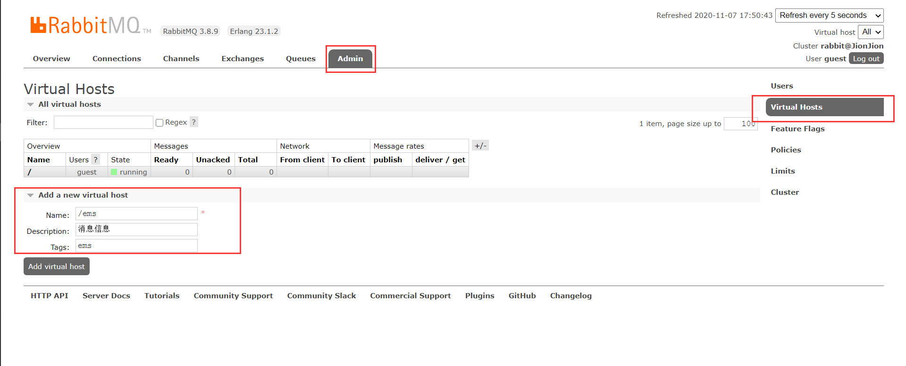
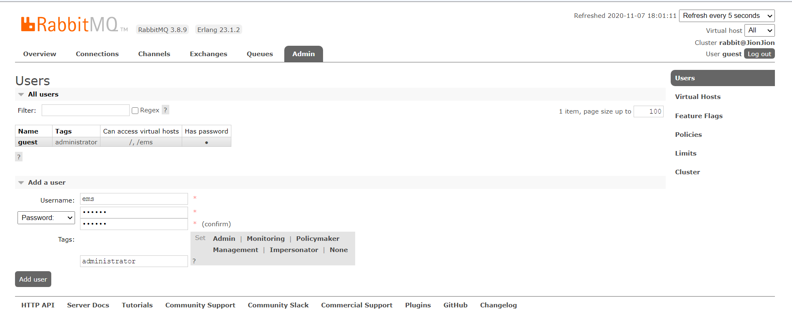
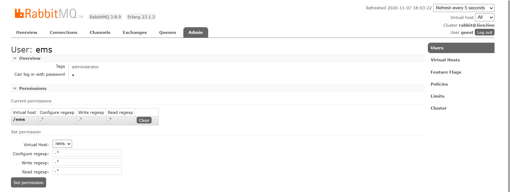

# 简介

使用 `AMQP` 协议的软件, 支持多种场景, 事务一致性, 持久化消息.

[官网](https://www.rabbitmq.com/)
[中文翻译](http://rabbitmq.mr-ping.com/)


## `AMQP` 协议模型

生产者和消费者之间通过 `RabbitMQ` 进行消息交换

生产者: 通过通道 `channel` 的形式进行转换, 将信息发送到交换或直接将消息发送到队列中.
每个生产者对应一个虚拟主机, 便于相互隔离.

虚拟主机: 与用户相关联, 将在具体使用时, 需要对应访问权限.

消费者: 从队列接收消息.




## 消息策略

[参阅](https://www.rabbitmq.com/getstarted.html)

- 点对点..  生产者直接发送到队列
- 广播
- 发布-订阅
- 路由
- 动态路由
- `RPC`
- 发布确认


## `Windows` 安装

首先安装依赖 `Erlang` 语言, 然后在安装 `RebbitMQ` 服务.. 

[参考](https://www.cnblogs.com/vaiyanzi/p/9531607.html)


## 启用管理控制插件

启用网页端管理控制插件

`rabbitmq-plugins enable rabbitmq_management`

访问浏览器页面 http://localhost:15672 , 默认用户/密码为 `guest/guest`

查看当前所有插件

`rabbitmq-plugins list`

## 应用场景

- 异步处理, 将系统不重要的操作通过消息队列异步操作完成.
- 多系统间调用, 通过队列的方式进行多系统间调用. 避免因为系统间依赖导致问题.
- 流量削峰. 如果请求过多,首先将请求写入消息队列中,随后再由系统慢慢执行.

# 基础操作

默认配置文件路径 `c:/Users/[user]/AppData/Roaming/RabbitMQ/advanced.config`

## 服务操作

```bash
# 启动
rabbitmq-service start   
# 关闭
rabbitmq-service stop
# 禁用服务
rabbitmq-service disable 
# 启用服务
rabbitmq-service enable
```

## 控制操作

使用 `rabbitmqctl` 进行命令行控制操作.可以进行

- 节点
- 集群
- 副本集
- 用户
- 访问控制
- 虚拟主机
- 环境信息
- ....


## 插件命令

使用 `rabbitmq-plugins`  对插件进行管理

```bash
# 停用插件
rabbitmq-plugins disable [插件名]
# 启用插件
rabbitmq-plugins enable [插件名] 
# 查询插件
rabbitmq-plugins list [插件名]
# 设置插件
rabbitmq-plugins set [插件名]
```


## `Web` 管理页面

默认位置 `http://localhost:15672/` ,登录用户密码 `guest / guest`


### 创建虚拟主机

在 `Admin` 选项卡下, 创建虚拟主机. **主机命名以 `/` 开头**




### 创建用户并分配虚拟主机

在 `Admin` 选项卡下, 创建用户. 建议用户名与虚拟主机一致, 同时设置密码和权限



点击创建后的用户名, 进入详细页面.并分配主机




# `Java` 调用

## 点对点模式

生产者直接将消息发送到消费者, 消费者持续等待并处理获取消息.

### 示例

生产者. 将消息发送到队列中. 
通过 `channel.queueDeclare` 绑定队列, 并调用 `channel.basicPublish` 方法, 将信息发送到  `hello` 队列. 交给监听者处理.

通过 `MessageProperties.PERSISTENT_TEXT_PLAIN` 属性可以设置在消息中间件重启后, 自动恢复.而不丢失.

```java
import com.rabbitmq.client.Channel;
import com.rabbitmq.client.Connection;
import com.rabbitmq.client.ConnectionFactory;
import com.rabbitmq.client.MessageProperties;

import java.io.IOException;
import java.util.concurrent.TimeoutException;

/** 点对点模式 - 生产者, 产生消息 */
public class Provider {

    /** 发送队列消息 */
    public static void main(String[] args) throws IOException, TimeoutException {
        // 连接工厂
        ConnectionFactory connectionFactory = new ConnectionFactory();
        // 地址
        connectionFactory.setHost("127.0.0.1");
        // 端口
        connectionFactory.setPort(5672);
        // 虚拟主机
        connectionFactory.setVirtualHost("/ems");
        // 认证, 用户名密码
        connectionFactory.setUsername("ems");
        connectionFactory.setPassword("123456");

        // 获取连接
        Connection connection = connectionFactory.newConnection();
        // 获取通道
        Channel channel = connection.createChannel();

        // 通道绑定对应消息队列. 参数:
        // 队列名(不存在则创建),
        // 是否持久化(队列重启后是否丢失, 消息是否丢失取决于发送时参数),
        // 是否独占队列, 当前队列只被当前连接访问.
        // 是否在消费完成后自动删除,
        // 额外的配置参数
        channel.queueDeclare("hello", false, false, false, null);

        // 发布消息. 参数:
        // 交换机名称,
        // 队列名称(真正发送到的队列名),
        // 额外属性参数(重启后恢复消息内容),
        // 消息内容
        channel.basicPublish("", "hello", MessageProperties.PERSISTENT_TEXT_PLAIN, "hello rabbit-mq".getBytes());

        // 关闭连接
        channel.close();
        connection.close();
    }
}

```


消费者. 通过 `channel.queueDeclare` 方法绑定监听队列, 然后调用 `channel.basicConsume` 传入匿名函数, 完成对响应消息的处理.

```java
import com.rabbitmq.client.*;

import java.io.IOException;
import java.util.concurrent.TimeoutException;

/** 点对点模式 - 消费者 */
public class Customer {

    /** 接受队列消息 */
    public static void main(String[] args) throws IOException, TimeoutException {
        // 连接工厂
        ConnectionFactory connectionFactory = new ConnectionFactory();
        // 地址
        connectionFactory.setHost("127.0.0.1");
        // 端口
        connectionFactory.setPort(5672);
        // 虚拟主机
        connectionFactory.setVirtualHost("/ems");
        // 认证, 用户名密码
        connectionFactory.setUsername("ems");
        connectionFactory.setPassword("123456");

        // 获取连接
        Connection connection = connectionFactory.newConnection();
        // 获取通达
        Channel channel = connection.createChannel();

        // 生产者,消费者的队列特性要求严格一致
        // 通道绑定对应消息队列. 队列名(不存在则创建), 是否持久化, 是否独占队列, 是否在消费完成后自动删除, 额外的配置参数
        channel.queueDeclare("hello", false, false, false, null);

        // 消费消息. 队列名, 是否自动确认消息, 消费回调接口
        channel.basicConsume("hello", true, new DefaultConsumer(channel){
            /**
             * No-op implementation of {@link Consumer#handleDelivery}.
             *
             * @param consumerTag 参数标签
             * @param envelope     信封
             * @param properties  属性
             * @param body  消息内容
             */
            @Override
            public void handleDelivery(String consumerTag, Envelope envelope, AMQP.BasicProperties properties, byte[] body) throws IOException {
                System.out.println("获得消息... " + new String(body));
            }
        });

        // 关闭连接, 建议不关闭, 持续监听消息.
        // channel.close();
        // connection.close();
    }
}
```


## 工作队列模式

生产者提供消息到队列, 多个消费者同时读取这个队列.共同处理消息

默认采用轮询的消息确认机制平均分配消息者.


### 示例

生产者, 指定消息队列 `work` , 并发送多条消息

```java
import com.rabbitmq.client.Channel;
import com.rabbitmq.client.Connection;
import com.rabbitmq.client.ConnectionFactory;

import java.io.IOException;
import java.util.concurrent.TimeoutException;

/** 工作队列模式 - 生产者, 产生消息 */
public class Provider {

    /** 发送队列消息 */
    public static void main(String[] args) throws IOException, TimeoutException {
        ConnectionFactory connectionFactory = new ConnectionFactory();
        connectionFactory.setHost("127.0.0.1");
        connectionFactory.setPort(5672);
        connectionFactory.setVirtualHost("/ems");
        connectionFactory.setUsername("ems");
        connectionFactory.setPassword("123456");

        Connection connection = connectionFactory.newConnection();
        Channel channel = connection.createChannel();

        channel.queueDeclare("work", false, false, false, null);

        // 循环发送消息
        for (int i=0; i<=10; i++){
            channel.basicPublish("", "work", null, ("hello rabbit work queue .. " + i).getBytes());
        }

        // 关闭连接
        channel.close();
        connection.close();
    }
}

```

消费者. 在多个类方法中, 监听同一个队列, 完成消费处理.
默认从 `Rabbit` 读取消息到 `Java`  中, 这个过程, 为轮询执行.

如果要修改为按需处理, 需要将自动确认取消, 并限制通道的每次监听消息数量, 手动确认后返回告知队列.

```java
import com.rabbitmq.client.*;

import java.io.IOException;
import java.util.concurrent.TimeoutException;

/** 工作队列模式 - 消费者A */
public class CustomerA {

    /** 接受队列消息 */
    public static void main(String[] args) throws IOException, TimeoutException {
        ConnectionFactory connectionFactory = new ConnectionFactory();
        connectionFactory.setHost("127.0.0.1");
        connectionFactory.setPort(5672);
        connectionFactory.setVirtualHost("/ems");
        connectionFactory.setUsername("ems");
        connectionFactory.setPassword("123456");

        Connection connection = connectionFactory.newConnection();
        Channel channel = connection.createChannel();

        channel.queueDeclare("work", false, false, false, null);

        channel.basicConsume("work", true, new DefaultConsumer(channel){
            @Override
            public void handleDelivery(String consumerTag, Envelope envelope, AMQP.BasicProperties properties, byte[] body) throws IOException {
                System.out.println("消费者A获得消息... " + new String(body));
            }
        });

        // 关闭连接, 建议不关闭, 持续监听消息.
        // channel.close();
        // connection.close();
    }
}

/** 工作队列模式 - 消费者B, 手动确认消息,并限制流量 */
public class CustomerB {

    /** 接受队列消息 */
    public static void main(String[] args) throws IOException, TimeoutException {
        ConnectionFactory connectionFactory = new ConnectionFactory();
        connectionFactory.setHost("127.0.0.1");
        connectionFactory.setPort(5672);
        connectionFactory.setVirtualHost("/ems");
        connectionFactory.setUsername("ems");
        connectionFactory.setPassword("123456");

        Connection connection = connectionFactory.newConnection();
        Channel channel = connection.createChannel();

        channel.queueDeclare("work", false, false, false, null);
        // 2.每次消费通道只会处理一条
        channel.basicQos(1);
        // 1.修改, 不会自动确认消息
        channel.basicConsume("work", false, new DefaultConsumer(channel){
            @Override
            public void handleDelivery(String consumerTag, Envelope envelope, AMQP.BasicProperties properties, byte[] body) throws IOException {
                System.out.println("消费者B获得消息... " + new String(body));
                try {
                    Thread.sleep(10);
                } catch (InterruptedException e) {
                    e.printStackTrace();
                }
                // 3. 手动确认. 队列中的消息唯一编码,  是否开启多个消息确认
                channel.basicAck(envelope.getDeliveryTag(), false);
            }
        });

        // 关闭连接, 建议不关闭, 持续监听消息.
        // channel.close();
        // connection.close();
    }
}

```


## 广播队列模式

生产者提供消息到交换机.
交换机将消息发送到不同的临时队列.
消费者绑定临时队列, 监听消息

实现一条消息被多个消费者消费


### 示例

生产者, 通过 `channel.exchangeDeclare` 声明交换机, 并指定交换机类型为 `BuiltinExchangeType.FANOUT`. 将每一个消息, 都发送到监听的队列中.

```java
import com.rabbitmq.client.BuiltinExchangeType;
import com.rabbitmq.client.Channel;
import com.rabbitmq.client.Connection;
import com.rabbitmq.client.ConnectionFactory;

import java.io.IOException;
import java.util.concurrent.TimeoutException;

/** 广播队列模式 - 生产者, 产生消息 */
public class Provider {

    /** 发送队列消息 */
    public static void main(String[] args) throws IOException, TimeoutException {
        ConnectionFactory connectionFactory = new ConnectionFactory();
        connectionFactory.setHost("127.0.0.1");
        connectionFactory.setPort(5672);
        connectionFactory.setVirtualHost("/ems");
        connectionFactory.setUsername("ems");
        connectionFactory.setPassword("123456");

        Connection connection = connectionFactory.newConnection();
        Channel channel = connection.createChannel();

        // 声明交换机. 交换机名称, 交换机类型(广播类型).
        channel.exchangeDeclare("exchange", BuiltinExchangeType.FANOUT);

        // 发送消息,指定交换机
        channel.basicPublish("exchange", "", null, ("hello rabbit fanout queue .. ").getBytes());

        // 关闭连接
        channel.close();
        connection.close();
    }
}
```

消费者.  通过 `channel.exchangeDeclare` 绑定交换机, 并在 `channel.queueBind` 中绑定交换机与临时队列. 完成监听.

```java
import com.rabbitmq.client.*;

import java.io.IOException;
import java.util.concurrent.TimeoutException;

/** 广播队列模式 - 消费者A */
public class CustomerA {

    /** 接受队列消息 */
    public static void main(String[] args) throws IOException, TimeoutException {
        ConnectionFactory connectionFactory = new ConnectionFactory();
        connectionFactory.setHost("127.0.0.1");
        connectionFactory.setPort(5672);
        connectionFactory.setVirtualHost("/ems");
        connectionFactory.setUsername("ems");
        connectionFactory.setPassword("123456");

        Connection connection = connectionFactory.newConnection();
        Channel channel = connection.createChannel();

        // 绑定交换机
        channel.exchangeDeclare("exchange", BuiltinExchangeType.FANOUT);

        // 临时队列
        String queueName = channel.queueDeclare().getQueue();
        // 绑定交换机和队列. 临时队列名, 交换机名, 路由的关键字
        channel.queueBind(queueName, "exchange", "");

        // 消费
        channel.basicConsume(queueName, true, new DefaultConsumer(channel){
            @Override
            public void handleDelivery(String consumerTag, Envelope envelope, AMQP.BasicProperties properties, byte[] body) throws IOException {
                System.out.println("消费者A获得消息... " + new String(body));
            }
        });

        // 关闭连接, 建议不关闭, 持续监听消息.
        // channel.close();
        // connection.close();
    }
}

/** 广播队列模式 - 消费者B */
public class CustomerB {

    /** 接受队列消息 */
    public static void main(String[] args) throws IOException, TimeoutException {
        ConnectionFactory connectionFactory = new ConnectionFactory();
        connectionFactory.setHost("127.0.0.1");
        connectionFactory.setPort(5672);
        connectionFactory.setVirtualHost("/ems");
        connectionFactory.setUsername("ems");
        connectionFactory.setPassword("123456");

        Connection connection = connectionFactory.newConnection();
        Channel channel = connection.createChannel();

        // 绑定交换机
        channel.exchangeDeclare("exchange", BuiltinExchangeType.FANOUT);

        // 临时队列
        String queueName = channel.queueDeclare().getQueue();
        // 绑定交换机和队列. 临时队列名, 交换机名, 路由的关键字
        channel.queueBind(queueName, "exchange", "");

        // 消费
        channel.basicConsume(queueName, true, new DefaultConsumer(channel){
            @Override
            public void handleDelivery(String consumerTag, Envelope envelope, AMQP.BasicProperties properties, byte[] body) throws IOException {
                System.out.println("消费者B获得消息... " + new String(body));
            }
        });

        // 关闭连接, 建议不关闭, 持续监听消息.
        // channel.close();
        // connection.close();
    }
}
```


## 路由模式 (订阅)

定制路由规则, 针对不同的消息分发到不同的交换机.

生产者提供消息到交换机,并指定路由关键字
交换机根据消息规则发送到不同的临时队列.
消费者绑定临时队列,指定路由关键字, 监听消息.

如果生产者的消息没有绑定路由关键字, 则不会被绑定关键字的消费者接收

### 示例

生产者. 声明交换机类型为 `BuiltinExchangeType.DIRECT`  , 并在发布时, 绑定路由关键字. 

```java
import com.rabbitmq.client.BuiltinExchangeType;
import com.rabbitmq.client.Channel;
import com.rabbitmq.client.Connection;
import com.rabbitmq.client.ConnectionFactory;

import java.io.IOException;
import java.util.concurrent.TimeoutException;

/** 路由模式 - 生产者, 产生消息 */
public class Provider {

    /** 发送队列消息 */
    public static void main(String[] args) throws IOException, TimeoutException {
        ConnectionFactory connectionFactory = new ConnectionFactory();
        connectionFactory.setHost("127.0.0.1");
        connectionFactory.setPort(5672);
        connectionFactory.setVirtualHost("/ems");
        connectionFactory.setUsername("ems");
        connectionFactory.setPassword("123456");

        Connection connection = connectionFactory.newConnection();
        Channel channel = connection.createChannel();

        // 声明交换机. 交换机名称, 交换机类型(路由类型).
        channel.exchangeDeclare("direct", BuiltinExchangeType.DIRECT);
        // 发送消息,指定交换机. 无需绑定队列, 指定路由关键字
        channel.basicPublish("direct", "error", null, ("这是路由规则 .. " + "error").getBytes());
        channel.basicPublish("direct", "warning", null, ("这是路由规则 .. " + "warning").getBytes());
        channel.basicPublish("direct", "info", null, ("这是路由规则 .. " + "info").getBytes());

        // 关闭连接
        channel.close();
        connection.close();
    }
}
```

消费者.  绑定路由关键字, 对处理消息进行处理.

```java
import com.rabbitmq.client.*;

import java.io.IOException;
import java.util.concurrent.TimeoutException;

/** 路由模式 - 消费者A */
public class CustomerA {

    /** 接受队列消息 */
    public static void main(String[] args) throws IOException, TimeoutException {
        ConnectionFactory connectionFactory = new ConnectionFactory();
        connectionFactory.setHost("127.0.0.1");
        connectionFactory.setPort(5672);
        connectionFactory.setVirtualHost("/ems");
        connectionFactory.setUsername("ems");
        connectionFactory.setPassword("123456");

        Connection connection = connectionFactory.newConnection();
        Channel channel = connection.createChannel();

        // 声明交换机. 交换机名称, 交换机类型(路由类型).
        channel.exchangeDeclare("direct", BuiltinExchangeType.DIRECT);

        // 临时队列
        String queueName = channel.queueDeclare().getQueue();
        // 基于路由关键字,绑定交换机和队列. 临时队列名, 交换机名, 路由的关键字
        channel.queueBind(queueName, "direct", "error");

        // 消费
        channel.basicConsume(queueName, true, new DefaultConsumer(channel){
            @Override
            public void handleDelivery(String consumerTag, Envelope envelope, AMQP.BasicProperties properties, byte[] body) throws IOException {
                System.out.println("消费者A获得消息... " + new String(body));
            }
        });

        // 关闭连接, 建议不关闭, 持续监听消息.
        // channel.close();
        // connection.close();
    }
}

/** 路由模式 - 消费者B */
public class CustomerB {

    /** 接受队列消息 */
    public static void main(String[] args) throws IOException, TimeoutException {
        ConnectionFactory connectionFactory = new ConnectionFactory();
        connectionFactory.setHost("127.0.0.1");
        connectionFactory.setPort(5672);
        connectionFactory.setVirtualHost("/ems");
        connectionFactory.setUsername("ems");
        connectionFactory.setPassword("123456");

        Connection connection = connectionFactory.newConnection();
        Channel channel = connection.createChannel();

        // 声明交换机. 交换机名称, 交换机类型(路由类型).
        channel.exchangeDeclare("direct", BuiltinExchangeType.DIRECT);

        // 临时队列
        String queueName = channel.queueDeclare().getQueue();
        // 基于路由关键字,绑定交换机和队列. 临时队列名, 交换机名, 路由的关键字
        channel.queueBind(queueName, "direct", "info");
        channel.queueBind(queueName, "direct", "warning");

        // 消费
        channel.basicConsume(queueName, true, new DefaultConsumer(channel){
            @Override
            public void handleDelivery(String consumerTag, Envelope envelope, AMQP.BasicProperties properties, byte[] body) throws IOException {
                System.out.println("消费者A获得消息... " + new String(body));
            }
        });

        // 关闭连接, 建议不关闭, 持续监听消息.
        // channel.close();
        // connection.close();
    }
}
```


## 动态路由模式 (发布 - 订阅)

支持通配符的方式绑定路由关键字.

建议路由命名以 `.` 作分割符号, 便于使用通配符, 匹配**单词** `*` , 多个**单词** `#`


### 示例

生产者.通过在发布时, 指定路由关键字.

```java
import com.rabbitmq.client.BuiltinExchangeType;
import com.rabbitmq.client.Channel;
import com.rabbitmq.client.Connection;
import com.rabbitmq.client.ConnectionFactory;

import java.io.IOException;
import java.util.concurrent.TimeoutException;

/** 动态路由模式 - 生产者, 产生消息 */
public class Provider {

    /** 发送队列消息 */
    public static void main(String[] args) throws IOException, TimeoutException {
        ConnectionFactory connectionFactory = new ConnectionFactory();
        connectionFactory.setHost("127.0.0.1");
        connectionFactory.setPort(5672);
        connectionFactory.setVirtualHost("/ems");
        connectionFactory.setUsername("ems");
        connectionFactory.setPassword("123456");

        Connection connection = connectionFactory.newConnection();
        Channel channel = connection.createChannel();

        // 声明交换机. 交换机名称, 交换机类型(动态路由类型).
        channel.exchangeDeclare("topic", BuiltinExchangeType.TOPIC);
        // 发送消息,指定交换机. 无需绑定队列, 指定路由关键字
        channel.basicPublish("topic", "user.login", null, ("这是路由规则 .. " + "user.login").getBytes());
        channel.basicPublish("topic", "user.logout", null, ("这是路由规则 .. " + "user.logout").getBytes());
        channel.basicPublish("topic", "user.info.all", null, ("这是路由规则 .. " + "user.info.all").getBytes());

        // 关闭连接
        channel.close();
        connection.close();
    }
}
```

消费者. 通过通配符进行消息绑定.

```java
import com.rabbitmq.client.*;

import java.io.IOException;
import java.util.concurrent.TimeoutException;

/** 动态路由模式 - 消费者A */
public class CustomerA {

    /** 接受队列消息 */
    public static void main(String[] args) throws IOException, TimeoutException {
        ConnectionFactory connectionFactory = new ConnectionFactory();
        connectionFactory.setHost("127.0.0.1");
        connectionFactory.setPort(5672);
        connectionFactory.setVirtualHost("/ems");
        connectionFactory.setUsername("ems");
        connectionFactory.setPassword("123456");

        Connection connection = connectionFactory.newConnection();
        Channel channel = connection.createChannel();

        // 声明交换机. 交换机名称, 交换机类型(路由类型).
        channel.exchangeDeclare("topic", BuiltinExchangeType.TOPIC);

        // 临时队列
        String queueName = channel.queueDeclare().getQueue();
        // 基于路由关键字,绑定交换机和队列. 临时队列名, 交换机名, 路由的关键字,通配符方式 * 匹配单个单词
        channel.queueBind(queueName, "topic", "user.*");

        // 消费
        channel.basicConsume(queueName, true, new DefaultConsumer(channel){
            @Override
            public void handleDelivery(String consumerTag, Envelope envelope, AMQP.BasicProperties properties, byte[] body) throws IOException {
                System.out.println("消费者A获得消息... " + new String(body));
            }
        });

        // 关闭连接, 建议不关闭, 持续监听消息.
        // channel.close();
        // connection.close();
    }
}

/** 动态路由模式 - 消费者B */
public class CustomerB {

    /** 接受队列消息 */
    public static void main(String[] args) throws IOException, TimeoutException {
        ConnectionFactory connectionFactory = new ConnectionFactory();
        connectionFactory.setHost("127.0.0.1");
        connectionFactory.setPort(5672);
        connectionFactory.setVirtualHost("/ems");
        connectionFactory.setUsername("ems");
        connectionFactory.setPassword("123456");

        Connection connection = connectionFactory.newConnection();
        Channel channel = connection.createChannel();

        // 声明交换机. 交换机名称, 交换机类型(路由类型).
        channel.exchangeDeclare("topic", BuiltinExchangeType.TOPIC);

        // 临时队列
        String queueName = channel.queueDeclare().getQueue();
        // 基于路由关键字,绑定交换机和队列. 临时队列名, 交换机名, 路由的关键字,通配符方式. # 配配多个单词,单用全部
        channel.queueBind(queueName, "topic", "user.#");
        channel.queueBind(queueName, "topic", "#");

        // 消费
        channel.basicConsume(queueName, true, new DefaultConsumer(channel){
            @Override
            public void handleDelivery(String consumerTag, Envelope envelope, AMQP.BasicProperties properties, byte[] body) throws IOException {
                System.out.println("消费者A获得消息... " + new String(body));
            }
        });

        // 关闭连接, 建议不关闭, 持续监听消息.
        // channel.close();
        // connection.close();
    }
}
```

## 远程调用模式 (`RPC`)

`Java` 暂无使用

## 接受确认模式

.....

# `SpringBoot` 调用


## 环境准备

`POM` 文件如下, 添加相关. 主要为 `spring-boot-starter-amqp` 场景启动器..

```java
<!-- Rabbit -->
<dependency>
    <groupId>org.springframework.boot</groupId>
    <artifactId>spring-boot-starter-amqp</artifactId>
</dependency>

<!-- Rabbit - Test -->
<dependency>
    <groupId>org.springframework.amqp</groupId>
    <artifactId>spring-rabbit-test</artifactId>
    <scope>test</scope>
</dependency>
```

`properties` 文件中, 添加虚拟主机相关信息. 包括地址, 用户与虚拟主机.

```properties
spring.rabbitmq.host=127.0.0.1
spring.rabbitmq.port=5672
spring.rabbitmq.username=ems
spring.rabbitmq.password=123456
spring.rabbitmq.virtual-host=/ems
```

## 相关模式

### 点对点模式

消费者

```java
import org.springframework.amqp.rabbit.annotation.Queue;
import org.springframework.amqp.rabbit.annotation.RabbitHandler;
import org.springframework.amqp.rabbit.annotation.RabbitListener;
import org.springframework.stereotype.Component;

/** 使用SpringBoot实现点对点模型 */
@Component
public class Peer {

    /** 接收消息 */
    @RabbitListener(queuesToDeclare = @Queue(name = "hello"))
    @RabbitHandler
    public void reviewMessage(String message) {
        System.out.println("获得消息... " + message);
    }
}
```

生产者

```java
import org.junit.jupiter.api.Test;
import org.springframework.amqp.rabbit.core.RabbitTemplate;
import org.springframework.beans.factory.annotation.Autowired;
import org.springframework.boot.test.context.SpringBootTest;

/** 使用SpringBoot实现点对点模型 */
@SpringBootTest
public class PeerTest {

    @Autowired
    private RabbitTemplate rabbitTemplate;

    /** 发送消息 */
    @Test
    public void sendMessage(){
        // 将对象转为底层的字节. 队列名, 内容对象
        rabbitTemplate.convertAndSend("hello", "hello rabbit-mq");
    }
}
```


### 工作队列模式

消费者

```java
/** 使用SpringBoot实现工作队列模式 */
@Component
public class Work {

    /** 接收消息 声明一个队列 */
    @RabbitListener(queuesToDeclare = @Queue(name = "work"))
    public void reviewMessageA(String message){
        System.out.println("消费者A获得消息... " + message);
    }

    /** 接收消息 */
    @RabbitListener(queuesToDeclare = @Queue(name = "work"))
    public void reviewMessageB(String message){
        System.out.println("消费者B获得消息... " + message);
    }

}
```

生产者

```java
/** 使用SpringBoot实现工作队列模型. 公平轮询 */
@SpringBootTest
public class WorkTest {

    @Autowired
    private RabbitTemplate rabbitTemplate;

    /** 发送消息 */
    @Test
    public void sendMessage(){
        // 将对象转为底层的字节. 队列名, 内容对象
        for (int i = 0; i < 10; i++) {
            rabbitTemplate.convertAndSend("work", "hello rabbit work queue .. " + i);
        }
    }
}
```

### 广播队列模式

消费者

```java
import org.springframework.amqp.core.ExchangeTypes;
import org.springframework.amqp.rabbit.annotation.Exchange;
import org.springframework.amqp.rabbit.annotation.Queue;
import org.springframework.amqp.rabbit.annotation.QueueBinding;
import org.springframework.amqp.rabbit.annotation.RabbitListener;
import org.springframework.stereotype.Component;

/** 使用SpringBoot实现广播模式 */
@Component
public class Fanout {

    /** 接收消息, 使用临时队列接受 */
    @RabbitListener(bindings = {
            @QueueBinding(value = @Queue, exchange = @Exchange(value = "fanout", type = ExchangeTypes.FANOUT))})
    public void reviewMessageA(String message){
        System.out.println("消费者A获得消息... " + message);
    }

    /** 接收消息 */
    @RabbitListener(bindings = {@QueueBinding(value = @Queue, exchange = @Exchange(value = "fanout", type = ExchangeTypes.FANOUT))})
    public void reviewMessageB(String message){
        System.out.println("消费者B获得消息... " + message);
    }
}
```

生产者

```java
import org.junit.jupiter.api.Test;
import org.springframework.amqp.rabbit.core.RabbitTemplate;
import org.springframework.beans.factory.annotation.Autowired;
import org.springframework.boot.test.context.SpringBootTest;

/** 使用SpringBoot实现广播模式 */
@SpringBootTest
public class FanoutTest {

    @Autowired
    private RabbitTemplate rabbitTemplate;

    /** 发送消息 */
    @Test
    public void sendMessage(){
        // 将对象转为底层的字节. 路由, 路由关键字, 内容对象
        rabbitTemplate.convertAndSend("fanout", "", "hello rabbit fanout queue .. ");
    }
}
```


### 路由模式

消费者

```java
import org.springframework.amqp.core.ExchangeTypes;
import org.springframework.amqp.rabbit.annotation.Exchange;
import org.springframework.amqp.rabbit.annotation.Queue;
import org.springframework.amqp.rabbit.annotation.QueueBinding;
import org.springframework.amqp.rabbit.annotation.RabbitListener;
import org.springframework.stereotype.Component;

/** 使用SpringBoot实现路由模式 */
@Component
public class Direct {

    /** 接收消息, 使用临时队列接受 */
    @RabbitListener(bindings = {
            @QueueBinding(value = @Queue,
                          exchange = @Exchange(value = "direct", type = ExchangeTypes.DIRECT),
                          key = {"info", "warning"})})
    public void reviewMessageA(String message){
        System.out.println("消费者A获得消息... " + message);
    }

    /** 接收消息, 指定关键字 */
    @RabbitListener(bindings = {@QueueBinding(value = @Queue, exchange = @Exchange(value = "direct", type = ExchangeTypes.DIRECT), key = {"error"})})
    public void reviewMessageB(String message){
        System.out.println("消费者B获得消息... " + message);
    }
}
```

生产者

```java
import org.junit.jupiter.api.Test;
import org.springframework.amqp.rabbit.core.RabbitTemplate;
import org.springframework.beans.factory.annotation.Autowired;
import org.springframework.boot.test.context.SpringBootTest;

/** 使用SpringBoot实现路由模式 */
@SpringBootTest
public class DirectTest {

    @Autowired
    private RabbitTemplate rabbitTemplate;

    /** 发送消息 */
    @Test
    public void sendMessage(){
        // 将对象转为底层的字节. 路由, 路由关键字, 内容对象
        rabbitTemplate.convertAndSend("direct", "error", "这是路由规则 .. error");
        rabbitTemplate.convertAndSend("direct", "warning", "这是路由规则 .. warning");
        rabbitTemplate.convertAndSend("direct", "info", "这是路由规则 .. info");
    }
}
```

### 动态路由

消费者

```java
import org.springframework.amqp.core.ExchangeTypes;
import org.springframework.amqp.rabbit.annotation.Exchange;
import org.springframework.amqp.rabbit.annotation.Queue;
import org.springframework.amqp.rabbit.annotation.QueueBinding;
import org.springframework.amqp.rabbit.annotation.RabbitListener;
import org.springframework.stereotype.Component;

/** 使用SpringBoot实现动态路由模式 */
@Component
public class Topic {

    /** 接收消息, 使用临时队列接受 */
    @RabbitListener(bindings = {
            @QueueBinding(value = @Queue,
                    exchange = @Exchange(value = "topic", type = ExchangeTypes.TOPIC),
                    key = {"user.*"})})
    public void reviewMessageA(String message){
        System.out.println("消费者A获得消息... " + message);
    }

    /** 接收消息, 指定路由匹配规则 */
    @RabbitListener(bindings = {@QueueBinding(value = @Queue, exchange = @Exchange(value = "topic", type = ExchangeTypes.TOPIC), key = {"user.#", "#"})})
    public void reviewMessageB(String message){
        System.out.println("消费者B获得消息... " + message);
    }

}
```

生产者

```java
import org.junit.jupiter.api.Test;
import org.springframework.amqp.rabbit.core.RabbitTemplate;
import org.springframework.beans.factory.annotation.Autowired;
import org.springframework.boot.test.context.SpringBootTest;

/** 使用SpringBoot实现动态路由模式 */
@SpringBootTest
public class TopicTest {

    @Autowired
    private RabbitTemplate rabbitTemplate;

    /** 发送消息 */
    @Test
    public void sendMessage() {
        rabbitTemplate.convertAndSend("topic", "user.login", "这是路由规则 .. user.login");
        rabbitTemplate.convertAndSend("topic", "user.logout", "这是路由规则 .. user.logout");
        rabbitTemplate.convertAndSend("topic", "user.info.all", "这是路由规则 .. user.info.all");
    }
}
```

