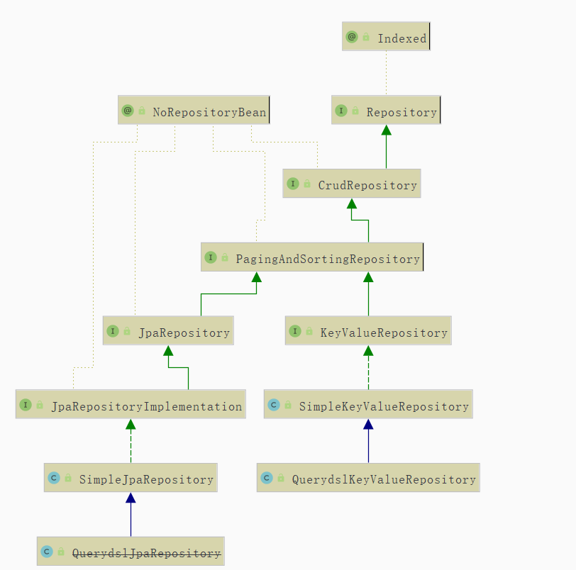

# 简介
Spring-Data提供了数据持久化的一种方式,其中`Spring-Data-Jpa`是实现`JPA`规范的一系列扩展.
通过继承`Repository`类及其子类,调用其预先定义好的各种实现.

## 数据库连接
### 数据库连接属性文件

```profile
# mysql database config
spring.datasource.url=jdbc:mysql://127.0.0.1/api
spring.datasource.username=api
spring.datasource.password=123456
spring.datasource.driver-class-name=com.mysql.jdbc.Driver
spring.jpa.show-sql=true
spring.jpa.database-platform=org.hibernate.dialect.MySQLDialect

```

## 常用类介绍

`Repository<T, ID>` 最简单的JAP接口,定义方法签名完成各种查询.
`CrudRepository<T, ID>` 继承自`Repository<T, ID>`,扩展了保存,删除方法,并可以根据主键查询.
`PagingAndSortingRepository<T, ID>` 继承自`CrudRepository<T, ID>`扩展了排序和分页查询
`JpaRepository<T, ID>`继承自`PagingAndSortingRepository<T, ID>`和`QueryByExampleExecutor<T>`基本满足查询,其独特的`Example`查询可以在不进行方法签名的情况下进行复杂的查询
`JpaSpecificationExecutor<T>`

类图如下



## 具体子类

### 测试基类

其他测试类,通过继承该类,完成Spring-Data-JPA的测试方法.
```java
import org.junit.runner.RunWith;
import org.springframework.boot.test.context.SpringBootTest;
import org.springframework.test.context.junit4.SpringRunner;

import javax.transaction.Transactional;

/**
 * @author Jion
 *  Spring-Data-JPA的测试基类
 */
@RunWith(SpringRunner.class)
@SpringBootTest
@Transactional
public abstract class SpringDataJpaBaseTest {

}
```

### `Repository<T, ID>` 接口方法签名
通过继承`Repository<T, ID>`,并将查询对象的Bean类型传入`T`中,指定`ID`为对应主键的类型.继而绑定查询来源于主键.

方法签名
```java
import org.springframework.data.repository.Repository;
import springData.jpa.bean.Student;

import java.util.Date;
import java.util.List;

/**
 *	使用JPARepository访问数据库
 *	通过继承Repository接口或者使用@RepositoryDefinition 
 *	标识该类使用Spring-Data
 *	通过方法签名,实现查询
 */
public interface StudentRepository extends Repository<Student,Integer> {
	
	/**
     *  根据姓名查询
	 *	select * from student where name = ?
	 */
	public Student findByName(String name);

	/**
     *  姓氏开头,且年龄小于
	 * 	select * from student where name like ?% and age < ?
	 */
	public List<Student> findByNameStartsWithAndAgeLessThan(String name, Integer age);
	
	/**
     *  名字结尾,年龄大于等于
	 * 	select * from student where name like ?%> and age >= ?
	 */
	public List<Student> findByNameEndingWithAndAgeGreaterThanEqual(String name, Integer age);

	/**
     *  在/不在某个枚举中
	 * 	select * from student where name in ( ? , ? ) or address not in (? , ?)
	 */
	public List<Student> findByNameInOrAddressNotIn(List<String> names, List<String> addresses);
	
	/**
     *  日期范围
	 * 	select * from student where workday between ? and ?
	 */
	public List<Student> findByBirthdayBetween(Date start, Date end);
	
	/**
     *  非空查询
	 * 	select * from student where id is not null and name is null
	 */
	public List<Student> findByIdNotNullAndNameIsNull();
}
```

测试类
```java

import lombok.extern.slf4j.Slf4j;
import org.junit.Test;
import org.springframework.beans.factory.annotation.Autowired;
import springData.jpa.bean.Student;
import springData.jpa.repository.StudentRepository;

import java.util.*;

import static org.junit.Assert.assertNotEquals;
import static org.junit.Assert.assertNotNull;

/**
 * @author Jion
 */
@Slf4j
public class StudentRepositoryTest extends SpringDataJpaBaseTest {

    @Autowired
    private StudentRepository studentRepository;


    /**
     *  根据姓名查询
     *	select * from student where name = ?
     */
    @Test
    public void testFindByName(){
        Student student = studentRepository.findByName("Jion");
        assertNotNull(student);
        log.info(student.toString());
    }

    /**
     *  姓氏开头,且年龄小于
     * 	select * from student where name like ?% and age < ?
     */
    @Test
    public void testFindByNameStartsWithAndAgeLessThan(){
        String name = "J";
        Integer age = 25;
        List<Student> list = studentRepository.findByNameStartsWithAndAgeLessThan(name,age);
        assertNotEquals(0,list.size());
        log.info(list.toString());
    }

    /**
     *  名字结尾,年龄大于等于
     * 	select * from student where name like ?% > and age >= ?
     */
    @Test
    public void testFindByNameEndingWithAndAgeGreaterThanEqual(){
        String name = "e";
        Integer age = 19;
        List<Student> list = studentRepository.findByNameEndingWithAndAgeGreaterThanEqual(name,age);
        assertNotEquals(0,list.size());
        log.info(list.toString());
    };

    /**
     *  在/不在某个枚举中
     * 	select * from student where name in ( ? , ? ) or address not in (? , ?)
     */
    @Test
    public void testFindByNameInOrAddressNotIn(){
        List<String> names = new ArrayList<>();
        names.add("Jion");
        names.add("Arise");
        List<String> addresses = new ArrayList<>();
        addresses.add("北京");
        addresses.add("上海");
        List<Student> list = studentRepository.findByNameInOrAddressNotIn(names, addresses);
        assertNotNull(list);
        log.info(list.toString());
    }

    /**
     *  日期范围
     * 	select * from student where workday between ? and ?
     */
    @Test
    public void findByBirthdayBetween(){
        Date start = new GregorianCalendar(2019,12,31).getTime();
        Date end = new GregorianCalendar(2017,01,01).getTime();
        List<Student> list = studentRepository.findByBirthdayBetween(start, end);
    }

    /**
     *  非空查询
     * 	select * from student where id is not null and name is null
     */
    @Test
    public void findByIdNotNullAndNameIsNull(){
        List<Student> list = studentRepository.findByIdNotNullAndNameIsNull();
    }
}
```


#### 方法签名关键字


| 关键字 | 签名 | SQL|
| --- | --- | --- |
| And | findByLastnameAndFirstname | … where x.lastname = ?1 and x.firstname = ?2 |
| Or | findByLastnameOrFirstname | … where x.lastname = ?1 or x.firstname = ?2 |
| Is,Equals | findByFirstname,findByFirstnameIs,findByFirstnameEquals | … where x.firstname = ?1 |
| Between | findByStartDateBetween | … where x.startDate between ?1 and ?2 |
| LessThan | findByAgeLessThan | … where x.age < ?1 |
| LessThanEqual | findByAgeLessThanEqual | … where x.age <= ?1 |
| GreaterThan | findByAgeGreaterThan | … where x.age > ?1 |
| GreaterThanEqual | findByAgeGreaterThanEqual | … where x.age >= ?1 |
| After | findByStartDateAfter | … where x.startDate > ?1 |
| Before | findByStartDateBefore | … where x.startDate < ?1 |
| IsNull | findByAgeIsNull | … where x.age is null |
| IsNotNull,NotNull | findByAge(Is)NotNull | … where x.age not null |
| Like | findByFirstnameLike | … where x.firstname like ?1 |
| NotLike | findByFirstnameNotLike | … where x.firstname not like ?1 |
| StartingWith | findByFirstnameStartingWith | … where x.firstname like ?1 (parameter bound with appended %) |
| EndingWith | findByFirstnameEndingWith | … where x.firstname like ?1 (parameter bound with prepended %) |
| Containing | findByFirstnameContaining | … where x.firstname like ?1 (parameter bound wrapped in %) |
| OrderBy | findByAgeOrderByLastnameDesc | … where x.age = ?1 order by x.lastname desc |
| Not | findByLastnameNot | … where x.lastname <> ?1 |
| In | findByAgeIn(Collection\<Age> ages) | … where x.age in ?1 |
| NotIn | findByAgeNotIn(Collection\<Age> ages) | … where x.age not in ?1 |
| True | findByActiveTrue() | … where x.active = true |
| False | findByActiveFalse() | … where x.active = false |
| IgnoreCase | findByFirstnameIgnoreCase | … where UPPER(x.firstame) = UPPER(?1) |

### `CrudRepository<T, ID>` 接口方法
该类继承自`Repository<T, ID>`,扩展了保存,删除方法,并可以根据主键查询.


#### 接口声明

| 返回 | 声明 |  说明 |
| --- | --- | --- |
| `<S extends T> S ` | `save(S entity)` |  将实体类保存到数据库,并返回保存后的结果 |
| `<S extends T> Iterable<S>` |  `saveAll(Iterable<S> entities)` | 将多个实体集合保存,并返回结果 |
| `Optional<T>` | `findById(ID id)` | 通过ID主键查询,并返回查询结果 |
| `boolean` |  `existsById(ID id)` | 根据ID判断是否存在 |
| `Iterable<T>` |  `findAll()` | 查询全部,返回一个迭代 |
| `Iterable<T>` |  `findAllById(Iterable<ID> ids)` | 通过ID主键进行查询 |
| `long` |  `count()` | 返回数据总数 |
| `void` | `deleteById(ID id)` | 根据ID进行删除 |
| `void` |  `delete(T entity)` | 根据实体类进行删除 |
| `void` | `deleteAll(Iterable<? extends T> entities)` | 根据多个实体的集合进行删除 |
| `void` | `deleteAll()` | 删除全部 |

#### 示例方法
继承`CrudRepository<T,ID>`接口

```java
import org.springframework.data.repository.CrudRepository;
import springData.jpa.bean.Student;

/**
 *	使用JPARepository访问数据库
 *	通过继承CrudRepository接口或者使用@RepositoryDefinition 
 *	标识该类使用Spring-Data
 */
public interface StudentCrudRepository extends CrudRepository<Student,Integer>{

}
```

方法测试
```java
import lombok.extern.slf4j.Slf4j;
import org.junit.Test;
import org.springframework.beans.factory.annotation.Autowired;
import org.springframework.test.annotation.Rollback;
import springData.jpa.bean.Student;
import springData.jpa.repository.StudentCrudRepository;

import java.util.*;

import static org.junit.Assert.*;

/**
 * @author Jion
 */
@Slf4j
@Rollback
public class StudentCrudRepositoryTest extends SpringDataJpaBaseTest {


    @Autowired
    private StudentCrudRepository studentCrudRepository;

    /**
     * 	保存实体
     */
    @Test
    public void testSaveS() {
        Student Student = new Student();
        // ID通过数据库自增赋值
        Student.setId(0);
        Student.setName("Per");
        Student.setAge(20);
        Student.setAddress("开封");
        Student.setBirthday(new Date());
        Student result = studentCrudRepository.save(Student);
        assertNotNull(result);
        log.info(result.toString());
    }

    /***
     *  保存全部
     */
    @Test
    public void testSaveAll(){
        List<Student> list = new ArrayList<>();
        Student jion = new Student();
        jion.setName("Jion");
        jion.setAge(10);
        jion.setAddress("河南");
        jion.setBirthday(new GregorianCalendar(2010, Calendar.JULY,11).getTime());
        list.add(jion);
        Student arise = new Student();
        jion.setName("Jion");
        jion.setAge(11);
        jion.setAddress("上海");
        jion.setBirthday(new GregorianCalendar(2011,Calendar.SEPTEMBER,1).getTime());
        list.add(arise);
        List result = (List) studentCrudRepository.saveAll(list);
        assertNotEquals(0,result.size());
        log.info(result.toString());
    }

    /**
     *  通过ID主键查询
     */
    @Test
    public void testFindById(){
        Optional<Student> optional = studentCrudRepository.findById(1);
        Student result = null;
        // 存在赋值
        if(optional.isPresent()){
            result = optional.get();
        }
        assertNotNull(result);
        log.info(result.toString());
    }

    /**
     *  判断ID主键是否存在
     */
    @Test
    public void testExistsById(){
        Boolean result = studentCrudRepository.existsById(1);
        assertEquals(true,result);
        log.info(result.toString());
    }

    /**
     *  返回一个实现了Iterable<T>接口的实体对象
     */
    @Test
    public void testFindAll(){
        Iterable<Student> iterable = studentCrudRepository.findAll();
        Iterator<Student> iterator = iterable.iterator();
        assertTrue(iterator.hasNext());
        while (iterator.hasNext()){
            Student result = iterator.next();
            log.info(result.toString());
        }
    }

    /**
     *  通过主键集合查询全部
     */
    @Test
    public void testFindAllById(){
        Set<Integer> ids = new HashSet<>();
        ids.add(1);
        ids.add(2);
        Iterable<Student> iterable = studentCrudRepository.findAllById(ids);
        Iterator<Student> iterator = iterable.iterator();
        assertTrue(iterator.hasNext());
        // 迭代全部
        while (iterator.hasNext()){
            Student result = iterator.next();
            log.info(result.toString());
        }
    }

    /**
     *  查询总数
     */
    @Test
    public void testCount() {
        Long result = studentCrudRepository.count();
        assertNotEquals(new Long(0), result);
        log.info(result.toString());
    }

    /**
     *  根据ID删除
     */
    @Test
    public void testDeleteById(){
        studentCrudRepository.deleteById(1);
    }

    /**
     *  根据对象删除
     */
    @Test
    public void testDelete(){
        Optional<Student> optional = studentCrudRepository.findById(1);
        Student student = null;
        if(optional.isPresent()){
            student = optional.get();
        }
        studentCrudRepository.delete(student);
    }

    /**
     * 	删除当前数据表
     */
    @Test
    public void testDeleteAll() {
        studentCrudRepository.deleteAll();
    }

    /**
     *  删除指定集合
     */
    @Test
    public void testDeleteAllBySet(){
        Set<Student> set = new HashSet<>();
        Optional<Student> optional1 = studentCrudRepository.findById(1);
        Student student1 = null;
        if(optional1.isPresent()){
            student1 = optional1.get();
        }
        Optional<Student> optional2 = studentCrudRepository.findById(1);
        Student student2 = null;
        if(optional2.isPresent()){
            student2 = optional2.get();
        }
        set.add(student1);
        set.add(student2);
        studentCrudRepository.deleteAll(set);
    }
}
```

### `PagingAndSortingRepository<T, ID>` 接口方法
声明了分页和排序的方法.

#### 接口声明
| 返回 | 声明 |  说明 |
| --- | --- | --- |
|`Iterable<T>` | `findAll(Sort sort)` | 根据排序规则进行排序,查询 |
| `Page<T>` |  `findAll(Pageable pageable)` | 根据分页查询 |

#### 示例方法

继承自`PagingAndSortingRepository<T,ID>`接口
```java
import org.springframework.data.repository.PagingAndSortingRepository;
import springData.jpa.bean.Student;

/**
 *	使用JPARepository访问数据库
 *	通过继承PagingAndSortingRepository接口或者使用@RepositoryDefinition 
 *	标识该类使用Spring-Data
 */

public interface StudentPagingAndSortingRepository extends PagingAndSortingRepository<Student,Integer>{

}
```
各种测试方法
```java

import lombok.extern.slf4j.Slf4j;
import org.junit.Test;
import org.springframework.beans.factory.annotation.Autowired;
import org.springframework.data.domain.Page;
import org.springframework.data.domain.PageRequest;
import org.springframework.data.domain.Pageable;
import org.springframework.data.domain.Sort;
import springData.jpa.bean.Student;
import springData.jpa.repository.StudentPagingAndSortingRepository;

import static org.junit.Assert.*;

/**
 * @author Jion
 */
@Slf4j
public class StudentPagingAndSortingRepositoryTest extends SpringDataJpaBaseTest {

    @Autowired
    private StudentPagingAndSortingRepository studentPagingAndSortingRepository;

    /**
     * 	测试排序逻辑
     */
    @Test
    public void testFindAllSort() {

        //匿名内部类,完成根据id降序排列
        Sort.Order ordersId = new Sort.Order(Sort.Direction.DESC,"id");
        // age升序
        Sort.Order ordersAge = new Sort.Order(Sort.Direction.ASC,"age");
        // 多个排序规则
        Sort sort = Sort.by(ordersId, ordersAge);

        //分页查询,第一页,显示三个,并传入排序规则
        Pageable pageable = PageRequest.of(2, 2,sort);
        Page<Student> page =  studentPagingAndSortingRepository.findAll(pageable);
        assertNotNull(page);
        log.info("总页数:" + page.getTotalPages());
        log.info("总记录数:" + page.getTotalElements());
        log.info("当前页面总记录" + page.getSize());
        log.info("当前页面是否全部查询" + page.hasContent());
        log.info("当前页数:" + page.getNumber());					//从0开始
        log.info("当前页面记录数:" + page.getNumberOfElements());
        log.info("当前页面的集合:" + page.getContent());
        //当前页
        page.getPageable();
        // 下一页
        if(page.hasNext()){
            page.nextPageable();
        }
        // 上一页
        if(page.hasPrevious()){
            page.previousPageable();
        }
        log.info("是否第一页:" + page.isFirst());
        log.info("是否最后一页:" + page.isLast());
        log.info("是否空页:" + page.isEmpty());
    }

    /**
     * 	测试分页逻辑
     */
    @Test
    public void testFindAllPageable() {
        //分页查询,第一页,显示三个
        Pageable pageable = PageRequest.of(0, 2);
        Page<Student> page = studentPagingAndSortingRepository.findAll(pageable);
        assertNotNull(page);
        log.info("总页数:" + page.getTotalPages());
        log.info("总记录数:" + page.getTotalElements());
        log.info("当前页数:" + page.getNumber());					//从0开始
        log.info("当前页面记录数:" + page.getNumberOfElements());
        log.info("当前页面的集合:" + page.getContent());
    }
}
```

#### `Page<T>`接口及`Slice<T>`接口常用声明
`Page<T>`接口继承自`Slice<T>`接口,拥有其父类方法

**`Page<T>` 接口**

| 返回 | 声明 |  说明 |
| --- | --- | --- |
| `int`| `getTotalPages()` |  总分页页数 |
| `long ` | `getTotalElements()` | 总记录数 |

**`Slice<T>` 接口 **

| 返回 | 声明 |  说明 |
| --- | --- | --- |
| `int`| `getNumber()` |  当前是第几页,从0开始 |
| `int` | `getSize()` | 当前页总记录数 |
| `List<T>` | `getContent()` | 当前所有记录 |
| `boolean`  | `hasContent()` | 当前页是否有纪录 |
| `Sort` |  `getSort()` | 获得排序对象 |
| `boolean` |  `isFirst()` | 是否第一页 |
| `boolean` | `isLast()` | 是否最后一个 |
| `boolean` | `hasNext()` | 是否含有下一页 |
| `boolean` | `hasPrevious()` | 是否含有上一页 |
| `Pageable` | `getPageable()` | 获得当前页的查询 |
| `Pageable` | `nextPageable()`| 获得下一页 |
| `Pageable` | `previousPageable()` | 获得上一页 |


###  `JpaRepository<T, ID>` 接口方法
基本满足查询,其独特的`Example`类查询查询可以在不进行方法签名的情况下进行复杂的查询

#### 接口方法
| 返回 | 声明 |  说明 |
| --- | --- | --- |
| `List<T>` | `findAll()` | 查询全部 |
| `List<T> ` |  `List<T> findAll(Sort sort)` | 根据排序规则,查询全部 |
| `List<T>` | `findAllById(Iterable<ID> ids)`| 根据ID主键集合,查询 |
| `List<S>` | `saveAll(Iterable<S> entities)` | 保存实体集合 |
| `void` | `flush()` | 提交事务,将当前改变写入数据库 |
| `S` |  `saveAndFlush(S entity)` | 立即保存当前实体 |
| `void` | `deleteInBatch(Iterable<T> entities)` | 批量删除,在一个SQL语句中 |
| `void` |  `deleteAllInBatch()` | 全部删除,在一个SQL语句中 |
| `T` | `getOne(ID id)` | 根据主键查询一个|
| `List<S>` |  `findAll(Example<S> example)` | 根据`Example<S>`查询 |
| `List<S>` |  `findAll(Example<S> example, Sort sort)` | 根据 `Example<S>`,排序查询 |

#### 示例方法

继承自`JpaRepository<T,ID>`类.
```java
import org.springframework.data.jpa.repository.JpaRepository;
import springData.jpa.bean.Student;

/**
 *	使用JPARepository访问数据库
 *	通过继承JpaRepository接口或者使用@RepositoryDefinition 
 *	标识该类使用Spring-Data
 */
public interface StudentJpaRepository extends JpaRepository<Student,Integer>{
	
}
```
各种测试方法

```java
import lombok.extern.slf4j.Slf4j;
import org.junit.Test;
import org.springframework.beans.factory.annotation.Autowired;
import org.springframework.data.domain.Sort;
import org.springframework.data.domain.Sort.Direction;
import org.springframework.test.annotation.Rollback;
import springData.jpa.bean.Student;
import springData.jpa.repository.StudentJpaRepository;

import java.util.*;

import static org.junit.Assert.assertNotNull;

/**

 * @author Jion
 */
@Rollback
@Slf4j
public class StudentJpaRepositoryTest extends SpringDataJpaBaseTest {

    @Autowired
    private StudentJpaRepository studentJpaRepository;

    /**

     * 查询全部
     */
    @Test
    public void testFindAll() {
        List<Student> result = studentJpaRepository.findAll();
        assertNotNull(result);
        log.info(result.toString());
    }

    /**

     * 查询全部
     * 排序规则:根据ID降序
     */
    @Test
    public void testFindAllSort() {
        Sort.Order orderId = new Sort.Order(Direction.DESC, "id");
        Sort sort = Sort.by(orderId);
        // 根据排序查询
        List<Student> result = studentJpaRepository.findAll(sort);
        assertNotNull(result);
        log.info(result.toString());
    }

    /**

     * 根据ID主键集合查询
     */
    @Test
    public void testFindAllById() {
        Set<Integer> ids = new HashSet<>();
        ids.add(1);
        ids.add(2);
        List<Student> result = studentJpaRepository.findAllById(ids);
        assertNotNull(result);
        log.info(result.toString());
    }

    /**

     * 保存Set中的全部
     */
    @Test
    public void testSaveAll() {
        Set<Student> students = new HashSet<>();
        Student jion = new Student();
        jion.setName("Jion");
        jion.setAge(10);
        jion.setAddress("河南");
        jion.setBirthday(new GregorianCalendar(2010, Calendar.JULY, 11).getTime());
        students.add(jion);
        List<Student> result = studentJpaRepository.saveAll(students);
        assertNotNull(result);
        log.info(result.toString());
    }

    /**

     * 提交事物,将所有的实体类变动提交数据库
     */
    @Test
    public void testFlush() {
        studentJpaRepository.flush();
    }

    /**

     * 保存单条对象,立刻并写入数据库
     */
    @Test
    public void testSaveAndFlush() {
        Student jion = new Student();
        jion.setName("Jion");
        jion.setAge(10);
        jion.setAddress("河南");
        jion.setBirthday(new GregorianCalendar(2010, Calendar.JULY, 11).getTime());
        //保存并写入数据库
        Student result = studentJpaRepository.saveAndFlush(jion);
        assertNotNull(result);
        log.info(result.toString());
    }

    /**

     * 批量删除,在一个SQL语句中完成
     */
    @Test
    public void testDeleteInBatch() {

        Set<Student> students = new HashSet<>();
        students.add(studentJpaRepository.getOne(1));
        students.add(studentJpaRepository.getOne(2));
        // 批量删除,在一个SQL语句中完成
        studentJpaRepository.deleteInBatch(students);
    }

    /**

     * 删除全部的方法
     */
    @Test
    public void testDeleteAllInBatch() {
        studentJpaRepository.deleteAll();
    }

    /**

     * 通过ID主键查询一个,为懒加载方式
     */
    @Test
    public void testGetOne() {
        Student result = studentJpaRepository.getOne(1);
        assertNotNull(result);
        log.info(result.toString());
    }
}
```


### `Example`类查询
参考 [官网](https://docs.spring.io/spring-data/jpa/docs/2.1.8.RELEASE/reference/html/#query-by-example)

### `HQL`/`SQL`自定义查询
通过`@RepositoryDefinition`注解或者继承自`Repository<T,ID>`接口.通过注解完成`HQL`/`SQL`的编写.
`@Query` 可以执行`HQL`/`SQL`语句
`@Modifying`配合`@Query`进行增删改.
`@Param`对查询参数进行注入.


示例代码
```java
import org.springframework.data.jpa.repository.Modifying;
import org.springframework.data.jpa.repository.Query;
import org.springframework.data.repository.Repository;
import org.springframework.data.repository.RepositoryDefinition;
import org.springframework.data.repository.query.Param;
import org.springframework.transaction.annotation.Transactional;
import springData.jpa.bean.Student;

/**
 *	使用JPARepository访问数据库
 *	通过继承Repository接口或者使用@RepositoryDefinition 
 *	标识该类使用Spring-Data
 *	通过使用@Query注解,重写查询语句
 */

//@RepositoryDefinition(domainClass = Student.class, idClass = Integer.class)
public interface StudentQueryRepository extends Repository<Student,Integer> {
	
				/* ******************************|
				 * 			HQL语句				|
				 * *****************************/
	
	/**
     *  查询最大值
	 * 	select t from student t where id = (select max(id) from student)
	 */
	@Query("select t from Student t where id = (select max(id) from Student)")
	public Student getStudentByMaxId();
	
	/**		
	 * 	select t from student t where t.name = ?1
	 */
	@Query("select t from Student t where t.name = ?1")
	public Student getStudentByParamName(String name);

	/**
	 * 	select t from student t where t.address = :address
	 */
	@Query("select t from Student t where t.address = :address")
	public Student getStudentByParamAddress(@Param("address") String address);

	/**
	 * update student t set t.age = :age where t.id = :id
	 * 添加@Modifying注解和事务开启,其中@Modifying必须和@Query配合使用
	 */
	@Modifying
	@Query("update Student t set t.age = :age where t.id = :id")
	public void updateSetName(@Param("id") Integer id, @Param("age") Integer age);

				/* *****************************|
				 * 			SQL语句				|
				 * *****************************/
	
	/**
	 * 	使用原生的SQL进行查询.需要开启nativeQuery注解属性
	 * 	select count(*) from student
	 */
	@Query(value = "select count(*) from student" , nativeQuery = true)
	public Long getCount();
    
	@Modifying
	@Query("update student t set t.age = :age where t.id = :id", nativeQuery = true)
	public void updateSetName(@Param("id") Integer id, @Param("age") Integer age);    
}
```

各种测试
```java
import lombok.extern.slf4j.Slf4j;
import org.junit.Test;
import org.springframework.beans.factory.annotation.Autowired;
import org.springframework.test.annotation.Rollback;
import springData.jpa.bean.Student;
import springData.jpa.repository.StudentQueryRepository;

import static org.junit.Assert.assertNotNull;

/**
 *	自定义查询
 */
@Slf4j
@Rollback
public class StudentQueryRepositoryTest extends SpringDataJpaBaseTest{

	@Autowired
	StudentQueryRepository studentQueryRepository;


	/**
	 * 	select t from student t where id = (select max(id) from Student)
	 */
	@Test
	public void testGetStudentByMaxId() {
		Student result =  studentQueryRepository.getStudentByMaxId();
		assertNotNull(result);
		log.info(result.toString());
	}

	/**
	 * 	select t from student t where t.name = ?1
	 */
	@Test
	public void testGetStudentByParamName(){
        Student result = studentQueryRepository.getStudentByParamName("Jion");
        assertNotNull(result);
        log.info(result.toString());
    }

    /**
     * 	select t from student t where t.address = :address
     */
    @Test
	public void testGetStudentByParamAddress(){
        Student result = studentQueryRepository.getStudentByParamAddress("上海");
        assertNotNull(result);
        log.info(result.toString());
    }

	/**
	 * 	update student t set t.age = :age where t.id = :id
	 */
	@Test
	public void testUpdateSetName(){
	    studentQueryRepository.updateSetName(1,10);
	}

	/**
     *  使用原生的SQL进行查询.需要开启nativeQuery注解属性
	 * 	select count(*) from student
	 */
	@Test
	public void testGetCount(){
	    Long result = studentQueryRepository.getCount();
	    assertNotNull(result);
	    log.info(result.toString());
    }
}
```


# 实战示例

## 多数据源配置

可以配置多个数据源,实现分布式数据库管理.

`@Configuration` 标识这是一个配置类

`@EnableJpaRepositories` 标识启用`JPA` , 其中 `basePackages` 指向具体的`Repository` 接口,配置对应的实体类`LocalContainerEntityManagerFactoryBean.class` 和事物管理器`PlatformTransactionManager.class`

`Environment.class` 类代指项目当前运行环境,可以从中获得属性配置信息

`DataSource` 配置数据库连接信息

`LocalContainerEntityManagerFactoryBean.class` 指定需要扫描的实体类所在的包,和 `JPA` 相关配置

`PlatformTransactionManager` 事物管理器

`JpaVendorAdapter` 适配器,将一些 `JAP` 属性进行设置

```java
@Configuration
@EnableJpaRepositories(
        basePackages = "top.jionjion.web.console.dao.console",
        entityManagerFactoryRef = "consoleEntityManager",
        transactionManagerRef = "consoleTransactionManager"
)
public class ConsoleDatasourceJpaConfig {

    /** 环境变量 */
    private final Environment env;

    /** 配置属性信息 */
    private final ConsoleDatasourceProperties properties;

    public ConsoleDatasourceJpaConfig(Environment env, ConsoleDatasourceProperties properties) {
        this.env = env;
        this.properties = properties;
    }

    /** 容器Bean映射管理 */
    @Bean(name = "consoleEntityManager")
    @Primary
    public LocalContainerEntityManagerFactoryBean consoleEntityManager() {
        LocalContainerEntityManagerFactoryBean em = new LocalContainerEntityManagerFactoryBean();
        em.setDataSource(consoleDataSource());

        // 扫描Bean
        em.setPackagesToScan("top.jionjion.web.console.po");

        HibernateJpaVendorAdapter vendorAdapter= new HibernateJpaVendorAdapter();
        em.setJpaVendorAdapter(vendorAdapter);

        HashMap<String, Object> properties = new HashMap<>(4);
        properties.put("spring.jpa.database-platform", env.getProperty("spring.jpa.database-platform"));
        properties.put("spring.jpa.hibernate.ddl-auto", env.getProperty("spring.jpa.hibernate.ddl-auto"));
        properties.put("spring.jpa.show-sql", env.getProperty("spring.jpa.show-sql"));
        em.setJpaPropertyMap(properties);

        return em;
    }

    /** 数据源 */
    @Primary
    @Bean(name = "consoleDataSource")
    public DataSource consoleDataSource() {

        DriverManagerDataSource dataSource  = new DriverManagerDataSource();
        dataSource.setUsername(properties.getUsername());
        dataSource.setPassword(properties.getPassword());
        dataSource.setUrl(properties.getUrl());
        dataSource.setDriverClassName(properties.getDriverClassName());

        return dataSource;
    }

    /** 事物管理器 */
    @Primary
    @Bean(name = "consoleTransactionManager")
    public PlatformTransactionManager consoleTransactionManager() {

        JpaTransactionManager transactionManager = new JpaTransactionManager();
        transactionManager.setEntityManagerFactory(consoleEntityManager().getObject());
        return transactionManager;
    }

    /** JAP适配器 */
    @Primary
    @Bean(name = "consoleJpaVendorAdapter")
    public JpaVendorAdapter consoleJpaVendorAdapter() {
        HibernateJpaVendorAdapter adapter =new HibernateJpaVendorAdapter();
        adapter.setDatabase(Database.MYSQL);
        adapter.setShowSql(Boolean.parseBoolean(env.getProperty("spring.jpa.show-sql")));
        adapter.setGenerateDdl(Boolean.parseBoolean(env.getProperty("spring.jpa.hibernate.ddl-auto")));
        adapter.setDatabasePlatform(env.getProperty("spring.jpa.database-platform"));
        return adapter;
    }
}
```


## 数据库表名大小写

`MySQL` 数据库在Linxu环境下,数据库设定为表名大小写敏感 .因此,一般数据库表名大写,字段名大写.
需要在配置文件中添加以下信息

通过实现 `org.hibernate.boot.model.naming.PhysicalNamingStrategy` 接口中定义的方法.可以重写数据库对象名,默认实现空类为 `org.hibernate.boot.model.naming.PhysicalNamingStrategyStandardImpl` 

默认实现

```java
public class PhysicalNamingStrategyStandardImpl implements PhysicalNamingStrategy, Serializable {
	/**
	 * Singleton access
	 */
	public static final PhysicalNamingStrategyStandardImpl INSTANCE = new PhysicalNamingStrategyStandardImpl();

    // 重写数据库目录
	@Override
	public Identifier toPhysicalCatalogName(Identifier name, JdbcEnvironment context) {
		return name;
	}

    // 重写数据库 Schema
	@Override
	public Identifier toPhysicalSchemaName(Identifier name, JdbcEnvironment context) {
		return name;
	}

    // 重写数据库表名
	@Override
	public Identifier toPhysicalTableName(Identifier name, JdbcEnvironment context) {
		return name;
	}

    // 重写数据库字序列名
	@Override
	public Identifier toPhysicalSequenceName(Identifier name, JdbcEnvironment context) {
		return name;
	}

    // 重写数据库字段名
	@Override
	public Identifier toPhysicalColumnName(Identifier name, JdbcEnvironment context) {
		return name;
	}
}
```

在配置文件中添加使用

```properties
# 表名统一大写
spring.jpa.hibernate.naming.physical-strategy=top.jionjion.web.fish.config.UpperTableStrategy
```

