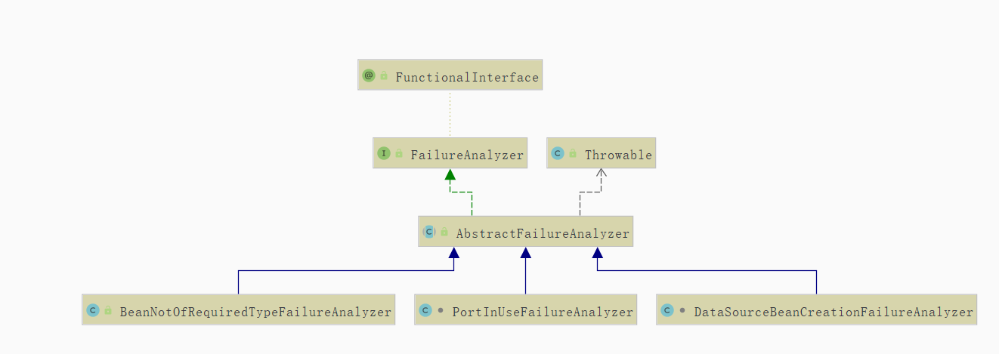
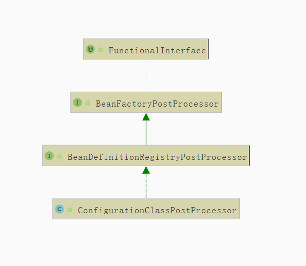

# 简介

介绍SpringBoot的启动原理,场景启动器,Bean管理等...


## 环境信息

- JDK14
- spring-boot 2.3.X
- idea


# 启动流程

1. 框架初始化
2. 框架启动
3. 自动化装配


## 框架初始化

1. 配置资源加载器
2. 配置 `primarySources`
3. 应用环境监测
4. 配置系统初始化器
5. 配置应用监听器
6. 配置 `main` 方法所在类


## 启动框架

1. 计时器启动
2. `Headless` 模式赋值
3. 发送 `ApplicationStartingEven` 事件
4. 配置环境模块
5. 发送 `ApplicationEnvironmentPreparedEvent` 事件
6. 打印 `banner`
7. 创建应用上下文对象
8. 初始化失败分析器
9. 关联SpringBoot组件与应用上下文对象
10. 发送 `ApplicationContextInitializedEvent` 事件
11. 加载 `source` 到 `context`
12. 发送 `ApplicationPreparedEvent` 事件
13. 刷新上下文
14. 计时器停止计数
15. 发送 `ApplicationStartedEvent` 事件
16. 调用框架启动扩展类
17. 发送 `ApplicationReadyEvent` 事件


## 框架自动化装配步骤

1. 收集配置文件中的配置工厂类
2. 加载组件工厂
3. 注册组件内定义的 `Bean`


# 框架初始化

## 系统初始化器

接口 `org.springframework.context.ApplicationContextInitializer`
在Spring容器刷新 `refresh` 方法 前进行函数回调, 以便向容器中注入属性.
通过继承接口并各自实现.


### 作用

- 上下文刷新 `refresh` 方法前调用
- 编码设置一些属性变量.通常在 web 环境中
- 通过 `order` 接口进行排序


### 示例 - 自定义初始化器

其中, `@Order` 注解中的值越小,则越先执行


####  工厂文件注册

首先通过实现 `org.springframework.context.ApplicationContextInitializer` 接口中的初始化方法,随后在项目创建 `META-INF/spring.factories` 文件, 注册初始化器

**实现接口**

```java
import org.springframework.context.ApplicationContextInitializer;
import org.springframework.context.ConfigurableApplicationContext;
import org.springframework.core.annotation.Order;
import org.springframework.core.env.ConfigurableEnvironment;

/**
 *  自定义容器启动器. 通过 META-INF/spring.factories 注册
 *      在容器注入时,进行操作
 * @author Jion
 */
@Order(1)
public class WebApplicationInitializerFirst implements ApplicationContextInitializer<ConfigurableApplicationContext> {

    @Override
    public void initialize(ConfigurableApplicationContext applicationContext) {
        // 获得容器中环境变量
        ConfigurableEnvironment environment = applicationContext.getEnvironment();
        System.out.println("--- 方法一 ---");
        System.out.println("容器初始化器启动...");
        System.out.println("------");
    }
}
```

**注册初始化器**

```properties
# 注册自定义系统初始化器
org.springframework.context.ApplicationContextInitializer=top.jionjion.initializer.WebApplicationInitializerFirst
```


#### 启动类注册

实现 `org.springframework.context.ApplicationContextInitializer` 接口,并在启动类中注册初始化器

**实现接口**

```java
import org.springframework.context.ApplicationContextInitializer;
import org.springframework.context.ConfigurableApplicationContext;
import org.springframework.core.annotation.Order;
import org.springframework.core.env.ConfigurableEnvironment;

/**
 *  自定义容器启动器. 通过启动类注册
 *      在容器注入时,进行操作
 * @author Jion
 */
@Order(2)
public class WebApplicationInitializerSecond implements ApplicationContextInitializer<ConfigurableApplicationContext> {

    @Override
    public void initialize(ConfigurableApplicationContext applicationContext) {
        // 获得容器中环境变量
        ConfigurableEnvironment environment = applicationContext.getEnvironment();
        System.out.println("--- 方法二 ---");
        System.out.println("容器初始化器启动...");
        System.out.println("------");
    }
}
```

**注册启动器**

```java
import org.springframework.boot.SpringApplication;
import org.springframework.boot.autoconfigure.SpringBootApplication;
import org.springframework.context.ApplicationContextInitializer;
import top.jionjion.initializer.WebAppInitializerSecond;

import java.util.Collections;

/**
 *  主启动类
 * @author 14345
 */
@SpringBootApplication
public class WebApplication {

    public static void main(String[] args) {
        // 正常的启动方式
        //SpringApplication.run(WebApplication.class, args);

        // 自定义容器的初始化器,并调用run方法
        SpringApplication springApplication = new SpringApplication(WebApplication.class);
        springApplication.setInitializers(Collections.singleton(new WebApplicationInitializerSecond()));
        springApplication.run(args);
    }
}
```


#### 配置文件注册

**实现接口**

```java
package top.jionjion.initializer;

import org.springframework.context.ApplicationContextInitializer;
import org.springframework.context.ConfigurableApplicationContext;
import org.springframework.core.annotation.Order;
import org.springframework.core.env.ConfigurableEnvironment;

/**
 *  自定义容器启动器. 通过属性 context.initializer.classes 指定调用
 *      在容器注入时,进行操作
 * @author Jion
 */
@Order(3)
public class WebApplicationInitializerThird implements ApplicationContextInitializer<ConfigurableApplicationContext> {

    @Override
    public void initialize(ConfigurableApplicationContext applicationContext) {
        // 获得容器中环境变量
        ConfigurableEnvironment environment = applicationContext.getEnvironment();
        System.out.println("--- 方法三 ---");
        System.out.println("容器初始化器启动...");
        System.out.println("------");
    }
}
```

**配置文件**

```yaml
context:
  initializer:
    classes: top.jionjion.initializer.WebApplicationInitializerThird
```


### 初始化器调用位置

在 `run` 方法中, 调用 `prepareContext(context, environment, listeners, applicationArguments, printedBanner)` 方法.

```java
public ConfigurableApplicationContext run(String... args) {
    StopWatch stopWatch = new StopWatch();
    stopWatch.start();
    ConfigurableApplicationContext context = null;
    Collection<SpringBootExceptionReporter> exceptionReporters = new ArrayList<>();
    configureHeadlessProperty();
    SpringApplicationRunListeners listeners = getRunListeners(args);
    listeners.starting();
    try {
        ApplicationArguments applicationArguments = new DefaultApplicationArguments(args);
        ConfigurableEnvironment environment = prepareEnvironment(listeners, applicationArguments);
        configureIgnoreBeanInfo(environment);
        Banner printedBanner = printBanner(environment);
        context = createApplicationContext();
        exceptionReporters = getSpringFactoriesInstances(SpringBootExceptionReporter.class,
                                                         new Class[] { ConfigurableApplicationContext.class }, context);
        // 准备容器 
        prepareContext(context, environment, listeners, applicationArguments, printedBanner);
        refreshContext(context);
        afterRefresh(context, applicationArguments);
        stopWatch.stop();
        if (this.logStartupInfo) {
            new StartupInfoLogger(this.mainApplicationClass).logStarted(getApplicationLog(), stopWatch);
        }
        listeners.started(context);
        callRunners(context, applicationArguments);
    }
    catch (Throwable ex) {
        handleRunFailure(context, ex, exceptionReporters, listeners);
        throw new IllegalStateException(ex);
    }

    try {
        listeners.running(context);
    }
    catch (Throwable ex) {
        handleRunFailure(context, ex, exceptionReporters, null);
        throw new IllegalStateException(ex);
    }
    return context;
}
```

在其中调用 `applyInitializers(context) ` 调用初始化容器方法

```java
private void prepareContext(ConfigurableApplicationContext context, ConfigurableEnvironment environment,
                            SpringApplicationRunListeners listeners, ApplicationArguments applicationArguments, Banner printedBanner) {
    context.setEnvironment(environment);
    postProcessApplicationContext(context);
    // 初始化容器
    applyInitializers(context);
    listeners.contextPrepared(context);
    if (this.logStartupInfo) {
        logStartupInfo(context.getParent() == null);
        logStartupProfileInfo(context);
    }
    // Add boot specific singleton beans
    ConfigurableListableBeanFactory beanFactory = context.getBeanFactory();
    beanFactory.registerSingleton("springApplicationArguments", applicationArguments);
    if (printedBanner != null) {
        beanFactory.registerSingleton("springBootBanner", printedBanner);
    }
    if (beanFactory instanceof DefaultListableBeanFactory) {
        ((DefaultListableBeanFactory) beanFactory)
        .setAllowBeanDefinitionOverriding(this.allowBeanDefinitionOverriding);
    }
    if (this.lazyInitialization) {
        context.addBeanFactoryPostProcessor(new LazyInitializationBeanFactoryPostProcessor());
    }
    // Load the sources
    Set<Object> sources = getAllSources();
    Assert.notEmpty(sources, "Sources must not be empty");
    load(context, sources.toArray(new Object[0]));
    listeners.contextLoaded(context);
}
```

这里, 断言进行判断.只有在当前容器为泛型中定义容器子类的对象才有必要进行初始化
如: `implements ApplicationContextInitializer<ConfigurableApplicationContext>`

```java
protected void applyInitializers(ConfigurableApplicationContext context) {
    for (ApplicationContextInitializer initializer : getInitializers()) {
        // 断言,只有该容器对象类为其泛型的子类时,才能进行初始化操作
        Class<?> requiredType = GenericTypeResolver.resolveTypeArgument(initializer.getClass(),
                                                                        ApplicationContextInitializer.class);
        Assert.isInstanceOf(requiredType, context, "Unable to call initializer.");
        initializer.initialize(context);
    }
}
```

#### 扩展

定义在 `spring.factories` 文件中的初始化器被 `SpringFactoriesLoader` 发现并注册

`SpringApplication` 初始化后再手动添加注册

通过备配置文件注册的初始化器,会由 `org.springframework.boot.context.config.DelegatingApplicationContextInitializer` 类进行注册调用, 该类由Spring加载, 其配置优先级最高,会使其属性文件 `context.initializer.classes` 定义的初始化器最先调用.不受 `Order` 排序影响.


### 加载步骤

1. 判断缓存中是否存在,如果存在则返回.否则继续
2. 读取指定资源文件
3. 构造 `properties` 对象
4. 获取指定 `key` 对应的 `value` 值
5. 逗号分隔到 `value`
6. 保存结果到缓存
7. 依次实例化到结果对象
8. 对结果进行排序
9. 返回实例结果


### 扩展 - `SpringFactoriesLoader `

Spring 提供的通用工厂加载机制.
在 `META-INF/spring.factories`  从 `classpath` 下多个 `jar` 内的特定位置读取文件并初始化类.
其配置文件必须为 `properties` 文件, `key` 为全限定名, `value` 为具体的实现,可以有多个,并用逗号分隔.


### 源码步骤

#### 0-0-0-0 启动入口

通过传入主启动类进行启动.调用 `run` 方法

```java
@SpringBootApplication
public class WebApplication {
    public static void main(String[] args) {
        SpringApplication.run(WebApplication.class, args);
    }
}
```


#### 1-1-0-0 `run` 方法调用前

在静态方法中, 传入主启动类和系统参数,调用静态方法 `run`

```java
public static ConfigurableApplicationContext run(Class<?> primarySource, String... args) {
    return run(new Class<?>[] { primarySource }, args);
}
```

在静态 `run` 方法中,创建容器 `SpringApplication` 对象, 并调用实例 `run` 方法

```java
public static ConfigurableApplicationContext run(Class<?>[] primarySources, String[] args) {
    return new SpringApplication(primarySources).run(args);
}
```

#### 1-2-0-0 初始化 `SpringApplication`

带 `Class` 参数的构造器, 传入 `primarySources` , 即主启动类, 调用构造器

```java
public SpringApplication(Class<?>... primarySources) {
    this(null, primarySources);
}
```

带 `ResourceLoader` 资源加载器和 `primarySources` 的构造器.其中完成了 `SpringApplication` 的对象初始化.

1. 存放资源加载器 `ResourceLoader`
2. 判断是否为 `WEB` 环境
3. 加载初始化器
4. 加载监听器
5. 推断主要启动类

```java
public SpringApplication(ResourceLoader resourceLoader, Class<?>... primarySources) {
    // 1. 资源加载器, 一般为空
    this.resourceLoader = resourceLoader;
    Assert.notNull(primarySources, "PrimarySources must not be null");
    // 2. 主启动类
    this.primarySources = new LinkedHashSet<>(Arrays.asList(primarySources));
    // 3. 判断是否为WEB环境
    this.webApplicationType = WebApplicationType.deduceFromClasspath();
    // 4. 加载,初始化器
    setInitializers((Collection) getSpringFactoriesInstances(ApplicationContextInitializer.class));
    // 5. 加载,监听器
    setListeners((Collection) getSpringFactoriesInstances(ApplicationListener.class));
    // 6. 推断主要启动类
    this.mainApplicationClass = deduceMainApplicationClass();
}
```

####1-2-4-0 加载容器初始化器

通过传入 `org.springframework.context.ApplicationContextInitializer` 的接口类型,加载其具体实现

```java
private <T> Collection<T> getSpringFactoriesInstances(Class<T> type) {
    return getSpringFactoriesInstances(type, new Class<?>[] {});
}
```

这里主要有三步

1. 使用加载器加载具体实现类的全限定名
2. 创建工厂具体实例对象
3. 对其进行排序. 如使用 @Order 注解

```java
private <T> Collection<T> getSpringFactoriesInstances(Class<T> type, Class<?>[] parameterTypes, Object... args) {
    // 类加载器
    ClassLoader classLoader = getClassLoader();
    // 1. 使用加载器加载具体实现类的全限定名
    Set<String> names = new LinkedHashSet<>(SpringFactoriesLoader.loadFactoryNames(type, classLoader));
    // 2. 创建加载器加载的具体实例对象
    List<T> instances = createSpringFactoriesInstances(type, parameterTypes, classLoader, args, names);
    // 3. 对其进行排序. 如使用 @Order 注解
    AnnotationAwareOrderComparator.sort(instances);
    return instances;
}
```

#### 1-2-4-1 获取加载器的具体实现类的全限定名

通过 `SpringFactoriesLoader.loadFactoryNames(type, classLoader)` 方法,获得Spring的 `META-INF/spring.factories` 中定义的接口和实现类.
在使用 `getOrDefault(factoryTypeName, Collections.emptyList())` 传入具体要获得加载的类的全限定名 `factoryTypeName` 如果为空,则返回空列表.

```java
public static List<String> loadFactoryNames(Class<?> factoryType, @Nullable ClassLoader classLoader) {
    String factoryTypeName = factoryType.getName();
    return loadSpringFactories(classLoader).getOrDefault(factoryTypeName, Collections.emptyList());
}
```

#### - - - - 获得工厂类及其实例

具体的加载原理如下.
首先尝试从缓存中加载,如果能获得到需要的接口及其实现类,则返回结束.

从当前项目/系统目录中的各个 Jar 包中,获取 `META-INF/spring.factories` 文件,其为属性文件.进行读取; 
将其封装为 `Properties` 对象,并对每个 `Properties` 对象进行遍历;
属性对象中的 `key` 为各种接口的全限定名,  `value` 为各个接口的具体的实现类,如果有多个则进行逗号拼接.

读取属性文件,并将其转为 `Map<String, List<String>>` 结构. `key` 为各种接口的全限定名, `value` 为具体实现类的全限定名的列表.

```java
private static Map<String, List<String>> loadSpringFactories(@Nullable ClassLoader classLoader) {
    // 尝试从缓存中加载,如果能获得到需要的接口及其实现类,则返回结束
    MultiValueMap<String, String> result = cache.get(classLoader);
    if (result != null) {
        return result;
    }

    try {
        Enumeration<URL> urls = (classLoader != null ?
                                 // 获得 META-INF/spring.factories 文件位置
                                 classLoader.getResources(FACTORIES_RESOURCE_LOCATION) :
                                 ClassLoader.getSystemResources(FACTORIES_RESOURCE_LOCATION));
        result = new LinkedMultiValueMap<>();
        // 加载,读取
        while (urls.hasMoreElements()) {
            URL url = urls.nextElement();
            UrlResource resource = new UrlResource(url);
            // 封装为 Properties
            Properties properties = PropertiesLoaderUtils.loadProperties(resource);
            for (Map.Entry<?, ?> entry : properties.entrySet()) {
                // 获得 key , 接口全限定名
                String factoryTypeName = ((String) entry.getKey()).trim();
                // 对 value 进行逗号拆分, 实现类全限定名
                for (String factoryImplementationName : StringUtils.commaDelimitedListToStringArray((String) entry.getValue())) {
                    // 放入结果,并返回
                    result.add(factoryTypeName, factoryImplementationName.trim());
                }
            }
        }
        cache.put(classLoader, result);
        return result;
    }
    catch (IOException ex) {
        // 如果 META-INF/spring.factories 文件加载失败,抛出异常
        throw new IllegalArgumentException("Unable to load factories from location [" +
                                           FACTORIES_RESOURCE_LOCATION + "]", ex);
    }
}
```

#### 1-2-4-2 创建工厂类的实例对象

通过 `names` 传入 `Set<String>` 集合, 集合中包括了要创建的实例对象的全限定名. 调用 `BeanUtils.instantiateClas` 方法传入类的构造器及参数,创建实例对象.

```java
private <T> List<T> createSpringFactoriesInstances(Class<T> type, Class<?>[] parameterTypes,
                                                   ClassLoader classLoader, Object[] args, Set<String> names) {
    // 默认单利模式,因此传入多少类,创建多少实例
    List<T> instances = new ArrayList<>(names.size());
    for (String name : names) {
        try {
            // 获得 Class 信息
            Class<?> instanceClass = ClassUtils.forName(name, classLoader);
            Assert.isAssignable(type, instanceClass);
            // 获得 Constructor 构造器对象
            Constructor<?> constructor = instanceClass.getDeclaredConstructor(parameterTypes);
            // 调用构造器及其参数 创建对象实例并返回
            T instance = (T) BeanUtils.instantiateClass(constructor, args);
            instances.add(instance);
        }
        catch (Throwable ex) {
            throw new IllegalArgumentException("Cannot instantiate " + type + " : " + name, ex);
        }
    }
    return instances;
}

```

#### 1-2-4-3 对加载器对象进行排序

使用 `AnnotationAwareOrderComparator.sort(instances)` 方法对 `List` 中的实例进行排序


## 监听/广播器

### 监听器/广播模式 

- 事件
- 监听器 
-  广播器:
-  触发机制


### 系统监听器

接口 `org.springframework.context.ApplicationListener` Spring提供的监听器类,用以监听事件.
其继承自 `java.util.EventListener` 标准监听器;
泛型中定义的事件同样继承自 `org.springframework.context.ApplicationEvent` 进行筛选事件.
`void onApplicationEvent(E event)` 当事件发生时,进行处理

```java
package org.springframework.context;

import java.util.EventListener;

@FunctionalInterface
public interface ApplicationListener<E extends ApplicationEvent> extends EventListener {

	/**
	 * 事件发生时进行处理
	 * @param 广播事件
	 */
	void onApplicationEvent(E event);

}

```


### 系统广播器

接口 `org.springframework.context.event.ApplicationEventMulticaster`  
其定义了添加/删除监听器的方法和广播方法

```java
public interface ApplicationEventMulticaster {

    // 添加监听器
	void addApplicationListener(ApplicationListener<?> listener);

    // 添加监听器
	void addApplicationListenerBean(String listenerBeanName);
	
    // 移除监听器
	void removeApplicationListener(ApplicationListener<?> listener);

    // 移除监听器
	void removeApplicationListenerBean(String listenerBeanName);

    // 移除所有监听器
	void removeAllListeners();

    // 广播事件
	void multicastEvent(ApplicationEvent event);

    // 广播事件给特定的监听器
	void multicastEvent(ApplicationEvent event, @Nullable ResolvableType eventType);
}

```


### 示例 - 自定义监听器

通过实现 `org.springframework.context.ApplicationListener<T>` 接口,对单一事件进行监听


#### 工厂文件注册

通过实现 `org.springframework.context.ApplicationListener<T>` 接口,对泛型中的时间进行监听.并在 `META-INF/spring.factories` 中配置监听器,监听容器事件.

**实现接口**

```java
import org.springframework.boot.context.event.ApplicationStartedEvent;
import org.springframework.context.ApplicationEvent;
import org.springframework.context.ApplicationListener;
import org.springframework.core.annotation.Order;

/**
 *  自定义实现监听器, 在 META-INF/spring.factories 中注册
 *      泛型指定其感兴趣的事件
 * @author Jion
 */
@Order(1)
public class WebApplicationListenerFirst implements ApplicationListener<ApplicationStartedEvent> {

    @Override
    public void onApplicationEvent(ApplicationStartedEvent event) {
        System.out.println("--- 方法一 ---");
        System.out.println("监听器: Spring 准备启动..");
        System.out.println("------");
    }
}
```

**注册初始化器**

```properties
# 注册自定义系统监听器
org.springframework.context.ApplicationListener=top.jionjion.listener.WebApplicationListenerFirst
```


#### 启动类注册

通过实现 `org.springframework.context.ApplicationListener<T>` 接口,对泛型中的时间进行监听.并在主启动类中,通过 `addListeners()` 方法注册监听器.

**实现接口**

```java
import org.springframework.boot.context.event.ApplicationStartedEvent;
import org.springframework.context.ApplicationListener;
import org.springframework.core.annotation.Order;

/**
 *  自定义实现监听器, 通过启动类注册
 *      泛型指定其感兴趣的事件
 * @author Jion
 */
@Order(2)
public class WebApplicationListenerSecond implements ApplicationListener<ApplicationStartedEvent> {
 
    @Override
    public void onApplicationEvent(ApplicationStartedEvent event) {
        System.out.println("--- 方法二 ---");
        System.out.println("监听器: Spring 准备启动..");
        System.out.println("------");
    }
}
```

**注册启动器**

```java
@SpringBootApplication
public class CoreWebApplication{
    public static void main(String[] args) {
        // 自定义容器的初始化器,并调用run方法
        SpringApplication springApplication = new SpringApplication(CoreWebApplication.class);
        // 监听器
        springApplication.addListeners(new WebApplicationListenerSecond());
        springApplication.run(args);
    }
}
```


#### 配置文件注册

通过实现 `org.springframework.context.ApplicationListener<T>` 接口,对泛型中的时间进行监听;并在`application.yml` 中配置属性 `context.listener.classes` 指定配置监听器.优先级最高.

**实现接口**

```java
import org.springframework.boot.context.event.ApplicationStartedEvent;
import org.springframework.context.ApplicationListener;
import org.springframework.core.annotation.Order;

/**
 *  自定义实现监听器, 在 CoreWebApplication 中注册
 *      泛型指定其感兴趣的事件
 * @author Jion
 */
@Order(3)
public class WebApplicationListenerThird implements ApplicationListener<ApplicationStartedEvent> {
    
    @Override
    public void onApplicationEvent(ApplicationStartedEvent event) {
        System.out.println("--- 方法三 ---");
        System.out.println("监听器: Spring 准备启动..");
        System.out.println("------");
    }
}

```

**配置文件**

```yaml
# 容器配置信息
context:
  listener:
    classes: top.jionjion.listener.WebApplicationListenerThird
```


#### 扩展 - 其他接口实现

通过实现 `org.springframework.context.event.SmartApplicationListener`
可以对多个事件进行监听, 注册方式与之前相同.

```java
import org.springframework.boot.context.event.ApplicationStartedEvent;
import org.springframework.context.ApplicationEvent;
import org.springframework.context.event.SmartApplicationListener;
import org.springframework.core.annotation.Order;

/**
 *  自定义实现监听器
 *      泛型指定其感兴趣的事件
 * @author Jion
 */
@Order(4)
public class WebApplicationListenerFourth implements SmartApplicationListener {

    @Override
    public boolean supportsEventType(Class<? extends ApplicationEvent> eventType) {
        // 感兴趣的事件  ApplicationStartedEvent 事件
        return  ApplicationStartedEvent.class.isAssignableFrom(eventType);
    }

    @Override
    public void onApplicationEvent(ApplicationEvent event) {
        // 监听执行时间
        System.out.println("--- 方法四 ---");
        System.out.println("监听器: Spring 准备启动..");
        System.out.println("------");
    }
}
```


### 监听器调用位置

在 SpringBoot 启动的不同节点,会进行不同的广播. 相关监听器在注册到容器中后,如果收到相关事件且感兴趣,会执行其对应的方法.
容器事件参考 `org.springframework.boot.context.event.SpringApplicationEvent` 类及其子类.
容器监听器,参考配置文件

```java

```

#### 扩展

定义在 `spring.factories` 文件中的监听器被 `SpringFactoriesLoader` 发现并注册

`SpringApplication` 初始化后再手动添加监听器

通过备配置文件注册的监听器,会由 `org.springframework.boot.context.config.DelegatingApplicationListener`  类进行注册调用, 该类由Spring加载, 其配置优先级最高,会使其属性文件 `context.listener.classes` 定义的初始化器最先调用.不受 `Order` 排序影响.


### 系统事件

Spring容器提供的各种事件. 
首先继承自 `java.util.EventObject` 事件类的抽象类`org.springframework.context.ApplicationEvent` , Spring再对此类作继承,提供一系列子类对象. 其中跟容器启动相关的为 `org.springframework.boot.context.event.SpringApplicationEvent` 抽象类, 其子类具体定义了各种事件.

#### 具体事件顺序

1.  `ApplicationStartingEvent` 框架启动事件, 启动时发送
2.  `ApplicationEnvironmentPreparedEvent` 环境准备完成事件, 已经加载系统配置属性
3.  `ApplicationContextInitializedEvent` 容器初始化完成事件,  `SpringBoot` 中已经准备好上下文容器,尚未装在`Bean` 对象
4.  `ApplicationPreparedEvent` 容器准备完成事件, 上下文对象容器完成,尚未完全加载完 `Bean`
5.  `ApplicationStartedEvent` 容器启动完成事件,  `Bean` 已经装载完成,尚未调用 `run` 扩展方法
6.  `ApplicationReadyEvent` 容器准备完成事件
7.  `ApplicationFailedEvent` 容器失败事件


### 加载步骤

1. 获得监听器列表
2. 尝试从缓存中读取监听器列表,不存在则计算
3. 遍历监听器,  从中找到对当前事件及触发节点感兴趣的监听器
4. 加入感兴趣的监听器列表,排序后依次执行 监听器 .


### 源码步骤

#### 1-2-5-0 加载容器监听器

与系统初始化器相同,在创建 `SpringApplication` 对象时, 通过 `SpringFactoriesLoader` 从 `META-INF/spring.factories` 中加载需要的监听器类. 并创建具体实例.

#### 2-0-0-0 `run` 方法调用

静态方法, 在创建 `SpringApplication` 后, 执行 `run` 方法

```java
public static ConfigurableApplicationContext run(Class<?>[] primarySources, String[] args) {
    return new SpringApplication(primarySources).run(args);
}
```

具体 `run` 如下.

```java
public ConfigurableApplicationContext run(String... args) {
    // 1. 启用秒表,并开始计时
    StopWatch stopWatch = new StopWatch();
    stopWatch.start();
    // 2. 准备可配置的容器上下文对象
    ConfigurableApplicationContext context = null;
    // 3. 异常报告列表, 失败分析器
    Collection<SpringBootExceptionReporter> exceptionReporters = new ArrayList<>();
    // 4. 配置 Headless 模式赋值
    configureHeadlessProperty();
    // 5. 获得已经通过 类工厂加载器 加载的 SpringApplicationRunListener 监听器, 具体为 EventPublishingRunListener
    SpringApplicationRunListeners listeners = getRunListeners(args);
    // 监听器启动, EventPublishingRunListener 发布 ApplicationStartingEvent 事件
    listeners.starting();
    try {
        // 6. 配置环境信息
        ApplicationArguments applicationArguments = new DefaultApplicationArguments(args);
        // 发布 ApplicationEnvironmentPreparedEvent 时间
        ConfigurableEnvironment environment = prepareEnvironment(listeners, applicationArguments);
        configureIgnoreBeanInfo(environment);
        // 7. 打印 banner
        Banner printedBanner = printBanner(environment);
        // 8. 创建应用上下文对象
        context = createApplicationContext();
        // 9. 初始化失败分析器
        exceptionReporters = getSpringFactoriesInstances(SpringBootExceptionReporter.class,
                                                         new Class[] { ConfigurableApplicationContext.class }, context);
        // 10. 关联SpringBoot组件与应用上下文对象
        prepareContext(context, environment, listeners, applicationArguments, printedBanner);
        // 11. 刷新上下文
        refreshContext(context);
        // 12. 刷新完成
        afterRefresh(context, applicationArguments);
        // 13. 计时器停止计数
        stopWatch.stop();
        if (this.logStartupInfo) {
            new StartupInfoLogger(this.mainApplicationClass).logStarted(getApplicationLog(), stopWatch);
        }
        // 14. 容器启动完成事件
        listeners.started(context);
        // 15. 调用框架启动扩展类
        callRunners(context, applicationArguments);
    }
    // 16. 异常处理
    catch (Throwable ex) {
        handleRunFailure(context, ex, exceptionReporters, listeners);
        throw new IllegalStateException(ex);
    }

    try {
        listeners.running(context);
    }
    // 16. 异常处理
    catch (Throwable ex) {
        handleRunFailure(context, ex, exceptionReporters, null);
        throw new IllegalStateException(ex);
    }
    return context;
}
```

#### 2-5-0-0 监听器启动

```java
// 1. 获得监听器启动对象
SpringApplicationRunListeners listeners = getRunListeners(args);
// 2. 启动监听器
listeners.starting();
```

#### 2-5-2-0 启动监听器

调用 `org.springframework.boot.SpringApplicationRunListener` 中的 `starting()` 方法

```java
void starting() {
    for (SpringApplicationRunListener listener : this.listeners) {        
        listener.starting();
    }
}
```

其接口实现类为 `org.springframework.boot.context.event.EventPublishingRunListener` ,其调用内部广播器`SimpleApplicationEventMulticaster` 发布一个 `ApplicationStartingEvent` 事件

```java
@Override
public void starting() {
    this.initialMulticaster.multicastEvent(new ApplicationStartingEvent(this.application, this.args));
}
```

**当然, `EventPublishingRunListener` 还负责发布跟容器启动的其他相关事件**

#### 2-5-3-1 创建事件

在 `SimpleApplicationEventMulticaster` 广播器创建事件时,创建了一个 `ApplicationStartingEvent`. 传入当前容器和启动参数.

#### 2-5-3-2 发布事件

发布事件,传入 `ApplicationStartingEvent` 事件, 并对其 `Class` 进行包装 `resolveDefaultEventType` 

```java
@Override
public void multicastEvent(ApplicationEvent event) {
    multicastEvent(event, resolveDefaultEventType(event));
}
```

具体方法为 

```java
@Override
public void multicastEvent(final ApplicationEvent event, @Nullable ResolvableType eventType) {
    // 获得事件类型
    ResolvableType type = (eventType != null ? eventType : resolveDefaultEventType(event));
    // 获得事件的执行者. null
    Executor executor = getTaskExecutor();
    // 获得对当前事件该兴趣的监听器列表.循环调用
    for (ApplicationListener<?> listener : getApplicationListeners(event, type)) {
        if (executor != null) {
            // 如果存在事件执行者,则事件执行者调用. 触发监听器
            executor.execute(() -> invokeListener(listener, event));
        }
        else {
            // 触发监听器
            invokeListener(listener, event);
        }
    }
}
```

#### 2-5-3-3 获得对当前事件感兴趣的监听器

计算获得对当前事件感兴趣的监听器,并返回

```java
protected Collection<ApplicationListener<?>> getApplicationListeners(
    ApplicationEvent event, ResolvableType eventType) {
	// 获得 SpringApplication 及其对应的 Class
    Object source = event.getSource();
    Class<?> sourceType = (source != null ? source.getClass() : null);
    // 计算 hash码
    ListenerCacheKey cacheKey = new ListenerCacheKey(eventType, sourceType);
		
    // 尝试从缓存中,获取感兴趣的 key 及其 调用来源
    ListenerRetriever retriever = this.retrieverCache.get(cacheKey);
    if (retriever != null) {
        // 存在缓存,则返回
        return retriever.getApplicationListeners();
    }
	
    // 不存在缓存
    if (this.beanClassLoader == null ||
        (ClassUtils.isCacheSafe(event.getClass(), this.beanClassLoader) &&
         (sourceType == null || ClassUtils.isCacheSafe(sourceType, this.beanClassLoader)))) {
        // 其他线程是否完成计算,并存入缓存
        synchronized (this.retrievalMutex) {
            // 是否有其他线程完成计算
            retriever = this.retrieverCache.get(cacheKey);
            if (retriever != null) {
                return retriever.getApplicationListeners();
            }
            // 没有,自行计算
            retriever = new ListenerRetriever(true);
            // 调用计算逻辑
            Collection<ApplicationListener<?>> listeners =
                retrieveApplicationListeners(eventType, sourceType, retriever);
            // 将计算结果存入缓存
            this.retrieverCache.put(cacheKey, retriever);
            // 返回感兴趣的监听器
            return listeners;
        }
    }
    else {
        // 没有对事件感兴趣的
        return retrieveApplicationListeners(eventType, sourceType, null);
    }
}
```


#### 2-5-3-4 计算感兴趣的监听器

遍历当前监听器,调用 `supportsEvent` 方法,判断其是否为对该事件感兴趣的监听器

```java
private Collection<ApplicationListener<?>> retrieveApplicationListeners(
    ResolvableType eventType, @Nullable Class<?> sourceType, @Nullable ListenerRetriever retriever) {
	// 返回结果
    List<ApplicationListener<?>> allListeners = new ArrayList<>();
    // 所有的监听器
    Set<ApplicationListener<?>> listeners;
    // 所有的监听器 Bean
    Set<String> listenerBeans;
    synchronized (this.retrievalMutex) {
        listeners = new LinkedHashSet<>(this.defaultRetriever.applicationListeners);
        listenerBeans = new LinkedHashSet<>(this.defaultRetriever.applicationListenerBeans);
    }

    // 获得对当前事件感兴趣的监听器 类
    for (ApplicationListener<?> listener : listeners) {
        if (supportsEvent(listener, eventType, sourceType)) {
            if (retriever != null) {
                retriever.applicationListeners.add(listener);
            }
            allListeners.add(listener);
        }
    }

    // 获得对当前事件感兴趣的监听器 Bean
    if (!listenerBeans.isEmpty()) {
        ConfigurableBeanFactory beanFactory = getBeanFactory();
        for (String listenerBeanName : listenerBeans) {
            try {
                if (supportsEvent(beanFactory, listenerBeanName, eventType)) {
                    ApplicationListener<?> listener =
                        beanFactory.getBean(listenerBeanName, ApplicationListener.class);
                    if (!allListeners.contains(listener) && supportsEvent(listener, eventType, sourceType)) {
                        if (retriever != null) {
                            if (beanFactory.isSingleton(listenerBeanName)) {
                                retriever.applicationListeners.add(listener);
                            }
                            else {
                                retriever.applicationListenerBeans.add(listenerBeanName);
                            }
                        }
                        allListeners.add(listener);
                    }
                }
                else {
                    // Remove non-matching listeners that originally came from
                    // ApplicationListenerDetector, possibly ruled out by additional
                    // BeanDefinition metadata (e.g. factory method generics) above.
                    Object listener = beanFactory.getSingleton(listenerBeanName);
                    if (retriever != null) {
                        retriever.applicationListeners.remove(listener);
                    }
                    allListeners.remove(listener);
                }
            }
            catch (NoSuchBeanDefinitionException ex) {
                // Singleton listener instance (without backing bean definition) disappeared -
                // probably in the middle of the destruction phase
            }
        }
    }

    // 监听器,根据 Order 值进行排序
    AnnotationAwareOrderComparator.sort(allListeners);
    if (retriever != null && retriever.applicationListenerBeans.isEmpty()) {
        retriever.applicationListeners.clear();
        retriever.applicationListeners.addAll(allListeners);
    }
    // 返回结果
    return allListeners;
}

```

具体判断逻辑如下

```java
protected boolean supportsEvent(
    ApplicationListener<?> listener, ResolvableType eventType, @Nullable Class<?> sourceType) {

    GenericApplicationListener smartListener = (listener instanceof GenericApplicationListener ?
                                                (GenericApplicationListener) listener : new GenericApplicationListenerAdapter(listener));
    return (smartListener.supportsEventType(eventType) && smartListener.supportsSourceType(sourceType));
}
```


# 启动框架

## Bean管理

### `IOC` 思想

将类的初始化过程交由容器完成,使用时只用向容器申请相应对象,容器会自动完成创建.

- 松耦合
- 灵活
- 可维护性提高

XML配置

- 低耦合
- 对象关系清晰
- 集中管理
- 配置繁琐
- 效率低
- 文件解析耗时

注解配置

- 使用简单
- 效率高
- 高内聚
- 配置分散
- 对象关系不明细
- 修改后需重新编译

### `XML` 方式

- 属性注入
- 构造器注入
- 静态工厂注入
- 实例工厂注入


#### 属性注入

定义对象 `Dog` 类

```java
import lombok.AllArgsConstructor;
import lombok.Data;
import lombok.NoArgsConstructor;

/**
 *  使用 xml 完成 IOC
 * @author Jion
 */
@Data
@NoArgsConstructor
@AllArgsConstructor
public class Dog {

    private String name;

    private Integer age;
}
```

在配置文件中,注入

```xml
<?xml version="1.0" encoding="UTF-8"?>
<beans xmlns="http://www.springframework.org/schema/beans"
       xmlns:xsi="http://www.w3.org/2001/XMLSchema-instance"
       xsi:schemaLocation="http://www.springframework.org/schema/beans http://www.springframework.org/schema/beans/spring-beans.xsd">

    <!-- 属性构造注入 -->
    <bean id="dog" class="top.jionjion.ioc.xml.Dog">
        <property name="name" value="大黄"/>
        <property name="age" value="3"/>
    </bean>
</beans>
```

测试用例

```java
import org.junit.Test;
import org.junit.runner.RunWith;
import org.springframework.beans.factory.annotation.Autowired;
import org.springframework.boot.test.context.SpringBootTest;
import org.springframework.test.context.junit4.SpringRunner;

/**
 * @author Jion
 */
@RunWith(SpringRunner.class)
@SpringBootTest
public class BeanConfigTest {

    @Autowired
    Dog dog;

    @Test
    public void test() {
        System.out.println("获得Bean:" + dog);
    }
}
```


#### 构造器注入

添加引用类 `DogHouse` 引用类 `Dog`  

```java
import lombok.Getter;
import lombok.Setter;

/**
 *  引用
 * @author Jion
 */
public class DogHouse {

    /** 引用 */
    @Getter
    @Setter
    private Dog dog;
}
```

在配置文件中,配置构造器注入和引用

```xml
<?xml version="1.0" encoding="UTF-8"?>
<beans xmlns="http://www.springframework.org/schema/beans"
       xmlns:xsi="http://www.w3.org/2001/XMLSchema-instance"
       xsi:schemaLocation="http://www.springframework.org/schema/beans http://www.springframework.org/schema/beans/spring-beans.xsd">

	<!-- 有参构造器注入 -->
    <bean id="dog" class="top.jionjion.ioc.xml.Dog">
        <constructor-arg index="0" value="二黄"/>
        <constructor-arg index="1" value="1"/>
    </bean>

    <!-- 使用Bean -->
    <bean id="dogHouse" class="top.jionjion.ioc.xml.DogHouse">
        <!-- 引用 -->
        <property name="dog" ref="dog"/>
    </bean>
</beans>    
```

测试用例

```java
import org.junit.Test;
import org.junit.runner.RunWith;
import org.springframework.beans.factory.annotation.Autowired;
import org.springframework.boot.test.context.SpringBootTest;
import org.springframework.test.context.junit4.SpringRunner;

/**
 * @author Jion
 */
@RunWith(SpringRunner.class)
@SpringBootTest
public class DogHouseTest {

    @Autowired
    DogHouse dogHouse;

    @Test
    public void test(){
        Dog dog = dogHouse.getDog();
        System.out.println("获得Bean:" + dogHouse);
    }
}
```


#### 静态工厂注入

创建抽象父类.

```java
/**
 *  抽象父类
 * @author Jion
 */
public abstract class Animal {

    /**
     *  获得动物名称
     * @return 名称
     */
     abstract String getName();
}
```

及其子类

```java
public class Cat extends Animal {
    @Override
    String getName() {
        return "我是猫... ";
    }
}
```

静态工厂类

```java
public class StaticAnimalFactory {
    public static Animal getAnimal(String type){
        // 工厂方法.
        if("cat".equalsIgnoreCase(type)){
            return new Cat();
        }
        return null;
    }
}
```

配置文件

```xml
<?xml version="1.0" encoding="UTF-8"?>
<beans xmlns="http://www.springframework.org/schema/beans"
       xmlns:xsi="http://www.w3.org/2001/XMLSchema-instance"
       xsi:schemaLocation="http://www.springframework.org/schema/beans http://www.springframework.org/schema/beans/spring-beans.xsd">
    <!-- 工厂类调用静态工厂方法,创建对应Bean -->
	<bean id="cat" class="top.jionjion.ioc.xml.factory.StaticAnimalFactory" factory-method="getAnimal">
        <constructor-arg value="cat"/>
    </bean>
</beans>
```

测试用例

```java
import org.junit.Test;
import org.junit.runner.RunWith;
import org.springframework.beans.factory.annotation.Autowired;
import org.springframework.boot.test.context.SpringBootTest;
import org.springframework.test.context.ContextConfiguration;
import org.springframework.test.context.junit4.SpringRunner;

/**
 *  测试静态工厂方法获得Bean
 * @author Jion
 */
@RunWith(SpringRunner.class)
@SpringBootTest
@ContextConfiguration(locations = "classpath:ioc/xml/bean-config.xml")
public class StaticAnimalFactoryTest {

    @Autowired
    Cat cat;

    @Test
    public void test(){
        System.out.println("获得Bean:" + cat.toString());
    }
}
```


#### 实例工厂注入

实例工厂类

```java
public class InstanceAnimalFactory {
    public Animal getAnimal(String type){
        // 工厂方法.
        if("cat".equalsIgnoreCase(type)){
            return new Cat();
        }
        return null;
    }
}
```

配置文件

```xml
<?xml version="1.0" encoding="UTF-8"?>
<beans xmlns="http://www.springframework.org/schema/beans"
       xmlns:xsi="http://www.w3.org/2001/XMLSchema-instance"
       xsi:schemaLocation="http://www.springframework.org/schema/beans http://www.springframework.org/schema/beans/spring-beans.xsd">
    <!-- 实例工厂方法 -->
    <bean id="instanceAnimalFactory" class="top.jionjion.ioc.xml.factory.InstanceAnimalFactory"/>
    <!-- 工厂类调用实例工厂方法,创建对应Bean  -->
    <bean id="cat" factory-bean="instanceAnimalFactory" factory-method="getAnimal">
        <constructor-arg value="cat"/>
    </bean>
</beans>

```

测试用例

```java
import org.junit.Test;
import org.junit.runner.RunWith;
import org.springframework.beans.factory.annotation.Autowired;
import org.springframework.boot.test.context.SpringBootTest;
import org.springframework.test.context.ContextConfiguration;
import org.springframework.test.context.junit4.SpringRunner;

/**
 *  测试实例工厂方法获得Bean
 * @author Jion
 */
@RunWith(SpringRunner.class)
@SpringBootTest
@ContextConfiguration(locations = "classpath:ioc/xml/bean-config.xml")
public class InstanceAnimalFactoryTest {

    @Autowired
    Cat cat;

    @Test
    public void test(){
        System.out.println("获得Bean:" + cat.toString());
    }
}
```


### `Annotation` 方式

- 使用 `@Component` 注解
- 配置类中使用 `@Bean`
- 实现 `FactoryBean`
- 实现 `BeanDefinitionRegistryPostProcessor`
- 实现 `ImportBeanDefinitionRegistrar`

#### 使用 @Component 注解

创建 `DogHouse` 类

```java
@Component
public class DogHouse {

}
```

测试用例

```java
import org.junit.Test;
import org.junit.runner.RunWith;
import org.springframework.beans.factory.annotation.Autowired;
import org.springframework.boot.test.context.SpringBootTest;
import org.springframework.test.context.junit4.SpringRunner;

/**
 *  测试 @Component 注入Bean
 * @author Jion
 */
@RunWith(SpringRunner.class)
@SpringBootTest
public class DogHouseTest {

    @Autowired
    DogHouse dogHouse;

    @Test
    public void test(){
        System.out.println("获得Bean:" + dogHouse);
    }
}
```


#### 配置类中使用 `@Bean`

声明一个空类 `Dog`

```java
public class Dog {

}
```

使用 `@Configuration` 注解一个类为配置信息类, 并使用  `@Bean` 注入

```java
import org.springframework.context.annotation.Bean;
import org.springframework.context.annotation.Configuration;

/**
 *  注解配置文件
 * @author Jion
 */
@Configuration
public class BeanConfig {

    @Bean
    public Dog dog(){
        return new Dog();
    }
}
```

测试用例

```java
import org.junit.Test;
import org.junit.runner.RunWith;
import org.springframework.beans.factory.annotation.Autowired;
import org.springframework.boot.test.context.SpringBootTest;
import org.springframework.test.context.junit4.SpringRunner;

/**
 *  测试,通过 @Configuration 结合 @Bean 注入Bean
 * @author Jion
 */
@RunWith(SpringRunner.class)
@SpringBootTest
public class BeanConfigTest {

    @Autowired
    Dog dog;

    @Test
    public void test() {
        System.out.println("获得Bean:" + dog);
    }
}
```


#### 实现 `FactoryBean<T>`

声明抽象类 `Animal` 

```java
public abstract class Animal {

    /**
     *  获得动物名称
     * @return 名称
     */
     abstract String getName();
}
```

具体的一个子类 `Cat`

```java
public class Cat extends Animal {

    @Override
    String getName() {
        return "我是猫... ";
    }
}
```

通过实现 `FactoryBean<T>` 接口传入父类的类型,并在 `@Component()` 中指定生成的Bean的名字

```java
import org.springframework.beans.factory.FactoryBean;
import org.springframework.stereotype.Component;

/**
 *  使用 FactoryBean<T> 注入Bean
 * @author Jion
 */
@Component("cat")
public class CatFactoryBean implements FactoryBean<Animal> {


    @Override
    public Animal getObject() throws Exception {
        return new Cat();
    }

    @Override
    public Class<?> getObjectType() {
        return Animal.class;
    }
}
```

测试用例, 多实现类,需要通过 `@Qualifier` 指定具体的子类的 `Bean` 名称

```java
import org.junit.Test;
import org.junit.runner.RunWith;
import org.springframework.beans.factory.annotation.Autowired;
import org.springframework.beans.factory.annotation.Qualifier;
import org.springframework.boot.test.context.SpringBootTest;
import org.springframework.test.context.junit4.SpringRunner;

/**
 *  测试 FactoryBean<T> 注入Bean
 * @author Jion
 */
@RunWith(SpringRunner.class)
@SpringBootTest
public class CatFactoryBeanTest {

    @Autowired
    @Qualifier("cat") // 指定具体Bean
    private Animal cat;

    @Test
    public void test(){
        System.out.println("获得Bean:" + cat);
    }
}
```


#### 实现 `BeanDefinitionRegistryPostProcessor`

创建子类 `Monkey`

```java
public class Monkey extends Animal {

    @Override
    String getName() {
        return "我是猴子... ";
    }
}
```

通过实现 `BeanDefinitionRegistryPostProcessor` 接口, 并在其 `postProcessBeanDefinitionRegistry(BeanDefinitionRegistry registry)` 方法中向容器注入Bean的类型和名称
`@Component` 将该实现类注入容器

```java
import org.springframework.beans.BeansException;
import org.springframework.beans.factory.config.ConfigurableListableBeanFactory;
import org.springframework.beans.factory.support.BeanDefinitionRegistry;
import org.springframework.beans.factory.support.BeanDefinitionRegistryPostProcessor;
import org.springframework.beans.factory.support.RootBeanDefinition;
import org.springframework.stereotype.Component;

/**
 *  使用 BeanDefinitionRegistryPostProcessor 注入 Bean
 * @author Jion
 */
@Component
public class MonkeyBeanDefinitionRegistryPostProcessor implements BeanDefinitionRegistryPostProcessor {
    @Override
    public void postProcessBeanDefinitionRegistry(BeanDefinitionRegistry registry) throws BeansException {
        // 注入Bean
        RootBeanDefinition rootBeanDefinition = new RootBeanDefinition();
        rootBeanDefinition.setBeanClass(Monkey.class);
        // 注入Bean名和定义
        registry.registerBeanDefinition("monkey", rootBeanDefinition);
    }

    @Override
    public void postProcessBeanFactory(ConfigurableListableBeanFactory beanFactory) throws BeansException {

    }
}
```

测试用例

```java
import org.junit.Test;
import org.junit.runner.RunWith;
import org.springframework.beans.factory.annotation.Autowired;
import org.springframework.beans.factory.annotation.Qualifier;
import org.springframework.boot.test.context.SpringBootTest;
import org.springframework.test.context.junit4.SpringRunner;

/**
 *  测试 BeanDefinitionRegistryPostProcessor 注入Bean
 * @author Jion
 */
@RunWith(SpringRunner.class)
@SpringBootTest
public class MonkeyBeanDefinitionRegistryPostProcessorTest {

    @Autowired
    @Qualifier("monkey")
    private Animal monkey;

    @Test
    public void test(){
        System.out.println("获得Bean:" + monkey);
    }
}
```


#### 实现 `ImportBeanDefinitionRegistrar`

创建子类 `Duck`

```java
public class Duck extends Animal {

    @Override
    String getName() {
        return "我是鸭子... ";
    }
}
```

通过重写 `ImportBeanDefinitionRegistrar`  中的方法, 将自定义的Bean注入容器.
`@Component`  将该实现类注入容器

```java
import org.springframework.beans.factory.support.BeanDefinitionRegistry;
import org.springframework.beans.factory.support.RootBeanDefinition;
import org.springframework.context.annotation.ImportBeanDefinitionRegistrar;
import org.springframework.core.type.AnnotationMetadata;
import org.springframework.stereotype.Component;

/**
 *  使用 ImportBeanDefinitionRegistrar 注入Bean
 * @author Jion
 */
@Component
public class DuckImportBeanDefinitionRegistrar implements ImportBeanDefinitionRegistrar {
    @Override
    public void registerBeanDefinitions(AnnotationMetadata importingClassMetadata, BeanDefinitionRegistry registry) {
        // 注入Bean
        RootBeanDefinition rootBeanDefinition = new RootBeanDefinition();
        rootBeanDefinition.setBeanClass(Duck.class);
        // 注入Bean名和定义
        registry.registerBeanDefinition("duck", rootBeanDefinition);
    }
}

```

测试用例, 需要使用 `@Import(DuckImportBeanDefinitionRegistrar.class)` 引入具体的实现类

```java
import org.junit.Test;
import org.junit.runner.RunWith;
import org.springframework.beans.factory.annotation.Autowired;
import org.springframework.boot.test.context.SpringBootTest;
import org.springframework.context.annotation.Import;
import org.springframework.test.context.junit4.SpringRunner;

/**
 *  使用 ImportBeanDefinitionRegistrar 注入Bean
 * @author Jion
 */
@RunWith(SpringRunner.class)
@SpringBootTest
@Import(DuckImportBeanDefinitionRegistrar.class)
public class DuckImportBeanDefinitionRegistrarTest {

    @Autowired
    Duck duck;

    @Test
    public void test(){
        System.out.println("获得Bean:" + duck);
    }
}
```


### `BeanDefinition` 类

在Spring中,对类的描述信息, 封装为 `org.springframework.beans.factory.config.BeanDefinition` 类. 
通过操作 `BeanDefinition` 完成 `Bean` 的实例化和属性注入

常见实现类为 `org.springframework.beans.factory.support.RootBeanDefinition`

#### 类图

其类图如下.


#### 自定义 `Bean` 初始化

通过实现 `org.springframework.beans.factory.config.InstantiationAwareBeanPostProcessor` 中的方法, 自定义创建 `Bean` 对象

```java
@Component
public class PeopleBeanPostProcessor implements InstantiationAwareBeanPostProcessor {

    @Override
    public Object postProcessBeforeInstantiation(Class<?> beanClass, String beanName) throws BeansException {
        // 在类初始化前调用, 若有返回值,则将该返回值作为实例化结果
        if ("people".equals(beanName)){
            return new People();
        }
        // 返回为null, 继续初始化
        return null;
    }

    @Override
    public boolean postProcessAfterInstantiation(Object bean, String beanName) throws BeansException {
        // 在类实例化后调用.
        if ("people".equals(beanName)){
            // 名称一致, 实例化, 修改属性
            People people = (People)  bean;
            people.setName("Aires");
        }
        // 返回 true 继续执行
        return true;
    }
}
```


## 容器刷新


### 作用

1. Bean的配置读取
2. Spring框架启动流程


### 源码步骤

#### 2-11-0-0 容器刷新

在 `org.springframework.boot.SpringApplication#run(java.lang.String...)` 中,通过 `refreshContext(context)` 调用容器刷新.

```java
private void refreshContext(ConfigurableApplicationContext context) {
    // 刷新容器
    refresh((ApplicationContext) context);
    if (this.registerShutdownHook) {
        try {
            context.registerShutdownHook();
        }
        catch (AccessControlException ex) {
            // Not allowed in some environments.
        }
    }
}
```

其中需要根据不同的环境会有不同的刷新,步骤.其父类 `org.springframework.context.support.AbstractApplicationContext#refresh` 中定义了主要的刷新步骤.

其方法为 `synchronized` 同步方法, 线程独占. 

```java
@Override
public void refresh() throws BeansException, IllegalStateException {
    synchronized (this.startupShutdownMonitor) {
        // 1. 准备刷新
        prepareRefresh();

        // 2. 获取容器的 beanFactory
        ConfigurableListableBeanFactory beanFactory = obtainFreshBeanFactory();

        // 3. 初始化 beanFactory, 设置相关属性,后置处理器
        prepareBeanFactory(beanFactory);

        try {
            // 4. 注册后置处理器, 具体子类实现
            postProcessBeanFactory(beanFactory);

            // 5. 注册BeanFactory 定义, 并对注册后的 Bean实例属性修改
            invokeBeanFactoryPostProcessors(beanFactory);

            // 6. 为Bean 添加初始化前后定义方法
            registerBeanPostProcessors(beanFactory);

            // 7. 初始化国际化资源
            initMessageSource();

            // 8. 初始化事件广播器
            initApplicationEventMulticaster();

            // 9. 根据不同的环境, 创建特护的类. 如 Web 容器
            onRefresh();

            // 10. 注册监听器到广播器
            registerListeners();

            // 11. 初始化单例的 Bean
            finishBeanFactoryInitialization(beanFactory);

            // 12. 结束刷新, 发布事件 ContextRefreshedEvent
            finishRefresh();
        }

        catch (BeansException ex) {
            if (logger.isWarnEnabled()) {
                logger.warn("Exception encountered during context initialization - " +
                            "cancelling refresh attempt: " + ex);
            }

            // Destroy already created singletons to avoid dangling resources.
            destroyBeans();

            // Reset 'active' flag.
            cancelRefresh(ex);

            // Propagate exception to caller.
            throw ex;
        }

        finally {
            // 13. 清理相关数据
            resetCommonCaches();
        }
    }
}
```


#### 2-11-1-0 准备刷新

主要进行 容器状态设置,  必备属性检查 ,初始化属性设置(环境, 应用监听器)

```java
protected void prepareRefresh() {
    // 设置容器状态
    this.startupDate = System.currentTimeMillis();
    this.closed.set(false);
    this.active.set(true);
    // 日志
    if (logger.isDebugEnabled()) {
        if (logger.isTraceEnabled()) {
            logger.trace("Refreshing " + this);
        }
        else {
            logger.debug("Refreshing " + getDisplayName());
        }
    }

    // 1. 初始化环境上下文信息
    initPropertySources();

    // 2. 检查容器环境中,启动时需要配置的属性.
    getEnvironment().validateRequiredProperties();

    // 3. 存放需要的系统监听器, this.applicationListeners 之前通过 loadSpringFactories 加载
    if (this.earlyApplicationListeners == null) {
        // this.earlyApplicationListeners 为 null, 需要重新复制
        this.earlyApplicationListeners = new LinkedHashSet<>(this.applicationListeners);
    }
    else {
        // 不为null, 重置 this.applicationListeners 系统监听器
        this.applicationListeners.clear();
        this.applicationListeners.addAll(this.earlyApplicationListeners);
    }

    // 初始化 属性 earlyApplicationEvents
    this.earlyApplicationEvents = new LinkedHashSet<>();
}
```


#### 2-11-1-1 初始化环境下文

`org.springframework.web.context.support.GenericWebApplicationContext#initPropertySources` 中调用.初始化环境上下文.
当前调用环境一般为 `org.springframework.web.context.support.StandardServletEnvironment`

```java
// 准备跟 Servlet 相关的环境信息
protected void initPropertySources() {
    ConfigurableEnvironment env = getEnvironment();
    // StandardServletEnvironment    
    if (env instanceof ConfigurableWebEnvironment) {
        // 初始化 Servlet信息, 传入 null
        ((ConfigurableWebEnvironment) env).initPropertySources(this.servletContext, null);
    }
}
```

初始化Servlet信息, 传入 `null` 并不会实际调用

```java
@Override
public void initPropertySources(@Nullable ServletContext servletContext, @Nullable ServletConfig servletConfig) {
    WebApplicationContextUtils.initServletPropertySources(getPropertySources(), servletContext, servletConfig);
}
```


#### 2-11-2-0 获取容器BeanFactory

调用 `org.springframework.context.support.AbstractApplicationContext#obtainFreshBeanFactory` 方法.  告诉子类需要刷新 `BeanFactory`

```java
protected ConfigurableListableBeanFactory obtainFreshBeanFactory() {
    // 刷新
    refreshBeanFactory();
    // 获得
    return getBeanFactory();
}
```


#### 2-11-2-1 刷新 `BeanFactory` 状态

设置容器刷新状态; 设置序列化ID

```java
protected final void refreshBeanFactory() throws IllegalStateException {
    // 设置状态,标识容器正在刷新. 乐观锁
    if (!this.refreshed.compareAndSet(false, true)) {
        throw new IllegalStateException(
            "GenericApplicationContext does not support multiple refresh attempts: just call 'refresh' once");
    }
    // 设置序列化ID org.springframework.boot.web.servlet.context.AnnotationConfigServletWebServerApplicationContext@5e1fa5b1
    this.beanFactory.setSerializationId(getId());
}
```


#### 2-11-2-2 返回 `BeanFactory` 实例

调用子类的 `org.springframework.context.support.AbstractRefreshableApplicationContext#getBeanFactory` 方法,返回 `org.springframework.beans.factory.support.DefaultListableBeanFactory` 实例

```java
	@Override
	public final ConfigurableListableBeanFactory getBeanFactory() {
		DefaultListableBeanFactory beanFactory = this.beanFactory;
		if (beanFactory == null) {
			throw new IllegalStateException("BeanFactory not initialized or already closed - " +
					"call 'refresh' before accessing beans via the ApplicationContext");
		}
		return beanFactory;
	}
```


#### 2-11-3-0 初始化 `BeanFactory`

将当前 ` BeanFactory` 与环境信息相绑定
调用 `org.springframework.context.support.AbstractApplicationContext#prepareBeanFactory`
设置 BeanFactory的一些属性; 添加后置处理器; 设置或略的自动装配接口; 注册组件

```java
protected void prepareBeanFactory(ConfigurableListableBeanFactory beanFactory) {
    // 设置类加载器
    beanFactory.setBeanClassLoader(getClassLoader());
    // 设置解析器. 解析SPEL表达式
    beanFactory.setBeanExpressionResolver(new StandardBeanExpressionResolver(beanFactory.getBeanClassLoader()));
    // 设置属性转换器. 转换属性
    beanFactory.addPropertyEditorRegistrar(new ResourceEditorRegistrar(this, getEnvironment()));

    // 设置 Bean的后置处理器
    beanFactory.addBeanPostProcessor(new ApplicationContextAwareProcessor(this));
    // 忽略自动装配的接口
    beanFactory.ignoreDependencyInterface(EnvironmentAware.class);
    beanFactory.ignoreDependencyInterface(EmbeddedValueResolverAware.class);
    beanFactory.ignoreDependencyInterface(ResourceLoaderAware.class);
    beanFactory.ignoreDependencyInterface(ApplicationEventPublisherAware.class);
    beanFactory.ignoreDependencyInterface(MessageSourceAware.class);
    beanFactory.ignoreDependencyInterface(ApplicationContextAware.class);

    // 添加解析依赖.
    beanFactory.registerResolvableDependency(BeanFactory.class, beanFactory);
    beanFactory.registerResolvableDependency(ResourceLoader.class, this);
    beanFactory.registerResolvableDependency(ApplicationEventPublisher.class, this);
    beanFactory.registerResolvableDependency(ApplicationContext.class, this);

    // 后置处理器
    beanFactory.addBeanPostProcessor(new ApplicationListenerDetector(this));

    // 是否包含  loadTimeWeaver
    if (beanFactory.containsBean(LOAD_TIME_WEAVER_BEAN_NAME)) {
        beanFactory.addBeanPostProcessor(new LoadTimeWeaverAwareProcessor(beanFactory));
        // 临时的ClassLoader
        beanFactory.setTempClassLoader(new ContextTypeMatchClassLoader(beanFactory.getBeanClassLoader()));
    }

    // 是否包含 environment 
    if (!beanFactory.containsLocalBean(ENVIRONMENT_BEAN_NAME)) {
        // 注册默认环境相关的Bean 
        beanFactory.registerSingleton(ENVIRONMENT_BEAN_NAME, getEnvironment());
    }
    // systemProperties
    if (!beanFactory.containsLocalBean(SYSTEM_PROPERTIES_BEAN_NAME)) {
        beanFactory.registerSingleton(SYSTEM_PROPERTIES_BEAN_NAME, getEnvironment().getSystemProperties());
    }
    // systemEnvironment
    if (!beanFactory.containsLocalBean(SYSTEM_ENVIRONMENT_BEAN_NAME)) {
        beanFactory.registerSingleton(SYSTEM_ENVIRONMENT_BEAN_NAME, getEnvironment().getSystemEnvironment());
    }
}
```


#### 2-11-4-0 设置 `BeanFactory` 后置处理器

调用子类 `org.springframework.boot.web.servlet.context.AnnotationConfigServletWebServerApplicationContext#postProcessBeanFactory` 方法进行设置

一般由子类重写,在`BeanFactory` 完成创建后进一步作设置, 如 `Web` 相关的一些组件

```java
protected void postProcessBeanFactory(ConfigurableListableBeanFactory beanFactory) {
    // 1. 设置 ServletContextAwareProcessor 后置处理器
    super.postProcessBeanFactory(beanFactory);
    // 包扫描
    if (this.basePackages != null && this.basePackages.length > 0) {
        this.scanner.scan(this.basePackages);
    }
    // 注解
    if (!this.annotatedClasses.isEmpty()) {
        this.reader.register(ClassUtils.toClassArray(this.annotatedClasses));
    }
}
```


#### 2-11-4-1 设置 `ServletContextAwareProcessor` 后置处理器

```java
@Override
protected void postProcessBeanFactory(ConfigurableListableBeanFactory beanFactory) {
    // 设置后置处理器
    beanFactory.addBeanPostProcessor(new WebApplicationContextServletContextAwareProcessor(this));
    // 忽略装配的接口
    beanFactory.ignoreDependencyInterface(ServletContextAware.class);
    // 
    registerWebApplicationScopes();
}

// 注册 Web 应用的作用域
private void registerWebApplicationScopes() {
    ExistingWebApplicationScopes existingScopes = new ExistingWebApplicationScopes(getBeanFactory());
    // 设置作用域
    WebApplicationContextUtils.registerWebApplicationScopes(getBeanFactory());
    existingScopes.restore();
}


```


#### 2-11-4-2 设置 `Web` 作用域

```java
public static void registerWebApplicationScopes(ConfigurableListableBeanFactory beanFactory,
                                                @Nullable ServletContext sc) {
	// 设置作用域
    beanFactory.registerScope(WebApplicationContext.SCOPE_REQUEST, new RequestScope());
    beanFactory.registerScope(WebApplicationContext.SCOPE_SESSION, new SessionScope());
    // Servlet 容器. 传入sc为null
    if (sc != null) {
        ServletContextScope appScope = new ServletContextScope(sc);
        beanFactory.registerScope(WebApplicationContext.SCOPE_APPLICATION, appScope);
        // 设置属性
        sc.setAttribute(ServletContextScope.class.getName(), appScope);
    }

    // 解析依赖
    beanFactory.registerResolvableDependency(ServletRequest.class, new RequestObjectFactory());
    beanFactory.registerResolvableDependency(ServletResponse.class, new ResponseObjectFactory());
    beanFactory.registerResolvableDependency(HttpSession.class, new SessionObjectFactory());
    beanFactory.registerResolvableDependency(WebRequest.class, new WebRequestObjectFactory());
    if (jsfPresent) {
        FacesDependencyRegistrar.registerFacesDependencies(beanFactory);
    }
}
```


#### 2-11-5-0 初始化BeanFactory

调用 `BeanDefinitionRegistryPostProcessor` 接口的实现, 向容器中添加 `Bean` 的定义.
调用 `BeanFactoryPostProcessor` 接口的实现., 向容器内的 `Bean` 添加/修改属性

```java
protected void invokeBeanFactoryPostProcessors(ConfigurableListableBeanFactory beanFactory) {
    // getBeanFactoryPostProcessors() 首先获得获得 BeanFactoryPostProcessors 的实现.
    // 1. 初始化Bean
    PostProcessorRegistrationDelegate.invokeBeanFactoryPostProcessors(beanFactory, getBeanFactoryPostProcessors());

    // 方法跳过, 不包含 loadTimeWeaver
    if (beanFactory.getTempClassLoader() == null && beanFactory.containsBean(LOAD_TIME_WEAVER_BEAN_NAME)) {
        beanFactory.addBeanPostProcessor(new LoadTimeWeaverAwareProcessor(beanFactory));
        beanFactory.setTempClassLoader(new ContextTypeMatchClassLoader(beanFactory.getBeanClassLoader()));
    }
}
```


#### 2-11-5-1 调用 `invokeBeanFactoryPostProcessors` 生成 `FactoryBean`

主要有三个遍历

首先遍历 `beanFactoryPostProcessors` 中的所有类,是否实现了 `BeanDefinitionRegistry` 接口 (用以向容器中注册 `Bean` ) , 
如果未实现了, 则放入 `regularPostProcessors` 集合, 表示未注入
如果实现了,则调用接口中的`postProcessBeanDefinitionRegistry` 方法, 向容器中添加 `Bean`, 并将该类放入 `registryProcessors` 集合,表示已注入

随后再次遍历 `beanFactory` 中 `BeanDefinitionRegistryPostProcessor` 接口的实现(用以向容器中注册 `Bean`),
其中实现类如果实现 `PriorityOrdered` 接口排序, 则将其添加到 `currentRegistryProcessors` 集合中,稍后对其排序, 并调用 `invokeBeanDefinitionRegistryPostProcessors` 方法初始化. 同时加入 `processedBeans` 集合表示该类已经被初始化.
清空集合.
最后为 ` while` 循环,  当仍有依赖尚未实现的 `BeanDefinitionRegistryPostProcessor` 接口实现类, 则通过循环,完成排序,初始化,清空集合.. 直到所有的 `BeanDefinitionRegistryPostProcessor` 接口实现类完成注入.

前两个遍历结束后,调用 `BeanFactoryPostProcessor` 接口的 `postProcessBeanFactory` 对注入后的 `Bean` 进行更多操作

剩余循环逻辑相似....

```java
public static void invokeBeanFactoryPostProcessors(
	ConfigurableListableBeanFactory beanFactory, List<BeanFactoryPostProcessor> beanFactoryPostProcessors) {

    // Invoke BeanDefinitionRegistryPostProcessors first, if any.
    Set<String> processedBeans = new HashSet<>();

    if (beanFactory instanceof BeanDefinitionRegistry) {
        BeanDefinitionRegistry registry = (BeanDefinitionRegistry) beanFactory;
        List<BeanFactoryPostProcessor> regularPostProcessors = new ArrayList<>();
        List<BeanDefinitionRegistryPostProcessor> registryProcessors = new ArrayList<>();

        for (BeanFactoryPostProcessor postProcessor : beanFactoryPostProcessors) {
            if (postProcessor instanceof BeanDefinitionRegistryPostProcessor) {
                BeanDefinitionRegistryPostProcessor registryProcessor =
                    (BeanDefinitionRegistryPostProcessor) postProcessor;
                registryProcessor.postProcessBeanDefinitionRegistry(registry);
                registryProcessors.add(registryProcessor);
            }
            else {
                regularPostProcessors.add(postProcessor);
            }
        }

        // Do not initialize FactoryBeans here: We need to leave all regular beans
        // uninitialized to let the bean factory post-processors apply to them!
        // Separate between BeanDefinitionRegistryPostProcessors that implement
        // PriorityOrdered, Ordered, and the rest.
        List<BeanDefinitionRegistryPostProcessor> currentRegistryProcessors = new ArrayList<>();

        // First, invoke the BeanDefinitionRegistryPostProcessors that implement PriorityOrdered.
        String[] postProcessorNames =
            beanFactory.getBeanNamesForType(BeanDefinitionRegistryPostProcessor.class, true, false);
        for (String ppName : postProcessorNames) {
            if (beanFactory.isTypeMatch(ppName, PriorityOrdered.class)) {
                currentRegistryProcessors.add(beanFactory.getBean(ppName, BeanDefinitionRegistryPostProcessor.class));
                processedBeans.add(ppName);
            }
        }
        sortPostProcessors(currentRegistryProcessors, beanFactory);
        registryProcessors.addAll(currentRegistryProcessors);
        invokeBeanDefinitionRegistryPostProcessors(currentRegistryProcessors, registry);
        currentRegistryProcessors.clear();

        // Next, invoke the BeanDefinitionRegistryPostProcessors that implement Ordered.
        postProcessorNames = beanFactory.getBeanNamesForType(BeanDefinitionRegistryPostProcessor.class, true, false);
        for (String ppName : postProcessorNames) {
            if (!processedBeans.contains(ppName) && beanFactory.isTypeMatch(ppName, Ordered.class)) {
                currentRegistryProcessors.add(beanFactory.getBean(ppName, BeanDefinitionRegistryPostProcessor.class));
                processedBeans.add(ppName);
            }
        }
        sortPostProcessors(currentRegistryProcessors, beanFactory);
        registryProcessors.addAll(currentRegistryProcessors);
        invokeBeanDefinitionRegistryPostProcessors(currentRegistryProcessors, registry);
        currentRegistryProcessors.clear();

        // Finally, invoke all other BeanDefinitionRegistryPostProcessors until no further ones appear.
        boolean reiterate = true;
        while (reiterate) {
            reiterate = false;
            postProcessorNames = beanFactory.getBeanNamesForType(BeanDefinitionRegistryPostProcessor.class, true, false);
            for (String ppName : postProcessorNames) {
                if (!processedBeans.contains(ppName)) {
                    currentRegistryProcessors.add(beanFactory.getBean(ppName, BeanDefinitionRegistryPostProcessor.class));
                    processedBeans.add(ppName);
                    reiterate = true;
                }
            }
            sortPostProcessors(currentRegistryProcessors, beanFactory);
            registryProcessors.addAll(currentRegistryProcessors);
            invokeBeanDefinitionRegistryPostProcessors(currentRegistryProcessors, registry);
            currentRegistryProcessors.clear();
        }

        // Now, invoke the postProcessBeanFactory callback of all processors handled so far.
        invokeBeanFactoryPostProcessors(registryProcessors, beanFactory);
        invokeBeanFactoryPostProcessors(regularPostProcessors, beanFactory);
    }

    else {
        // Invoke factory processors registered with the context instance.
        invokeBeanFactoryPostProcessors(beanFactoryPostProcessors, beanFactory);
    }

    // Do not initialize FactoryBeans here: We need to leave all regular beans
    // uninitialized to let the bean factory post-processors apply to them!
    String[] postProcessorNames =
        beanFactory.getBeanNamesForType(BeanFactoryPostProcessor.class, true, false);

    // Separate between BeanFactoryPostProcessors that implement PriorityOrdered,
    // Ordered, and the rest.
    List<BeanFactoryPostProcessor> priorityOrderedPostProcessors = new ArrayList<>();
    List<String> orderedPostProcessorNames = new ArrayList<>();
    List<String> nonOrderedPostProcessorNames = new ArrayList<>();
    for (String ppName : postProcessorNames) {
        if (processedBeans.contains(ppName)) {
            // skip - already processed in first phase above
        }
        else if (beanFactory.isTypeMatch(ppName, PriorityOrdered.class)) {
            priorityOrderedPostProcessors.add(beanFactory.getBean(ppName, BeanFactoryPostProcessor.class));
        }
        else if (beanFactory.isTypeMatch(ppName, Ordered.class)) {
            orderedPostProcessorNames.add(ppName);
        }
        else {
            nonOrderedPostProcessorNames.add(ppName);
        }
    }

    // First, invoke the BeanFactoryPostProcessors that implement PriorityOrdered.
    sortPostProcessors(priorityOrderedPostProcessors, beanFactory);
    invokeBeanFactoryPostProcessors(priorityOrderedPostProcessors, beanFactory);

    // Next, invoke the BeanFactoryPostProcessors that implement Ordered.
    List<BeanFactoryPostProcessor> orderedPostProcessors = new ArrayList<>(orderedPostProcessorNames.size());
    for (String postProcessorName : orderedPostProcessorNames) {
        orderedPostProcessors.add(beanFactory.getBean(postProcessorName, BeanFactoryPostProcessor.class));
    }
    sortPostProcessors(orderedPostProcessors, beanFactory);
    invokeBeanFactoryPostProcessors(orderedPostProcessors, beanFactory);

    // Finally, invoke all other BeanFactoryPostProcessors.
    List<BeanFactoryPostProcessor> nonOrderedPostProcessors = new ArrayList<>(nonOrderedPostProcessorNames.size());
    for (String postProcessorName : nonOrderedPostProcessorNames) {
        nonOrderedPostProcessors.add(beanFactory.getBean(postProcessorName, BeanFactoryPostProcessor.class));
    }
    invokeBeanFactoryPostProcessors(nonOrderedPostProcessors, beanFactory);

    // Clear cached merged bean definitions since the post-processors might have
    // modified the original metadata, e.g. replacing placeholders in values...
    beanFactory.clearMetadataCache();
}
```


#### 2-11-6-0 配置 `Bean` 的初始化方法

找到 `BeanPostProcessor` 的实现, 定义 `Bean` 在初始化前后的动作
根据 `Order` 对其实现进行排序

```java
protected void registerBeanPostProcessors(ConfigurableListableBeanFactory beanFactory) {
    PostProcessorRegistrationDelegate.registerBeanPostProcessors(beanFactory, this);
}
```

#### 2-11-6-1 具体配置方法

调用 `org.springframework.context.support.PostProcessorRegistrationDelegate#registerBeanPostProcessors` 具体实现

```java
public static void registerBeanPostProcessors(
    ConfigurableListableBeanFactory beanFactory, AbstractApplicationContext applicationContext) {

    String[] postProcessorNames = beanFactory.getBeanNamesForType(BeanPostProcessor.class, true, false);

    // Register BeanPostProcessorChecker that logs an info message when
    // a bean is created during BeanPostProcessor instantiation, i.e. when
    // a bean is not eligible for getting processed by all BeanPostProcessors.
    int beanProcessorTargetCount = beanFactory.getBeanPostProcessorCount() + 1 + postProcessorNames.length;
    beanFactory.addBeanPostProcessor(new BeanPostProcessorChecker(beanFactory, beanProcessorTargetCount));

    // Separate between BeanPostProcessors that implement PriorityOrdered,
    // Ordered, and the rest.
    List<BeanPostProcessor> priorityOrderedPostProcessors = new ArrayList<>();
    List<BeanPostProcessor> internalPostProcessors = new ArrayList<>();
    List<String> orderedPostProcessorNames = new ArrayList<>();
    List<String> nonOrderedPostProcessorNames = new ArrayList<>();
    for (String ppName : postProcessorNames) {
        if (beanFactory.isTypeMatch(ppName, PriorityOrdered.class)) {
            BeanPostProcessor pp = beanFactory.getBean(ppName, BeanPostProcessor.class);
            priorityOrderedPostProcessors.add(pp);
            if (pp instanceof MergedBeanDefinitionPostProcessor) {
                internalPostProcessors.add(pp);
            }
        }
        else if (beanFactory.isTypeMatch(ppName, Ordered.class)) {
            orderedPostProcessorNames.add(ppName);
        }
        else {
            nonOrderedPostProcessorNames.add(ppName);
        }
    }

    // First, register the BeanPostProcessors that implement PriorityOrdered.
    sortPostProcessors(priorityOrderedPostProcessors, beanFactory);
    registerBeanPostProcessors(beanFactory, priorityOrderedPostProcessors);

    // Next, register the BeanPostProcessors that implement Ordered.
    List<BeanPostProcessor> orderedPostProcessors = new ArrayList<>(orderedPostProcessorNames.size());
    for (String ppName : orderedPostProcessorNames) {
        BeanPostProcessor pp = beanFactory.getBean(ppName, BeanPostProcessor.class);
        orderedPostProcessors.add(pp);
        if (pp instanceof MergedBeanDefinitionPostProcessor) {
            internalPostProcessors.add(pp);
        }
    }
    sortPostProcessors(orderedPostProcessors, beanFactory);
    registerBeanPostProcessors(beanFactory, orderedPostProcessors);

    // Now, register all regular BeanPostProcessors.
    List<BeanPostProcessor> nonOrderedPostProcessors = new ArrayList<>(nonOrderedPostProcessorNames.size());
    for (String ppName : nonOrderedPostProcessorNames) {
        BeanPostProcessor pp = beanFactory.getBean(ppName, BeanPostProcessor.class);
        nonOrderedPostProcessors.add(pp);
        if (pp instanceof MergedBeanDefinitionPostProcessor) {
            internalPostProcessors.add(pp);
        }
    }
    registerBeanPostProcessors(beanFactory, nonOrderedPostProcessors);

    // Finally, re-register all internal BeanPostProcessors.
    sortPostProcessors(internalPostProcessors, beanFactory);
    registerBeanPostProcessors(beanFactory, internalPostProcessors);

    // Re-register post-processor for detecting inner beans as ApplicationListeners,
    // moving it to the end of the processor chain (for picking up proxies etc).
    beanFactory.addBeanPostProcessor(new ApplicationListenerDetector(applicationContext));
}
```


#### 2-11-7-0 初始化国际化资源

如果存在 `messageSource` 则进行配置, 否则自动生成一个放入容器.
一般没有,自动创建一个

```java
protected void initMessageSource() {
    ConfigurableListableBeanFactory beanFactory = getBeanFactory();
    if (beanFactory.containsLocalBean(MESSAGE_SOURCE_BEAN_NAME)) {
        this.messageSource = beanFactory.getBean(MESSAGE_SOURCE_BEAN_NAME, MessageSource.class);
        // Make MessageSource aware of parent MessageSource.
        if (this.parent != null && this.messageSource instanceof HierarchicalMessageSource) {
            HierarchicalMessageSource hms = (HierarchicalMessageSource) this.messageSource;
            if (hms.getParentMessageSource() == null) {
                // Only set parent context as parent MessageSource if no parent MessageSource
                // registered already.
                hms.setParentMessageSource(getInternalParentMessageSource());
            }
        }
        if (logger.isTraceEnabled()) {
            logger.trace("Using MessageSource [" + this.messageSource + "]");
        }
    }
    else {
        // Use empty MessageSource to be able to accept getMessage calls.
        DelegatingMessageSource dms = new DelegatingMessageSource();
        dms.setParentMessageSource(getInternalParentMessageSource());
        this.messageSource = dms;
        beanFactory.registerSingleton(MESSAGE_SOURCE_BEAN_NAME, this.messageSource);
        if (logger.isTraceEnabled()) {
            logger.trace("No '" + MESSAGE_SOURCE_BEAN_NAME + "' bean, using [" + this.messageSource + "]");
        }
    }
}

```


#### 2-11-8-0 初始化事件广播器

查看 `applicationEventMulticaster` 事件广播器是否存在,不存在则创建放入容器.

```java
protected void initApplicationEventMulticaster() {
    ConfigurableListableBeanFactory beanFactory = getBeanFactory();
    if (beanFactory.containsLocalBean(APPLICATION_EVENT_MULTICASTER_BEAN_NAME)) {
        this.applicationEventMulticaster =
            beanFactory.getBean(APPLICATION_EVENT_MULTICASTER_BEAN_NAME, ApplicationEventMulticaster.class);
        if (logger.isTraceEnabled()) {
            logger.trace("Using ApplicationEventMulticaster [" + this.applicationEventMulticaster + "]");
        }
    }
    else {
        this.applicationEventMulticaster = new SimpleApplicationEventMulticaster(beanFactory);
        beanFactory.registerSingleton(APPLICATION_EVENT_MULTICASTER_BEAN_NAME, this.applicationEventMulticaster);
        if (logger.isTraceEnabled()) {
            logger.trace("No '" + APPLICATION_EVENT_MULTICASTER_BEAN_NAME + "' bean, using " +
                         "[" + this.applicationEventMulticaster.getClass().getSimpleName() + "]");
        }
    }
}
```


#### 2-11-9-0 初始化特殊的 `Bean`

根据不同的环境, 交由具体的子类实现

`Web` 环境下,交由 `org.springframework.boot.web.servlet.context.ServletWebServerApplicationContext#onRefresh` 去实现, 具体为创建一个 `web` 容器

```java
protected void onRefresh() {
    super.onRefresh();
    try {
        createWebServer();
    }
    catch (Throwable ex) {
        throw new ApplicationContextException("Unable to start web server", ex);
    }
}
```


#### 2-11-10-0 注册监听器到广播器

注册从 `META-INF/spring.factories` 读取的系统监听器; 注册从 `BeanFactory` 中读取的系统监听器; 广播早期事件

`earlyApplicationEvents` 为早期事件, 当容器尚未创建完成但却已触发事件,则会保存其中

```java
protected void registerListeners() {
    // 注册系统监听器, 已经通过 SpringFactoriesLoader 加载
    for (ApplicationListener<?> listener : getApplicationListeners()) {
        getApplicationEventMulticaster().addApplicationListener(listener);
    }

    // 获得程序定义的监听器,而非 META-INF/spring.factories 中定义的
    String[] listenerBeanNames = getBeanNamesForType(ApplicationListener.class, true, false);
    for (String listenerBeanName : listenerBeanNames) {
        getApplicationEventMulticaster().addApplicationListenerBean(listenerBeanName);
    }

    // 如 earlyApplicationEvents 不为空, 则将其广播
    Set<ApplicationEvent> earlyEventsToProcess = this.earlyApplicationEvents;
    this.earlyApplicationEvents = null;
    if (!CollectionUtils.isEmpty(earlyEventsToProcess)) {
        for (ApplicationEvent earlyEvent : earlyEventsToProcess) {
            getApplicationEventMulticaster().multicastEvent(earlyEvent);
        }
    }
}
```


#### 2-11-11-0 初始化单例 `Bean`

初始化剩下的单实例 `Bean`

**主要为自定义的业务逻辑 `Bean`**

步骤为:
`getBean` -> `doGetBean` -> `getSingleton` -> `CreateBean` -> `resolveBeforeInstantiation` -> `doGreateBean` -> `createBeanInstance` -> `instantiateBean` -> `instantiate` -> `populateBean` -> `initializedBean` 

具体代码如下

```java
protected void finishBeanFactoryInitialization(ConfigurableListableBeanFactory beanFactory) {
    // 判断是否含有 conversionService 的实现,如果有则存入.
    if (beanFactory.containsBean(CONVERSION_SERVICE_BEAN_NAME) &&
        beanFactory.isTypeMatch(CONVERSION_SERVICE_BEAN_NAME, ConversionService.class)) {
        beanFactory.setConversionService(
            beanFactory.getBean(CONVERSION_SERVICE_BEAN_NAME, ConversionService.class));
    }

    // 是否加载 解析器, 没有则注入
    if (!beanFactory.hasEmbeddedValueResolver()) {
        beanFactory.addEmbeddedValueResolver(strVal -> getEnvironment().resolvePlaceholders(strVal));
    }

    // 加载 LoadTimeWeaverAware 进行 AOP 织入操作
    String[] weaverAwareNames = beanFactory.getBeanNamesForType(LoadTimeWeaverAware.class, false, false);
    for (String weaverAwareName : weaverAwareNames) {
        getBean(weaverAwareName);
    }

    // 停止使用临时的 ClassLoader
    beanFactory.setTempClassLoader(null);

    // 1. 冻结 BeanFactory , 实例化期间不希望有 Bean 注入
    beanFactory.freezeConfiguration();

    // 2. 实例剩下的单实例 Bean
    beanFactory.preInstantiateSingletons();
}
```


#### 2-11-11-1 冻结 `BeanFactory`

标记当前 `BeanFactory` 状态为 `configurationFrozen`  , 停止其他 `Bean` 的注入
`frozenBeanDefinitionNames`  存放当前正在实例化中的 `Bean` 实例

```java
@Override
public void freezeConfiguration() {
    this.configurationFrozen = true;
    this.frozenBeanDefinitionNames = StringUtils.toStringArray(this.beanDefinitionNames);
}
```


#### 2-11-11-2 单例 `Bean` 的实例化

子类 `org.springframework.beans.factory.support.DefaultListableBeanFactory#preInstantiateSingletons` 方法调用, 进行实例化

```java
public void preInstantiateSingletons() throws BeansException {
    if (logger.isTraceEnabled()) {
        logger.trace("Pre-instantiating singletons in " + this);
    }

    // 获得所有的 Bean 定义的名字
    List<String> beanNames = new ArrayList<>(this.beanDefinitionNames);

    // 构建单实例 Bean
    for (String beanName : beanNames) {
        // 获得 Bean 的 BeanDefinition 描述信息
        RootBeanDefinition bd = getMergedLocalBeanDefinition(beanName);
        // 非抽象类, 单例, 非延迟加载
        if (!bd.isAbstract() && bd.isSingleton() && !bd.isLazyInit()) {
            // 当前 Bean 是否为 工厂类
            if (isFactoryBean(beanName)) {
                // 获得 FactoryBean 实例, Bean 的名字, 以  & 开头,表示工厂本身,而非工厂生产的Bean
                Object bean = getBean(FACTORY_BEAN_PREFIX + beanName);
                // 属于 FactoryBean
                if (bean instanceof FactoryBean) {
                    final FactoryBean<?> factory = (FactoryBean<?>) bean;
                    boolean isEagerInit;
                    if (System.getSecurityManager() != null && factory instanceof SmartFactoryBean) {
                        isEagerInit = AccessController.doPrivileged((PrivilegedAction<Boolean>)
                                                                    ((SmartFactoryBean<?>) factory)::isEagerInit,
                                                                    getAccessControlContext());
                    }
                    else {
                        isEagerInit = (factory instanceof SmartFactoryBean &&
                                       ((SmartFactoryBean<?>) factory).isEagerInit());
                    }
                    if (isEagerInit) {
                        getBean(beanName);
                    }
                }
            }
            else {
                // 3. 非工厂 FactoryBean , 实例化
                getBean(beanName);
            }
        }
    }

    // Trigger post-initialization callback for all applicable beans...
    for (String beanName : beanNames) {
        Object singletonInstance = getSingleton(beanName);
        if (singletonInstance instanceof SmartInitializingSingleton) {
            final SmartInitializingSingleton smartSingleton = (SmartInitializingSingleton) singletonInstance;
            if (System.getSecurityManager() != null) {
                AccessController.doPrivileged((PrivilegedAction<Object>) () -> {
                    smartSingleton.afterSingletonsInstantiated();
                    return null;
                }, getAccessControlContext());
            }
            else {
                smartSingleton.afterSingletonsInstantiated();
            }
        }
    }
}
```

#### 2-11-11-3 实例化 `Bean`

```java
protected <T> T doGetBean(final String name, @Nullable final Class<T> requiredType,
                          @Nullable final Object[] args, boolean typeCheckOnly) throws BeansException {
	// 获得 Bean 的名字. 如果是工厂类,去&前缀, 如果是别名, 获得原Bean名字
    final String beanName = transformedBeanName(name);
    Object bean;

    // 尝试从缓存中.读取 Bean
    Object sharedInstance = getSingleton(beanName);
    // 缓存读取成功
    if (sharedInstance != null && args == null) {
        if (logger.isTraceEnabled()) {
            if (isSingletonCurrentlyInCreation(beanName)) {
                logger.trace("Returning eagerly cached instance of singleton bean '" + beanName +
                             "' that is not fully initialized yet - a consequence of a circular reference");
            }
            else {
                logger.trace("Returning cached instance of singleton bean '" + beanName + "'");
            }
        }
        bean = getObjectForBeanInstance(sharedInstance, name, beanName, null);
    }
	// 缓存读取失败
    else {
        // Fail if we're already creating this bean instance:
        // We're assumably within a circular reference.
        if (isPrototypeCurrentlyInCreation(beanName)) {
            throw new BeanCurrentlyInCreationException(beanName);
        }

        // 获取 父类 BeanFactory
        BeanFactory parentBeanFactory = getParentBeanFactory();
        // 如果 父类已经加载过,则返回
        if (parentBeanFactory != null && !containsBeanDefinition(beanName)) {
            // Not found -> check parent.
            String nameToLookup = originalBeanName(name);
            if (parentBeanFactory instanceof AbstractBeanFactory) {
                return ((AbstractBeanFactory) parentBeanFactory).doGetBean(
                    nameToLookup, requiredType, args, typeCheckOnly);
            }
            else if (args != null) {
                // Delegation to parent with explicit args.
                return (T) parentBeanFactory.getBean(nameToLookup, args);
            }
            else if (requiredType != null) {
                // No args -> delegate to standard getBean method.
                return parentBeanFactory.getBean(nameToLookup, requiredType);
            }
            else {
                return (T) parentBeanFactory.getBean(nameToLookup);
            }
        }

        // 标记当前Bean正在被创建
        if (!typeCheckOnly) {
            markBeanAsCreated(beanName);
        }

        try {
            // 获得 Bean 的定义信息
            final RootBeanDefinition mbd = getMergedLocalBeanDefinition(beanName);
            // 检查
            checkMergedBeanDefinition(mbd, beanName, args);

            // 获得 Bean 的依赖对象
            String[] dependsOn = mbd.getDependsOn();
            // 如果存在依赖, 则优先创建依赖对象 @DependOn 注解标识需要的Bean
            if (dependsOn != null) {
                for (String dep : dependsOn) {
                    if (isDependent(beanName, dep)) {
                        throw new BeanCreationException(mbd.getResourceDescription(), beanName,
                                                        "Circular depends-on relationship between '" + beanName + "' and '" + dep + "'");
                    }
                    registerDependentBean(dep, beanName);
                    try {
                        getBean(dep);
                    }
                    catch (NoSuchBeanDefinitionException ex) {
                        throw new BeanCreationException(mbd.getResourceDescription(), beanName,
                                                        "'" + beanName + "' depends on missing bean '" + dep + "'", ex);
                    }
                }
            }

            // 不存在依赖, 如果是单例,创建 Bean
            if (mbd.isSingleton()) {
                // 获得 Bean 工厂
                sharedInstance = getSingleton(beanName, () -> {
                    try {
                        return createBean(beanName, mbd, args);
                    }
                    catch (BeansException ex) {
                        // Explicitly remove instance from singleton cache: It might have been put there
                        // eagerly by the creation process, to allow for circular reference resolution.
                        // Also remove any beans that received a temporary reference to the bean.
                        destroySingleton(beanName);
                        throw ex;
                    }
                });
                bean = getObjectForBeanInstance(sharedInstance, name, beanName, mbd);
            }

            else if (mbd.isPrototype()) {
                // It's a prototype -> create a new instance.
                Object prototypeInstance = null;
                try {
                    beforePrototypeCreation(beanName);
                    prototypeInstance = createBean(beanName, mbd, args);
                }
                finally {
                    afterPrototypeCreation(beanName);
                }
                bean = getObjectForBeanInstance(prototypeInstance, name, beanName, mbd);
            }

            else {
                String scopeName = mbd.getScope();
                final Scope scope = this.scopes.get(scopeName);
                if (scope == null) {
                    throw new IllegalStateException("No Scope registered for scope name '" + scopeName + "'");
                }
                try {
                    Object scopedInstance = scope.get(beanName, () -> {
                        beforePrototypeCreation(beanName);
                        try {
                            return createBean(beanName, mbd, args);
                        }
                        finally {
                            afterPrototypeCreation(beanName);
                        }
                    });
                    bean = getObjectForBeanInstance(scopedInstance, name, beanName, mbd);
                }
                catch (IllegalStateException ex) {
                    throw new BeanCreationException(beanName,
                                                    "Scope '" + scopeName + "' is not active for the current thread; consider " +
                                                    "defining a scoped proxy for this bean if you intend to refer to it from a singleton",
                                                    ex);
                }
            }
        }
        catch (BeansException ex) {
            cleanupAfterBeanCreationFailure(beanName);
            throw ex;
        }
    }

    // Check if required type matches the type of the actual bean instance.
    if (requiredType != null && !requiredType.isInstance(bean)) {
        try {
            T convertedBean = getTypeConverter().convertIfNecessary(bean, requiredType);
            if (convertedBean == null) {
                throw new BeanNotOfRequiredTypeException(name, requiredType, bean.getClass());
            }
            return convertedBean;
        }
        catch (TypeMismatchException ex) {
            if (logger.isTraceEnabled()) {
                logger.trace("Failed to convert bean '" + name + "' to required type '" +
                             ClassUtils.getQualifiedName(requiredType) + "'", ex);
            }
            throw new BeanNotOfRequiredTypeException(name, requiredType, bean.getClass());
        }
    }
    return (T) bean;
}
```


#### 2-11-12-0 结束刷新

初始化生命周期处理器 `LifecycleProcessor` 实现类, 并调用 `onRefresh` 方法
发布 `ContextRefreshedEvent` 事件
`JMX` 相关处理

```java
protected void finishRefresh() {
    // 清空缓存
    clearResourceCaches();

    // 初始化生命周期
    initLifecycleProcessor();

    // 调用 LifecycleProcessor 接口实现类的 onRefresh 方法
    getLifecycleProcessor().onRefresh();

    // 发布事件 ContextRefreshedEvent
    publishEvent(new ContextRefreshedEvent(this));

    // JMX 相关处理
    LiveBeansView.registerApplicationContext(this);
}
```


#### 2-11-13-0 清理相关

清理相关 `Bean` 的元数据信息

```java
protected void resetCommonCaches() {
    ReflectionUtils.clearCache();
    AnnotationUtils.clearCache();
    ResolvableType.clearCache();
    CachedIntrospectionResults.clearClassLoader(getClassLoader());
}
```


## 单实例 `Bean` 注入


## `Banner` 打印

通过设置 `spring.banner.location` 设置文字简笔画图片
通过设置 `spring.banner.image.location` 设置图片(png,jpg,gif),系统会转为对应的字符简笔画
或者在 `SpringApplication` 中的 `setBanner()` 方法配置信息
系统默认位置在 `resources/banner.txt`  目录下


### 源码步骤

#### 2-7-0-0 打印 `Banner`

在 `run` 方法中, 调用 `Banner printedBanner = printBanner(environment)` 进行打印.

```java
private Banner printBanner(ConfigurableEnvironment environment) {
    // 是否启用 Banner 打印
    if (this.bannerMode == Banner.Mode.OFF) {
        return null;
    }
    // 1. 资源加载器,如果不存在则创建.打印默认的 Banner
    ResourceLoader resourceLoader = (this.resourceLoader != null) ? this.resourceLoader
        : new DefaultResourceLoader(getClassLoader());
    SpringApplicationBannerPrinter bannerPrinter = new SpringApplicationBannerPrinter(resourceLoader, this.banner);
    // 2. 打印到日志
    if (this.bannerMode == Mode.LOG) {
        return bannerPrinter.print(environment, this.mainApplicationClass, logger);
    }
    // 打印到控制台
    return bannerPrinter.print(environment, this.mainApplicationClass, System.out);
}
```

#### 2-7-1-0 获得 `Banner` 并打印

```java
Banner print(Environment environment, Class<?> sourceClass, Log logger) {
    // 1. 获得 Banner 对象
    Banner banner = getBanner(environment);
    try {
        // 日志
        logger.info(createStringFromBanner(banner, environment, sourceClass));
    }
    catch (UnsupportedEncodingException ex) {
        logger.warn("Failed to create String for banner", ex);
    }
    // 2. 构建打印对象
    return new PrintedBanner(banner, sourceClass);
}
```

#### 2-7-1-1 获得 `Banner` 对象

```java
private Banner getBanner(Environment environment) {
    // 创建 Banner 列表, 可以有多个Banner
    Banners banners = new Banners();
    // 尝试添加图片打印
    banners.addIfNotNull(getImageBanner(environment));
    // 尝试添加文字打印
    banners.addIfNotNull(getTextBanner(environment));    
    if (banners.hasAtLeastOneBanner()) {
        return banners;
    }
    // 如果在 SpringApplication 中指定,则返回
    if (this.fallbackBanner != null) {
        return this.fallbackBanner;
    }
    // 以上均未匹配, 返回默认的配置
    return DEFAULT_BANNER;
}

```

#### 2-7-1-2 不同类型的打印

默认打印的 `SpringBanner` 类如下.

```java
class SpringBootBanner implements Banner {

	private static final String[] BANNER = { "", "  .   ____          _            __ _ _",
			" /\\\\ / ___'_ __ _ _(_)_ __  __ _ \\ \\ \\ \\", "( ( )\\___ | '_ | '_| | '_ \\/ _` | \\ \\ \\ \\",
			" \\\\/  ___)| |_)| | | | | || (_| |  ) ) ) )", "  '  |____| .__|_| |_|_| |_\\__, | / / / /",
			" =========|_|==============|___/=/_/_/_/" };

	private static final String SPRING_BOOT = " :: Spring Boot :: ";

	private static final int STRAP_LINE_SIZE = 42;

	@Override
	public void printBanner(Environment environment, Class<?> sourceClass, PrintStream printStream) {
        // 文字简笔画打印
		for (String line : BANNER) {
			printStream.println(line);
		}
        // 版本信息
		String version = SpringBootVersion.getVersion();
		version = (version != null) ? " (v" + version + ")" : "";
		StringBuilder padding = new StringBuilder();
        // 字符串补空格
		while (padding.length() < STRAP_LINE_SIZE - (version.length() + SPRING_BOOT.length())) {
			padding.append(" ");
		}
		// 文字设置颜色
		printStream.println(AnsiOutput.toString(AnsiColor.GREEN, SPRING_BOOT, AnsiColor.DEFAULT, padding.toString(),
				AnsiStyle.FAINT, version));
		printStream.println();
	}
}
```

文字打印如下
具体方法为 `org.springframework.boot.ResourceBanner#printBanner` 

```java
@Override
public void printBanner(Environment environment, Class<?> sourceClass, PrintStream out) {
    try {
        // 读取文本, 指定字符
        String banner = StreamUtils.copyToString(this.resource.getInputStream(),
                                                 environment.getProperty("spring.banner.charset", Charset.class, StandardCharsets.UTF_8));
		// 可以通过 ${} 为系统指定环境信息
        for (PropertyResolver resolver : getPropertyResolvers(environment, sourceClass)) {
            banner = resolver.resolvePlaceholders(banner);
        }
        // 打印文本内容
        out.println(banner);
    }
    catch (Exception ex) {
        logger.warn(LogMessage.format("Banner not printable: %s (%s: '%s')", this.resource, ex.getClass(),
                                      ex.getMessage()), ex);
    }
}
```

图案打印

具体方法为 `org.springframework.boot.ImageBanner#printBanner`

```java
public void printBanner(Environment environment, Class<?> sourceClass, PrintStream out) {
	// 是否在 headless 模式下
    String headless = System.getProperty("java.awt.headless");
    try {
        System.setProperty("java.awt.headless", "true");
        // 打印方法
        printBanner(environment, out);
    }
    catch (Throwable ex) {
        logger.warn(LogMessage.format("Image banner not printable: %s (%s: '%s')", this.image, ex.getClass(),
                                      ex.getMessage()));
        logger.debug("Image banner printing failure", ex);
    }
    finally {
        if (headless == null) {
            System.clearProperty("java.awt.headless");
        }
        else {
            System.setProperty("java.awt.headless", headless);
        }
    }
}
```

具体打印

```java
private void printBanner(Environment environment, PrintStream out) throws IOException {
    // 基本信息. 通过 spring.banner.image.* 设置属性
   	int width = getProperty(environment, "width", Integer.class, 76);
    int height = getProperty(environment, "height", Integer.class, 0);
    int margin = getProperty(environment, "margin", Integer.class, 2);
    boolean invert = getProperty(environment, "invert", Boolean.class, false);
 	// 打印属性
    BitDepth bitDepth = getBitDepthProperty(environment);
    PixelMode pixelMode = getPixelModeProperty(environment);
    // 读取
    Frame[] frames = readFrames(width, height);
    for (int i = 0; i < frames.length; i++) {
        if (i > 0) {
            resetCursor(frames[i - 1].getImage(), out);
        }
        // 打印输出流,图片内容
        printBanner(frames[i].getImage(), margin, invert, bitDepth, pixelMode, out);
        sleep(frames[i].getDelayTime());
    }
}
```


## 计时器 `StopWatch`

Spring提供的计时器,主要方法如下.
可以多次停止,纪录多个任务,并

```java
// 创建计时器
StopWatch stopWatch = new StopWatch();  
// 计时,指定任务-A
stopWatch.start("任务-A");		
stopWatch.stop();
// 计时,指定任务-B
stopWatch.start("任务-B");
stopWatch.stop();
// 格式打印输出
stopWatch.prettyPrint();
```


## 启动加载器

在框架启动后, 进行某些操作

### 示例 - 自定义启动加载器

通过实现 `CommandLineRunner` 和 `ApplicationRunner` 接口进行定义, 可以使用 `@Order` 注解进行排序,相同排序则 `ApplicationRunner` 接口优先.

#### 实现 `CommandLineRunner` 接口

实现 `org.springframework.boot.CommandLineRunner` 接口中的方法, 重写 `run` 方法, 在程序完成后进行某些操作. `args` 为启动时传入的命令参数

```java
import org.springframework.boot.CommandLineRunner;
import org.springframework.core.annotation.Order;
import org.springframework.stereotype.Component;

/**
 *  自定义容器启动器,在容器启动后执行
 *      Order 注解 为启动器进行排序
 * @author Jion
 */
@Order(1)
@Component
public class WebApplicationCommandLineRunnerFirst implements CommandLineRunner {

    @Override
    public void run(String... args) throws Exception {
        System.out.println("--- 方法一 ---");
        System.out.println("启动加载器: 容器启动成功...");
        System.out.println("------");
    }
}
```

#### 实现 `ApplicationRunner` 接口

实现 `org.springframework.boot.ApplicationRunner` 接口中的方法, 重写 `run` 方法, 在Spring框架完成后进行操作.  `context` 为当前容器, `args` 为框架封装的启动参数

```java
import org.springframework.boot.ApplicationArguments;
import org.springframework.boot.ApplicationRunner;
import org.springframework.core.annotation.Order;
import org.springframework.stereotype.Component;

/**
 *  自定义容器启动器,在容器启动后执行
 *      优先执行
 * @author Jion
 */
@Order(1)
@Component
public class WebApplicationCommandLineRunnerSecond implements ApplicationRunner {

    @Override
    public void run(ApplicationArguments args) throws Exception {
        System.out.println("--- 方法二 ---");
        System.out.println("启动加载器: 容器启动成功...");
        System.out.println("------");
    }
}
```


### 源码步骤

#### 2-15-0-0 调用

在 `run` 方法中, 通过 `callRunners(context, applicationArguments)` 方法, 对启动扩展加载器进行调用.


```java
private void callRunners(ApplicationContext context, ApplicationArguments args) {
    // 集合
    List<Object> runners = new ArrayList<>();
    // ApplicationRunner 接口实现
    runners.addAll(context.getBeansOfType(ApplicationRunner.class).values());
    // CommandLineRunner 接口实现
    runners.addAll(context.getBeansOfType(CommandLineRunner.class).values());
    // 对其排序
    AnnotationAwareOrderComparator.sort(runners);
    // 进行调用
    for (Object runner : new LinkedHashSet<>(runners)) {
        // ApplicationRunner 接口先, 传入 ApplicationArguments 参数对象
        if (runner instanceof ApplicationRunner) {
            callRunner((ApplicationRunner) runner, args);
        }
        // CommandLineRunner 接口后, 传入 args 参数数组
        if (runner instanceof CommandLineRunner) {
            callRunner((CommandLineRunner) runner, args);
        }
    }
}
```


## 环境属性

### 属性配置

#### 配置先后

| 顺序 | 方式                                              | 示例                                                         |
| ---- | ------------------------------------------------- | ------------------------------------------------------------ |
| 1    | `Devtools` 全局属性                               |                                                              |
| 2    | 测试环境 `@TestPropertySource` 注解               | `@TestPropertySource("classpath:属性文件.properties")`       |
| 3    | 测试环境 `properties` 属性                        | 通过在 `@SpringBootTest` 注解中, 为属性 `properties` 添加 `json` 格式的参数对象,完成配置 |
| 4    | 命令行参数                                        |                                                              |
| 5    | `SPRING_APPLICATION_JSON` 属性                    | 通过将 `json`  格式的参数以 `SPRING_APPLICATION_JSON` 为参数名传入, 完成配置 |
| 6    | `ServletConfig` 初始化参数                        |                                                              |
| 7    | `ServletContext` 初始化参数                       |                                                              |
| 8    | `JNDI` 属性                                       |                                                              |
| 9    | `JAVA` 系统虚拟机属性                             | 通过设置 `JVM` 虚拟机参数                                    |
| 10   | 操作系统环境变量                                  |                                                              |
| 11   | `RandomValuePropertySource` 随机属性              | `{random.int[20,30]}` 属性配置                               |
| 12   | jar包外的 `application-{profile}.properties` 文件 | 默认使用 `default` 配置文件                                  |
| 13   | jar包内的 `application-{profile}.properties` 文件 |                                                              |
| 14   | jar包外的 `application.properties` 文件           |                                                              |
| 15   | jar包外的 `application.properties` 文件           |                                                              |
| 16   | `@PropertySource` 绑定配置                        | `@PropertySource("classpath:属性文件.properties")`           |
| 17   | 默认属性                                          | ```java Properties properties = new Properties(); properties.setProperty("author","Jion17"); springApplication.setDefaultProperties(properties); ``` |


## `Aware` 接口

 在需要使用 `Spring` 容器中的相关功能时, 调用 `org.springframework.beans.factory.Aware` 接口及其相关实现
因为 `Spring` 的相关功能多为工厂类或者各种容器,因此不能通过容器获得相应的对象引用, 因此需要 `Aware` 接口实现

### 常用接口

| 接口                             | 作用                     | 作用位置    |
| -------------------------------- | ------------------------ | ----------- |
| `BeanNameAware`                  | 获取容器中 `bean` 的名称 |             |
| `BeanClassLoaderAware`           | 获得类加载器             |             |
| `BeanFactoryAware`               | 获得 `bean` 创建工厂     | `bean` 创建 |
| `EnvironmentAware`               | 获得环境变量             | `bean` 创建 |
| `EmbeddedValueResolverAware`     | 获得容器加载属性文件的值 | `bean` 创建 |
| `ResourceLoaderAware`            | 获得资源加载器           | `bean` 创建 |
| `ApplicationEventPublisherAware` | 获得应用事件发布器       | `bean` 创建 |
| `MessageSouceAware`              | 获得文本信息, 用以国际化 | `bean` 创建 |
| `ApplicationContextAware`        | 获得当前应用上下文       | `bean` 创建 |

### 调用位置

`doCreateBean` -> `initializeBean` -> `invokeAwareMethods` -> `applyBeanPostProcessorsBeforeInitialization` -> `ApplicationContextAwareProcessor`

初始化 `Bean` 在方法 `org.springframework.beans.factory.support.AbstractAutowireCapableBeanFactory#initializeBean` 中

```java
protected Object initializeBean(final String beanName, final Object bean, @Nullable RootBeanDefinition mbd) {
    if (System.getSecurityManager() != null) {
        AccessController.doPrivileged((PrivilegedAction<Object>) () -> {
            // 调用
            invokeAwareMethods(beanName, bean);
            return null;
        }, getAccessControlContext());
    }
    else {
        // 调用
        invokeAwareMethods(beanName, bean);
    }

    Object wrappedBean = bean;
    if (mbd == null || !mbd.isSynthetic()) {
        // 2. 调用一些 aware 接口
        wrappedBean = applyBeanPostProcessorsBeforeInitialization(wrappedBean, beanName);
    }

    try {
        invokeInitMethods(beanName, wrappedBean, mbd);
    }
    catch (Throwable ex) {
        throw new BeanCreationException(
            (mbd != null ? mbd.getResourceDescription() : null),
            beanName, "Invocation of init method failed", ex);
    }
    if (mbd == null || !mbd.isSynthetic()) {
        wrappedBean = applyBeanPostProcessorsAfterInitialization(wrappedBean, beanName);
    }

    return wrappedBean;
}
```

在 `org.springframework.beans.factory.support.AbstractAutowireCapableBeanFactory#invokeAwareMethods` 中调用

```java
private void invokeAwareMethods(final String beanName, final Object bean) {
    if (bean instanceof Aware) {
        if (bean instanceof BeanNameAware) {
            ((BeanNameAware) bean).setBeanName(beanName);
        }
        if (bean instanceof BeanClassLoaderAware) {
            ClassLoader bcl = getBeanClassLoader();
            if (bcl != null) {
                ((BeanClassLoaderAware) bean).setBeanClassLoader(bcl);
            }
        }
        if (bean instanceof BeanFactoryAware) {
            ((BeanFactoryAware) bean).setBeanFactory(AbstractAutowireCapableBeanFactory.this);
        }
    }
}
```


`org.springframework.context.support.ApplicationContextAwareProcessor#postProcessBeforeInitialization` 方法, 进行调用

```java
public Object postProcessBeforeInitialization(Object bean, String beanName) throws BeansException {
    if (!(bean instanceof EnvironmentAware || bean instanceof EmbeddedValueResolverAware ||
          bean instanceof ResourceLoaderAware || bean instanceof ApplicationEventPublisherAware ||
          bean instanceof MessageSourceAware || bean instanceof ApplicationContextAware)){
        return bean;
    }

    AccessControlContext acc = null;

    if (System.getSecurityManager() != null) {
        acc = this.applicationContext.getBeanFactory().getAccessControlContext();
    }

    if (acc != null) {
        AccessController.doPrivileged((PrivilegedAction<Object>) () -> {
            invokeAwareInterfaces(bean);
            return null;
        }, acc);
    }
    else {
        // 调用 aware 接口
        invokeAwareInterfaces(bean);
    }
    return bean;
}
// 具体的调用
private void invokeAwareInterfaces(Object bean) {
    if (bean instanceof EnvironmentAware) {
        ((EnvironmentAware) bean).setEnvironment(this.applicationContext.getEnvironment());
    }
    if (bean instanceof EmbeddedValueResolverAware) {
        ((EmbeddedValueResolverAware) bean).setEmbeddedValueResolver(this.embeddedValueResolver);
    }
    if (bean instanceof ResourceLoaderAware) {
        ((ResourceLoaderAware) bean).setResourceLoader(this.applicationContext);
    }
    if (bean instanceof ApplicationEventPublisherAware) {
        ((ApplicationEventPublisherAware) bean).setApplicationEventPublisher(this.applicationContext);
    }
    if (bean instanceof MessageSourceAware) {
        ((MessageSourceAware) bean).setMessageSource(this.applicationContext);
    }
    if (bean instanceof ApplicationContextAware) {
        ((ApplicationContextAware) bean).setApplicationContext(this.applicationContext);
    }
}
```


### 示例 - 自定义 `Aware` 接口

自定义一个  `aware` 接口, 被用来继承,以期实现传入指定封装类.

#### 自定义封装类

自定义封装类, 用 `@Component` 注入容器中, 以便可以直接通过容器获得

```java
import org.springframework.stereotype.Component;

/**
 *  自定义类, 使用 aware 获取
 * @author Jion
 */
@Component
public class WebApplicationFlag {

    /** 是否Web应用 */
    private Boolean isWebApplicationFlag = Boolean.FALSE;

    public Boolean getWebApplicationFlag() {
        return isWebApplicationFlag;
    }

    public void setWebApplicationFlag(Boolean webApplicationFlag) {
        isWebApplicationFlag = webApplicationFlag;
    }
}

```


#### 自定义 `aware` 接口

通过实现 `Aware` 接口, 并自定义方法

```java
import org.springframework.beans.factory.Aware;

/**
 *  自定义的 Aware 接口, 用来 从容器中获得类
 * @see WebApplicationAwareProcess 设置过程
 * @see WebApplicationFlag 设置对象
 * @author Jion
 */
public interface WebApplicationAware extends Aware {

    /** 自定义, 将当容器对象设置到实现方法中 */
    void setWebApplicationFlag(WebApplicationFlag webApplicationFlag);
}
```


#### 自定义后置处理器

通过实现 `org.springframework.beans.factory.config.BeanPostProcessor` 接口,判断类型后将其类型转换,调用相关方法

```java
import org.springframework.beans.BeansException;
import org.springframework.beans.factory.Aware;
import org.springframework.beans.factory.config.BeanPostProcessor;
import org.springframework.context.ConfigurableApplicationContext;
import org.springframework.stereotype.Component;

/**
 *  对自定义 aware 接口进行后置处理
 * @author Jion
 */
@Component
public class WebApplicationAwareProcessor implements BeanPostProcessor {

    /** 上下文容器 */
    private final ConfigurableApplicationContext context;

    public WebApplicationAwareProcessor(ConfigurableApplicationContext context) {
        this.context = context;
    }

    @Override
    public Object postProcessBeforeInitialization(Object bean, String beanName) throws BeansException {
        if(bean instanceof Aware){
            if(bean instanceof WebApplicationAware){
                // 从上下文容器中获得, 并封装为 自定义对象
                WebApplicationFlag flag = context.getBean(WebApplicationFlag.class);
                String property = context.getEnvironment().getProperty("web-application");
                flag.setWebApplicationFlag(Boolean.parseBoolean(property));
                // 调用接口实现的方法
                ((WebApplicationAware) bean).setWebApplicationFlag(flag);
            }
        }
        // 一定要返回 Bean
        return bean;
    }
}
```


#### 尝试获取

通过继承,完成 `set` 方法, 获得接口中的对象

```java
import org.springframework.stereotype.Component;

/**
 * @author Jion
 */
@Component
public class MyWebApplicationAware implements WebApplicationAware {

    private WebApplicationFlag webApplicationFlag;

    @Override
    public void setWebApplicationFlag(WebApplicationFlag webApplicationFlag) {
        this.webApplicationFlag = webApplicationFlag;
    }

    /** 通过 aware 接口获得 */
    public Boolean getFlag(){
        return webApplicationFlag.getWebApplicationFlag();
    }
}

```


#### 测试用例

在 `@SpringBootTest(properties = {"web-application:true"})` 中, 注入环境属性

```java
import org.junit.Test;
import org.junit.runner.RunWith;
import org.springframework.beans.factory.annotation.Autowired;
import org.springframework.boot.test.context.SpringBootTest;
import org.springframework.test.context.junit4.SpringRunner;

/**
 * @author Jion
 */
@RunWith(SpringRunner.class)
@SpringBootTest(properties = {"web-application:true"})
public class MyWebApplicationAwareTest{

    @Autowired
    MyWebApplicationAware myWebApplicationAware;

    @Test
    public void getFlag() {
        Boolean flag = myWebApplicationAware.getFlag();
        System.out.println("通过Aware接口获得:" + flag);
    }
}
```


## `Environment` 环境

在 `Environment` 对象中,有多个 `propertySources` , 每个 `propertySources` 封装了来自框架内外的参数信息.从中获得相关的属性.


### 源码步骤

#### 2-6-0-0 配置环境信息

在 `run` 方法中 , 通过 `ConfigurableEnvironment environment = prepareEnvironment(listeners, applicationArguments)` 方法构建上下环境信息.

``` java
private ConfigurableEnvironment prepareEnvironment(SpringApplicationRunListeners listeners,
                                                   ApplicationArguments applicationArguments) {
    // 1. 创建一个环境信息
    ConfigurableEnvironment environment = getOrCreateEnvironment();
    // 2. 配置环境信息
    configureEnvironment(environment, applicationArguments.getSourceArgs());
    // 3. 添加可以配置的源 configurationProperties
    ConfigurationPropertySources.attach(environment);
    // 4. 发送一个事件
    listeners.environmentPrepared(environment);
    // 5. 绑定上下文对象属性
    bindToSpringApplication(environment);
    // 6. 转换场景,不同场景下配置对象不同,转为不同的环境配置
    if (!this.isCustomEnvironment) {
        environment = new EnvironmentConverter(getClassLoader()).convertEnvironmentIfNecessary(environment,
                                                                                               deduceEnvironmentClass());
    }
    // 7. 配置属性源
    ConfigurationPropertySources.attach(environment);
    return environment;
}
```


#### 2-6-1-0 创建环境信息

```java
private ConfigurableEnvironment getOrCreateEnvironment() {
    // 一般为 null
    if (this.environment != null) {
        return this.environment;
    }
    // 根据环境信息
    switch (this.webApplicationType) {
        case SERVLET:
            // 一般是这个..
            return new StandardServletEnvironment();
        case REACTIVE:
            return new StandardReactiveWebEnvironment();
        default:
            return new StandardEnvironment();
    }
}
```

#### 2-6-1-1 配置环境信息源

`StandardServletEnvironment`  继承自 `StandardEnvironment` , 而 `StandardEnvironment` 再继承自 `AbstractEnvironment`  类, 在该类的构造方法中,  回调方法 `customizePropertySources` 其具体实现为对应子类的方法.(最终子类实现)

```java
public AbstractEnvironment() {
    // 自义定属性来源
    customizePropertySources(this.propertySources);
}

// 交由子类实现
protected void customizePropertySources(MutablePropertySources propertySources) {}
```

在子类 `org.springframework.web.context.support.StandardServletEnvironment` 中, 有具体实现.

```java
@Override
protected void customizePropertySources(MutablePropertySources propertySources) {
    // 添加源 servletConfigInitParams
    propertySources.addLast(new StubPropertySource(SERVLET_CONFIG_PROPERTY_SOURCE_NAME));
    // 添加源 servletContextInitParams
    propertySources.addLast(new StubPropertySource(SERVLET_CONTEXT_PROPERTY_SOURCE_NAME));
    //是否为JNDI环境
    if (JndiLocatorDelegate.isDefaultJndiEnvironmentAvailable()) {
        // 添加源 jndiProperties
        propertySources.addLast(new JndiPropertySource(JNDI_PROPERTY_SOURCE_NAME));
    }
    // 调用父类的方法
    super.customizePropertySources(propertySources);
}
```

在父类  `org.springframework.core.env.StandardEnvironment#customizePropertySources` 方法中.添加属性源

```java
@Override
protected void customizePropertySources(MutablePropertySources propertySources) {
    propertySources.addLast(
        // 添加源 systemProperties 
        new PropertiesPropertySource(SYSTEM_PROPERTIES_PROPERTY_SOURCE_NAME, getSystemProperties()));
    propertySources.addLast(
        // 添加源 systemEnvironment
        new SystemEnvironmentPropertySource(SYSTEM_ENVIRONMENT_PROPERTY_SOURCE_NAME, getSystemEnvironment()));
}
```

#### 2-6-2-0 配置参数

```java
protected void configureEnvironment(ConfigurableEnvironment environment, String[] args) {
    // 属性转换
    if (this.addConversionService) {
        ConversionService conversionService = ApplicationConversionService.getSharedInstance();
        environment.setConversionService((ConfigurableConversionService) conversionService);
    }
    // 1. 配置启动参数
    configurePropertySources(environment, args);
    // 2. 
    configureProfiles(environment, args);
}
```

#### 2-6-2-1 配置启动参数属性

```java
protected void configurePropertySources(ConfigurableEnvironment environment, String[] args) {
    MutablePropertySources sources = environment.getPropertySources();
    // 添加默认的属性, 在 Application 中通过 setDefaultProperties 设置
    if (this.defaultProperties != null && !this.defaultProperties.isEmpty()) {
        sources.addLast(new MapPropertySource("defaultProperties", this.defaultProperties));
    }
    // 命令行参数属性赋值
    if (this.addCommandLineProperties && args.length > 0) {
        // commandLineArgs
        String name = CommandLinePropertySource.COMMAND_LINE_PROPERTY_SOURCE_NAME;
        if (sources.contains(name)) {
            PropertySource<?> source = sources.get(name);
            CompositePropertySource composite = new CompositePropertySource(name);
            composite.addPropertySource(
                new SimpleCommandLinePropertySource("springApplicationCommandLineArgs", args));
            composite.addPropertySource(source);
            sources.replace(name, composite);
        }
        else {
            // 添加命令行属性参数 --开头, =分割
            sources.addFirst(new SimpleCommandLinePropertySource(args));
        }
    }
}
```

#### 2-6-2-2 配置激活属性

```java
protected void configureProfiles(ConfigurableEnvironment environment, String[] args) {
    Set<String> profiles = new LinkedHashSet<>(this.additionalProfiles);
    profiles.addAll(Arrays.asList(environment.getActiveProfiles()));
    environment.setActiveProfiles(StringUtils.toStringArray(profiles));
}
```

#### 2-6-4-0 发布事件

在 `org.springframework.boot.SpringApplicationRunListeners#environmentPrepared`  方法中, 发布 `ApplicationEnvironmentPreparedEvent` 事件,该事件包含 `ConfigurableEnvironment` 配置对象,以便监听者可以对其进行修改.

```java
void environmentPrepared(ConfigurableEnvironment environment) {
    for (SpringApplicationRunListener listener : this.listeners) {
        // 获得 SpringApplicationRunListener 包装类, 并调用方法, 调用每一个监听器的 environmentPrepared() 方法
        listener.environmentPrepared(environment);
    }
}
```

在监听器中,通过 `org.springframework.context.event.SimpleApplicationEventMulticaster#multicastEvent` 方法,调用广播器进行广播,.

```java
@Override
public void environmentPrepared(ConfigurableEnvironment environment) {
    this.initialMulticaster
        .multicastEvent(new ApplicationEnvironmentPreparedEvent(this.application, this.args, environment));
}
@Override
public void multicastEvent(final ApplicationEvent event, @Nullable ResolvableType eventType) {
    ResolvableType type = (eventType != null ? eventType : resolveDefaultEventType(event));
    Executor executor = getTaskExecutor();
    // 获得对该事件感兴趣的监听器, 并调用其方法
    for (ApplicationListener<?> listener : getApplicationListeners(event, type)) {
        if (executor != null) {
            executor.execute(() -> invokeListener(listener, event));
        }
        else {
            invokeListener(listener, event);
        }
    }
}
```

其中的广播, `org.springframework.boot.context.config.ConfigFileApplicationListener#onApplicationEvent` 方法在收到该事件后, 对环境配置进行修改.
具体通过`SpringFactoriesLoader` 加载 `META-INF/spring.factories`  中接口 `org.springframework.boot.env.EnvironmentPostProcessor` 的实现类(实现 `Order` 接口, 定义具体属性重载排序), 并调用从而实现对配置信息的修改
常用的有 `SpringApplicationJsonEnvironmentPostProcessor`  (添加 `SPRING_APPLICATION_JSON` 属性集), `CloudFoundryVcapEnvironmentPostProcessor` (添加 `vcap` 属性集), `

```java
// 监听事件
@Override
public void onApplicationEvent(ApplicationEvent event) {
    if (event instanceof ApplicationEnvironmentPreparedEvent) {
        // 容器环境准备
        onApplicationEnvironmentPreparedEvent((ApplicationEnvironmentPreparedEvent) event);
    }
    if (event instanceof ApplicationPreparedEvent) {
        onApplicationPreparedEvent(event);
    }
}

// 容器环境备注
private void onApplicationEnvironmentPreparedEvent(ApplicationEnvironmentPreparedEvent event) {
    // 通过 META-INF/spring.factories 加载 EnvironmentPostProcessor 实现类
    List<EnvironmentPostProcessor> postProcessors = loadPostProcessors();
    postProcessors.add(this);
    // 排序
    AnnotationAwareOrderComparator.sort(postProcessors);
    for (EnvironmentPostProcessor postProcessor : postProcessors) {
        // 修改环境变量
        postProcessor.postProcessEnvironment(event.getEnvironment(), event.getSpringApplication());
    }
}

// 通过 META-INF/spring.factories 加载 EnvironmentPostProcessor 实现类
List<EnvironmentPostProcessor> loadPostProcessors() {
    return SpringFactoriesLoader.loadFactories(EnvironmentPostProcessor.class, getClass().getClassLoader());
}
```

#### 2-6-5-0 绑定上下文对象属性

将 `spring.main.*` 的属性 绑定到 `SpringApplication` 对象的属性

```java
protected void bindToSpringApplication(ConfigurableEnvironment environment) {
    try {
        // spring.main.* 的属性 绑定到 SpringApplication 对象
        Binder.get(environment).bind("spring.main", Bindable.ofInstance(this));
    }
    catch (Exception ex) {
        throw new IllegalStateException("Cannot bind to SpringApplication", ex);
    }
}
```

#### 2-6-6-0 转换场景环境配置

```java
StandardEnvironment convertEnvironmentIfNecessary(ConfigurableEnvironment environment,
                                                  Class<? extends StandardEnvironment> type) {
    // 将 ConfigurableEnvironment 转为具体的环境配. 如 StandardEnvironment, StandardServletEnvironment,StandardReactiveWebEnvironment
    if (type.equals(environment.getClass())) {
        return (StandardEnvironment) environment;
    }
    // 不存在,则转为 标准的 StandardEnvironment
    return convertEnvironment(environment, type);
}

// 转为 StandardEnvironment , 拷贝属性,并返回
private StandardEnvironment convertEnvironment(ConfigurableEnvironment environment,
                                               Class<? extends StandardEnvironment> type) {
    StandardEnvironment result = createEnvironment(type);
    result.setActiveProfiles(environment.getActiveProfiles());
    result.setConversionService(environment.getConversionService());
    copyPropertySources(environment, result);
    return result;
}
```


#### 2-6-7-0 可配置的源

```java
public static void attach(Environment environment) {
    Assert.isInstanceOf(ConfigurableEnvironment.class, environment);
    MutablePropertySources sources = ((ConfigurableEnvironment) environment).getPropertySources();
    // 配置源 configurationProperties
    PropertySource<?> attached = sources.get(ATTACHED_PROPERTY_SOURCE_NAME);
    // 一般存在,默认删除
    if (attached != null && attached.getSource() != sources) {
        sources.remove(ATTACHED_PROPERTY_SOURCE_NAME);
        attached = null;
    }
    // 不存在, 添加默认的
    if (attached == null) {
        sources.addFirst(new ConfigurationPropertySourcesPropertySource(ATTACHED_PROPERTY_SOURCE_NAME,
                                                                        new SpringConfigurationPropertySources(sources)));
    }
}

```


## `profile` 解析

默认激活的配置文件 `application-default.properti`, 如果存在其他配置文件,则失效

通过使用 `spring.profiles.active` 指定具体的配置文件环境前缀, 对应的 `spring.profiles.default` 指定默认的配置文件.两者互斥

通过使用 `spring.profiles.include` 指定包含多个配置文件

通过使用 `spring.profiles.name` 在命令行指定具体的配置文件


### 源码步骤

#### 2-6-4-1 收到事件

在框架环境准备完成后, 会发送 `ApplicationEnvironmentPreparedEvent` 事件,  `org.springframework.boot.context.config.ConfigFileApplicationListener#onApplicationEnvironmentPreparedEvent` 方法在监听到该事件后, 会调用接口`org.springframework.boot.env.EnvironmentPostProcessor` 的实现类中的`postProcessEnvironment` 方法, 其中包括 `ConfigFileApplicationListener` 类本身实现的方法.

```java
// 本身实现方法
@Override
public void postProcessEnvironment(ConfigurableEnvironment environment, SpringApplication application) {
    addPropertySources(environment, application.getResourceLoader());
}

// 添加指定环境配置源
protected void addPropertySources(ConfigurableEnvironment environment, ResourceLoader resourceLoader) {
    // 添加 random 和 systemEnvironment 配置源
    RandomValuePropertySource.addToEnvironment(environment);
    // 加载配置
    new Loader(environment, resourceLoader).load();
}
```

其中的 `load()` 方法, 将系统具体指定的配置前缀进行添加

```java
void load() {
    // defaultProperties
    FilteredPropertySource.apply(this.environment, DEFAULT_PROPERTIES, LOAD_FILTERED_PROPERTY,
                                 (defaultProperties) -> {
                                     // 初始化集合
                                     this.profiles = new LinkedList<>();
                                     this.processedProfiles = new LinkedList<>();
                                     this.activatedProfiles = false;
                                     this.loaded = new LinkedHashMap<>();
                                     // 初始化默认的 default 集合
                                     initializeProfiles();
                                     // 遍历配置集合. 如果不为空, 表示有属性集合, 加载读取其中的配置文件
                                     while (!this.profiles.isEmpty()) {
                                         Profile profile = this.profiles.poll();
                                         if (isDefaultProfile(profile)) {
                                             // 获得 spring.profiles.active 中指定的前缀, 默认为 default
                                             addProfileToEnvironment(profile.getName());
                                         }
                                         // 2. 加载读取配置文件
                                         load(profile, this::getPositiveProfileFilter,
                                              addToLoaded(MutablePropertySources::addLast, false));
                                         // 已读取集合 
                                         this.processedProfiles.add(profile);
                                     }
                                     // 如果为空, 调用读取
                                     load(null, this::getNegativeProfileFilter, addToLoaded(MutablePropertySources::addFirst, true));
                                     // 将读取到的配置文件, 写入到环境中
                                     addLoadedPropertySources();
                                     // 为环境设置激活的配置信息
                                     applyActiveProfiles(defaultProperties);
                                 });
}
```

初始化默认集合

```java
private void initializeProfiles() {
    // 添加空前缀. 如 applocation.  配置文件, 则没有环境前缀
    this.profiles.add(null);
    Binder binder = Binder.get(this.environment);
    // 获得激活的配置文件
    Set<Profile> activatedViaProperty = getProfiles(binder, ACTIVE_PROFILES_PROPERTY);
    // 获得扩展的配置文件
    Set<Profile> includedViaProperty = getProfiles(binder, INCLUDE_PROFILES_PROPERTY);
    List<Profile> otherActiveProfiles = getOtherActiveProfiles(activatedViaProperty, includedViaProperty);
    this.profiles.addAll(otherActiveProfiles);
    // 添加属性集
    this.profiles.addAll(includedViaProperty);
    addActiveProfiles(activatedViaProperty);
    // 如果为1, 表示只有 application. 配置文件, 添加默认的配置
    if (this.profiles.size() == 1) {
        // spring.profile.default 定义的配置文件, 如果定义了分散文件属性,则无法加载. 可以在命令行中加入
        for (String defaultProfileName : this.environment.getDefaultProfiles()) {
            Profile defaultProfile = new Profile(defaultProfileName, true);
            this.profiles.add(defaultProfile);
        }
    }
}
```


#### 2-6-4-2 加载配置

首先遍历,尝试获取配置文件的位置

```java
private void load(Profile profile, DocumentFilterFactory filterFactory, DocumentConsumer consumer) {
    // 获得配置文件的位置
    getSearchLocations().forEach((location) -> {
        // 判断是否为目录
        boolean isDirectory = location.endsWith("/");
        // 如果是目录,获得文件名. 属性 spring.config.name 指定文件名 默认 application  , 如果定义了分散文件属性,则无法加载. 可以在命令行中加入
        Set<String> names = isDirectory ? getSearchNames() : NO_SEARCH_NAMES;
        // 加载配置文件 指定文件路径 前缀 文件名
        names.forEach((name) -> load(location, name, profile, filterFactory, consumer));
    });
}
// 获得配置文件的位置
private Set<String> getSearchLocations() {
    // spring.config.additional-location 获取额外文件位置
    Set<String> locations = getSearchLocations(CONFIG_ADDITIONAL_LOCATION_PROPERTY);
    // spring.config.location 配置位置,如果指定,则加载
    if (this.environment.containsProperty(CONFIG_LOCATION_PROPERTY)) {
        locations.addAll(getSearchLocations(CONFIG_LOCATION_PROPERTY));
    }
    else {
        // 否则, 添加默认的配置文件路径
        locations.addAll(
            // 默认路径 classpath:/,classpath:/config/,file:./,file:./config/*/,file:./config/
            asResolvedSet(ConfigFileApplicationListener.this.searchLocations, DEFAULT_SEARCH_LOCATIONS));
    }
    return locations;
}
```

#### 2-6-4-2 读取文件

通过  `org.springframework.boot.context.config.ConfigFileApplicationListener.Loader#load`  方法,最终将配置文件中的属性读入

其中文件读取器有两个 `org.springframework.boot.env.PropertiesPropertySourceLoader` 读取 `.properties` 和 `.xml` 文件以及 `org.springframework.boot.env.YamlPropertySourceLoader` 读取 `.yml` 和 `.yaml`

```java
private void load(String location, String name, Profile profile, DocumentFilterFactory filterFactory,
                  DocumentConsumer consumer) {
    // 校验. 指定路径,文件不存再, 尝试递归调用
    if (!StringUtils.hasText(name)) {
        for (PropertySourceLoader loader : this.propertySourceLoaders) {
            if (canLoadFileExtension(loader, location)) {
                load(loader, location, profile, filterFactory.getDocumentFilter(profile), consumer);
                return;
            }
        }
        throw new IllegalStateException("File extension of config file location '" + location
                                        + "' is not known to any PropertySourceLoader. If the location is meant to reference "
                                        + "a directory, it must end in '/'");
    }
    // 读取文件
    Set<String> processed = new HashSet<>();
    for (PropertySourceLoader loader : this.propertySourceLoaders) {
        // 不同的加载器去加载. 在 /META-INF/spring.factories 中指定 PropertySourceLoader 实现类
        for (String fileExtension : loader.getFileExtensions()) {
            if (processed.add(fileExtension)) {
                // 读取文件方法.
                loadForFileExtension(loader, location + name, "." + fileExtension, profile, filterFactory,
                                     consumer);
            }
        }
    }
}
```

在读取文件方法中,具体如下

```java
// 读取文件方法.
private void loadForFileExtension(PropertySourceLoader loader, String prefix, String fileExtension,
                                  Profile profile, DocumentFilterFactory filterFactory, DocumentConsumer consumer) {
    DocumentFilter defaultFilter = filterFactory.getDocumentFilter(null);
    DocumentFilter profileFilter = filterFactory.getDocumentFilter(profile);
    if (profile != null) {
        // Try profile-specific file & profile section in profile file (gh-340)
        String profileSpecificFile = prefix + "-" + profile + fileExtension;
        load(loader, profileSpecificFile, profile, defaultFilter, consumer);
        load(loader, profileSpecificFile, profile, profileFilter, consumer);
        // Try profile specific sections in files we've already processed
        for (Profile processedProfile : this.processedProfiles) {
            if (processedProfile != null) {
                String previouslyLoaded = prefix + "-" + processedProfile + fileExtension;
                load(loader, previouslyLoaded, profile, profileFilter, consumer);
            }
        }
    }
    // Also try the profile-specific section (if any) of the normal file
    load(loader, prefix + fileExtension, profile, profileFilter, consumer);
}

// 具体的读取方式
private void load(PropertySourceLoader loader, String location, Profile profile, DocumentFilter filter,
				DocumentConsumer consumer) {
    // 获得资源路径
    Resource[] resources = getResources(location);
    for (Resource resource : resources) {
        try {
            // 是否存在
            if (resource == null || !resource.exists()) {
                if (this.logger.isTraceEnabled()) {
                    StringBuilder description = getDescription("Skipped missing config ", location, resource,
                                                               profile);
                    this.logger.trace(description);
                }
                continue;
            }
            // 文件扩展名是否正确
            if (!StringUtils.hasText(StringUtils.getFilenameExtension(resource.getFilename()))) {
                if (this.logger.isTraceEnabled()) {
                    StringBuilder description = getDescription("Skipped empty config extension ", location,
                                                               resource, profile);
                    this.logger.trace(description);
                }
                continue;
            }
            // 文件扩展名
            String name = "applicationConfig: [" + getLocationName(location, resource) + "]";
            // 加载配置文件, 包装为 Document 对象(属性集, 配置前缀, 激活的配置前缀, 包括的其他扩展配置集合). 
            List<Document> documents = loadDocuments(loader, name, resource);
            // 加载失败.说明配置文件有问题,不符合Spring结构. 结束
            if (CollectionUtils.isEmpty(documents)) {
                if (this.logger.isTraceEnabled()) {
                    StringBuilder description = getDescription("Skipped unloaded config ", location, resource,
                                                               profile);
                    this.logger.trace(description);
                }
                continue;
            }
            // 加载成功,遍历
            List<Document> loaded = new ArrayList<>();
            for (Document document : documents) {
                // 避免重复加载
                if (filter.match(document)) {
                    // 添加 激活的属性
                    addActiveProfiles(document.getActiveProfiles());
                    // 添加 扩展属性
                    addIncludedProfiles(document.getIncludeProfiles());
                    loaded.add(document);
                }
            }
            Collections.reverse(loaded);
            // 处理
            if (!loaded.isEmpty()) {
                loaded.forEach((document) -> consumer.accept(profile, document));
                if (this.logger.isDebugEnabled()) {
                    StringBuilder description = getDescription("Loaded config file ", location, resource,
                                                               profile);
                    this.logger.debug(description);
                }
            }
        }
        catch (Exception ex) {
            StringBuilder description = getDescription("Failed to load property source from ", location,
                                                       resource, profile);
            throw new IllegalStateException(description.toString(), ex);
        }
    }
}
```

#### 2-6-4-3 属性赋值环境

在获得 `environment` 环境中的 `MutablePropertySources` 集合,  随后

```java
private void addLoadedPropertySources() {
    // 环境信息中的属性
    MutablePropertySources destination = this.environment.getPropertySources();
    // 遍历已经加载的属性
    List<MutablePropertySources> loaded = new ArrayList<>(this.loaded.values());
    Collections.reverse(loaded);
    String lastAdded = null;
    Set<String> added = new HashSet<>();
    // 将已经加载的配置信息拷贝到环境信息变量中
    for (MutablePropertySources sources : loaded) {
        for (PropertySource<?> source : sources) {
            if (added.add(source.getName())) {
                addLoadedPropertySource(destination, lastAdded, source);
                lastAdded = source.getName();
            }
        }
    }
}
```


## 异常报告

通过接口 `org.springframework.boot.SpringBootExceptionReporter` 中定义的类进行实现

```java
@FunctionalInterface
public interface SpringBootExceptionReporter {
	boolean reportException(Throwable failure);
}
```


### 自定义异常报告

通过实现接口,并注册

#### 实现类

通过实现 `org.springframework.boot.SpringBootExceptionReporter` 接口,  并声明一个有参的构造器,传入 `ConfigurableApplicationContext` 容器上下文对象.

```java
public class WebApplicationExceptionReporter implements SpringBootExceptionReporter {


    private ConfigurableApplicationContext context;
    // 有参构造器, 传入容器对象
    WebApplicationExceptionReporter(ConfigurableApplicationContext context) {
        this.context = context;
    }

    @Override
    public boolean reportException(Throwable failure) {
        if(failure instanceof RuntimeException){
            System.out.println("容器启动失败...");
            System.out.println(context.toString());
        }
        // 如果返回 true 则改异常不会再被后续异常报告处理
        return false;
    }
}
```

#### 注册异常报告

在 `spring.factories` 中注册

```
org.springframework.boot.SpringBootExceptionReporter=top.jionjion.except.WebApplicationExceptionReporter
```


### 源码步骤

1. `run` 方法中调用, 创建填充 `Collection<SpringBootExceptionReporter>` 异常报告. 其泛型中接口的实现完成异常的捕捉处理.
  1. 调用 `analyze` 方法的具体实现, 找到对当前异常感兴趣的处理对象, 调用 `report` 方法.
  2. `report` 方法由 `FailureAnalysisReporter` 接口的实现类完成.

#### 2-9-0-0 异常报告器

在 `run` 方法中,  一共两次异常捕获, 一次是在容器创建, 另一次是在监听程序出现异常.

```java
	public ConfigurableApplicationContext run(String... args) {
		// ...
		Collection<SpringBootExceptionReporter> exceptionReporters = new ArrayList<>();
		// ...
		try {
            // .. 
			// 1. 获得容器初始化的异常报告器, 通过 ClassLoader 从 spring.factories 文件中读取. 
            // 传入 参数及其类型ConfigurableApplicationContext.class. 调用构造器
			exceptionReporters = getSpringFactoriesInstances(SpringBootExceptionReporter.class,
					new Class[] { ConfigurableApplicationContext.class }, context);
			
		}
        // 获得运行时异常信息
		catch (Throwable ex) {
            // 2. 并做处理, 交由不同的 监听器后续处理
			handleRunFailure(context, ex, exceptionReporters, listeners);
			throw new IllegalStateException(ex);
		}

		try {
            // 容器运行
			listeners.running(context);
		}
        // 出现异常
		catch (Throwable ex) {
            // 3. 并做处理
			handleRunFailure(context, ex, exceptionReporters, null);
			throw new IllegalStateException(ex);
		}
		return context;
	}
```


#### 2-9-1-0 初始化异常报告器

加载具体实现, `org.springframework.boot.diagnostics.FailureAnalyzers` 类实现了框架的异常报告捕获处理

```java
private <T> Collection<T> getSpringFactoriesInstances(Class<T> type, Class<?>[] parameterTypes, Object... args) {
    // 类加载器
    ClassLoader classLoader = getClassLoader();
    // 通过类加载器, 加载 spring.factories 文件中的实现类的名字
    Set<String> names = new LinkedHashSet<>(SpringFactoriesLoader.loadFactoryNames(type, classLoader));
    // 创建实例,   传入 参数及其类型ConfigurableApplicationContext.class. 调用构造器
    List<T> instances = createSpringFactoriesInstances(type, parameterTypes, classLoader, args, names);
    // 排序, 通过 Order 接口指定
    AnnotationAwareOrderComparator.sort(instances);
    return instances;
}
```

具体实现类为 `org.springframework.boot.diagnostics.FailureAnalyzers`
其构造方法如下, 

```java
// 初始化时,传入容器对象
FailureAnalyzers(ConfigurableApplicationContext context) {
    this(context, null);
}

// 传入容器对象, 及其类加载器
FailureAnalyzers(ConfigurableApplicationContext context, ClassLoader classLoader) {
    Assert.notNull(context, "Context must not be null");
    this.classLoader = (classLoader != null) ? classLoader : context.getClassLoader();
    // 1. 初始化 FailureAnalyzer 接口实例
    this.analyzers = loadFailureAnalyzers(this.classLoader);
    // 2. aware 接口调用
    prepareFailureAnalyzers(this.analyzers, context);
}
```

#### 2-9-1-1 初始化类 `FailureAnalyzer` 接口实例

```java
// 加载类
private List<FailureAnalyzer> loadFailureAnalyzers(ClassLoader classLoader) {
    // 类名
    List<String> analyzerNames = SpringFactoriesLoader.loadFactoryNames(FailureAnalyzer.class, classLoader);
    List<FailureAnalyzer> analyzers = new ArrayList<>();
    for (String analyzerName : analyzerNames) {
        try {
            // 获得类信息
            Constructor<?> constructor = ClassUtils.forName(analyzerName, classLoader).getDeclaredConstructor();
            // 类访问权限修改
            ReflectionUtils.makeAccessible(constructor);
            // 创建实例, 并添加
            analyzers.add((FailureAnalyzer) constructor.newInstance());
        }
        catch (Throwable ex) {
            logger.trace(LogMessage.format("Failed to load %s", analyzerName), ex);
        }
    }
    // 排序后返回
    AnnotationAwareOrderComparator.sort(analyzers);
    return analyzers;
}
```

#### 2-9-1-2 调用 `aware` 接口

调用 `BeanFactoryAware` 和 `EnvironmentAware` 中的设置方法. 设置属性

```java

private void prepareFailureAnalyzers(List<FailureAnalyzer> analyzers, ConfigurableApplicationContext context) {
    for (FailureAnalyzer analyzer : analyzers) {
        prepareAnalyzer(context, analyzer);
    }
}

private void prepareAnalyzer(ConfigurableApplicationContext context, FailureAnalyzer analyzer) {
    if (analyzer instanceof BeanFactoryAware) {
        ((BeanFactoryAware) analyzer).setBeanFactory(context.getBeanFactory());
    }
    if (analyzer instanceof EnvironmentAware) {
        ((EnvironmentAware) analyzer).setEnvironment(context.getEnvironment());
    }
}

```

#### 2-9-1-x `FailureAnalyzer`  接口

定义方法, 对抛出异常进行处理

```java
package org.springframework.boot.diagnostics;

@FunctionalInterface
public interface FailureAnalyzer {
	FailureAnalysis analyze(Throwable failure);
}
```

比如 `org.springframework.boot.diagnostics.AbstractFailureAnalyzer` 抽象类.定义类大多数异常分析器的方法. 其中泛型 `<T extends Throwable>` 传入感兴趣异常的类型
将异常信息封装为 `FailureAnalysis` 类

```java
public abstract class AbstractFailureAnalyzer<T extends Throwable> implements FailureAnalyzer {

	@Override
	public FailureAnalysis analyze(Throwable failure) {
        // getCauseType() 获得泛型中的异常类
        // findCause() 如果当前抛出异常类属于泛型中该兴趣的异常,则调用分析
		T cause = findCause(failure, getCauseType());
		if (cause != null) {
			return analyze(failure, cause);
		}
		return null;
	}
    
    // 子类具体实现, 封装为 FailureAnalysis 对象
    protected abstract FailureAnalysis analyze(Throwable rootFailure, T cause);

    // 获得泛型中定义的感兴趣的异常类
    protected Class<? extends T> getCauseType() {
        return (Class<? extends T>) ResolvableType.forClass(AbstractFailureAnalyzer.class, getClass()).resolveGeneric();
    }
    
    // 如果当前抛出异常类属于泛型中该兴趣的异常,则调用分析
    protected final <E extends Throwable> E findCause(Throwable failure, Class<E> type) {
        // 循环读取异常堆栈,获得其中感兴趣的异常.
        while (failure != null) {
            if (type.isInstance(failure)) {
                return (E) failure;
            }
            // 获得抛出的异常中的下一层.
            failure = failure.getCause();
        }
        return null;
    }
}
```

常见的具体实现类有以下等, 常用 `异常名` + `Analyzer` 命令, 表示这是对该类进行异常报告

- `BeanCurrentlyInCreationFailureAnalyzer.class` 
- `DataSourceBeanCreationFailureAnalyzer.class`
- `NoSuchMethodFailureAnalyzer.class`
- `NoUniqueBeanDefinitionFailureAnalyzer.class`
- `PortInUseFailureAnalyzer.class`

其类图如下



#### 2-9-2-0 报告异常

`org.springframework.boot.diagnostics.FailureAnalyzers`  实现 `org.springframework.boot.diagnostics.FailureAnalyzer` 接口中的 `analyze` 方法, 将当前异常信息封装为 `org.springframework.boot.diagnostics.FailureAnalysis` 对象, 并返回.
再由不同的异常报告类 `org.springframework.boot.diagnostics.FailureAnalysisReporter` 进行报告

```java
// 实现方法
@Override
public boolean reportException(Throwable failure) {
    // 获得封装的异常信息
    FailureAnalysis analysis = analyze(failure, this.analyzers);
    // 报告异常
    return report(analysis, this.classLoader);
}
```

#### 2-9-2-x 封装类 `FailureAnalysis`

```java
public class FailureAnalysis {
	// 描述
	private final String description;
	// 动作
	private final String action;
	// 异常
	private final Throwable cause;
}
```


#### 2-9-2-1 封装异常信息

```java
// 获得封装的异常信息
private FailureAnalysis analyze(Throwable failure, List<FailureAnalyzer> analyzers) {
    // 遍历,获得最先抛出的一个异常报告,并对其返回
    for (FailureAnalyzer analyzer : analyzers) {
        try {           
            FailureAnalysis analysis = analyzer.analyze(failure);
            if (analysis != null) {
                return analysis;
            }
        }
        catch (Throwable ex) {
            logger.debug(LogMessage.format("FailureAnalyzer %s failed", analyzer), ex);
        }
    }
    return null;
}
```


#### 2-9-2-2 报告异常

通过 `spring.factories` 中的 `org.springframework.boot.diagnostics.FailureAnalysisReporter` 接口实现类,去完成报告的创建

```java
private boolean report(FailureAnalysis analysis, ClassLoader classLoader) {
    List<FailureAnalysisReporter> reporters = SpringFactoriesLoader.loadFactories(FailureAnalysisReporter.class,
                                                                                  classLoader);
    if (analysis == null || reporters.isEmpty()) {
        return false;
    }
    for (FailureAnalysisReporter reporter : reporters) {
        reporter.report(analysis);
    }
    return true;
}
```

#### 2-9-3-0 `FailureAnalysisReporter`  异常分析报告接口
通过读取 `spring.factories` 中的 `org.springframework.boot.diagnostics.FailureAnalysisReporter` 接口实现类, 将当前封装的异常信息进行处理. 其具体实现为 `org.springframework.boot.diagnostics.LoggingFailureAnalysisReporter` 目前只有一个.

```java
package org.springframework.boot.diagnostics;

import org.apache.commons.logging.Log;
import org.apache.commons.logging.LogFactory;

import org.springframework.util.StringUtils;

public final class LoggingFailureAnalysisReporter implements FailureAnalysisReporter {

	private static final Log logger = LogFactory.getLog(LoggingFailureAnalysisReporter.class);
	// 报告异常
	@Override
	public void report(FailureAnalysis failureAnalysis) {
        // 打印异常信息
		if (logger.isDebugEnabled()) {
			logger.debug("Application failed to start due to an exception", failureAnalysis.getCause());
		}
		if (logger.isErrorEnabled()) {
			logger.error(buildMessage(failureAnalysis));
		}
	}
	// 具体的异常信息
	private String buildMessage(FailureAnalysis failureAnalysis) {
		StringBuilder builder = new StringBuilder();
		builder.append(String.format("%n%n"));
		builder.append(String.format("***************************%n"));
		builder.append(String.format("APPLICATION FAILED TO START%n"));
		builder.append(String.format("***************************%n%n"));
		builder.append(String.format("Description:%n%n"));
		builder.append(String.format("%s%n", failureAnalysis.getDescription()));
		if (StringUtils.hasText(failureAnalysis.getAction())) {
			builder.append(String.format("%nAction:%n%n"));
			builder.append(String.format("%s%n", failureAnalysis.getAction()));
		}
		return builder.toString();
	}

}
```


#### 2-16-0-0 异常处理

1. 在 `try - catch` 中捕获到异常,调用 `handleRunFailure` 方法
2. 获得系统预设的退出状态码. 并将其进行广播
3. 调用 `SpringApplicationRunListener` 的 `failed` 方法, 广播 `ApplicationFailedEvent` 事件
4. 调用 `SpringBootExceptionReporter` 接口的 `reportException` 方法, 报告异常信息
5. 容器关闭
6. 重新抛出异常,告知外围系统

#### 2-16-0-1 流程
在初始化异常报告器后, 如果在后续过程中发生了异常,则调用 `handleRunFailure` 方法, 将处理具体异常

```java
private void handleRunFailure(ConfigurableApplicationContext context, Throwable exception,
                              Collection<SpringBootExceptionReporter> exceptionReporters, SpringApplicationRunListeners listeners) {
    try {
        try {
            // 1. 处理异常,获取退出代码
            handleExitCode(context, exception);
            if (listeners != null) {
                // 2. 发送监听事件
                listeners.failed(context, exception);
            }
        }
        finally {
            // 3. 生成异常报告
            reportFailure(exceptionReporters, exception);
            if (context != null) {
                // 4. 容器关闭
                context.close();
            }
        }
    }
    catch (Exception ex) {
        logger.warn("Unable to close ApplicationContext", ex);
    }
    // 5. 重新抛出异常
    ReflectionUtils.rethrowRuntimeException(exception);
}
```

#### 2-16-1-0 获取退出代码
通过 `getExitCodeFromException` 方法, 获得退出代码. 
如果不为 `0` , 表示异常退出, 发布异常时间.
```java
private void handleExitCode(ConfigurableApplicationContext context, Throwable exception) {
    // 获得退出代码
    int exitCode = getExitCodeFromException(context, exception);
    if (exitCode != 0) {
        if (context != null) {
            // 发布失败事件 ExitCodeEvent
            context.publishEvent(new ExitCodeEvent(context, exitCode));
        }
        // 异常处理类,将当前异常退出代码存入
        SpringBootExceptionHandler handler = getSpringBootExceptionHandler();
        if (handler != null) {
             // 异常退出代码存入 
            handler.registerExitCode(exitCode);
        }
    }
}
```

#### 2-16-1-1 退出代码

获取当前的系统异常, 主要通过 `org.springframework.boot.ExitCodeExceptionMapper` 接口实现和 `org.springframework.boot.ExitCodeGenerator` 接口实现确认具体的异常及其对应的退出代码.

** 如果自定义异常状态码及其捕获异常, 那么在容器抛出相关异常后,则判定容器退出,调用失败事件发布/容器关闭等... **

```java
// 获取当前退出系统代码
private int getExitCodeFromException(ConfigurableApplicationContext context, Throwable exception) {
    // ExitCodeExceptionMapper 接口实现获得
    int exitCode = getExitCodeFromMappedException(context, exception);
    if (exitCode == 0) {
        // ExitCodeGenerator 接口实现获得
        exitCode = getExitCodeFromExitCodeGeneratorException(exception);
    }
    return exitCode;
}

private int getExitCodeFromMappedException(ConfigurableApplicationContext context, Throwable exception) {
    // 容器存在, 且不为已停止的
    if (context == null || !context.isActive()) {
        return 0;
    }
    ExitCodeGenerators generators = new ExitCodeGenerators();
    Collection<ExitCodeExceptionMapper> beans = context.getBeansOfType(ExitCodeExceptionMapper.class).values();
    generators.addAll(exception, beans);
    return generators.getExitCode();
}

private int getExitCodeFromExitCodeGeneratorException(Throwable exception) {
    if (exception == null) {
        return 0;
    }
    if (exception instanceof ExitCodeGenerator) {
        return ((ExitCodeGenerator) exception).getExitCode();
    }
    return getExitCodeFromExitCodeGeneratorException(exception.getCause());
}
```

#### 2-16-2-0 发送监听事件
通过 `SpringApplicationRunListeners` 封装类, 封装了所有的 `SpringApplicationRunListener` 运行监听器接口的实现,作为工具类,调用其中的 `failed` 方法. 遍历每一个监听器,广播一个事件

```java
void failed(ConfigurableApplicationContext context, Throwable exception) {
    // 调用加载的监听器
    for (SpringApplicationRunListener listener : this.listeners) {
        callFailedListener(listener, context, exception);
    }
}

private void callFailedListener(SpringApplicationRunListener listener, ConfigurableApplicationContext context,
                                Throwable exception) {
    try {
        // 1. 调用运行监听器工具对象中的方法
        listener.failed(context, exception);
    }
    catch (Throwable ex) {
        if (exception == null) {
            ReflectionUtils.rethrowRuntimeException(ex);
        }
        if (this.log.isDebugEnabled()) {
            this.log.error("Error handling failed", ex);
        }
        else {
            String message = ex.getMessage();
            message = (message != null) ? message : "no error message";
            this.log.warn("Error handling failed (" + message + ")");
        }
    }
}
```
#### 2-16-2-1 发送事件
`org.springframework.boot.SpringApplicationRunListener`接口定义了一系列发布容器事件,其的具体实现为 `org.springframework.boot.context.event.EventPublishingRunListener` , 在容器失败后,调用 `failed` 方法.
创建一个 `ApplicationFailedEvent` 事件, 并对其进行广播

```java
@Override
public void failed(ConfigurableApplicationContext context, Throwable exception) {
    ApplicationFailedEvent event = new ApplicationFailedEvent(this.application, this.args, context, exception);
    // 如果容器不为空, 且处于活动状态 -> 严重的异常导致容器退出
    if (context != null && context.isActive()) {        
        // 容器发布事件
        context.publishEvent(event);
    }
    else {
        // 容器初始化中, 使用 SimpleApplicationEventMulticaster 容器初始化广播器进行发布事件
        if (context instanceof AbstractApplicationContext) {
            for (ApplicationListener<?> listener : ((AbstractApplicationContext) context)
                 .getApplicationListeners()) {
                this.initialMulticaster.addApplicationListener(listener);
            }
        }
        this.initialMulticaster.setErrorHandler(new LoggingErrorHandler());
        this.initialMulticaster.multicastEvent(event);
    }
}
```


#### 2-16-3-0 生成异常报告

调用 `SpringBootExceptionReporter` 接口实现类中的  `reportException` 方法, 完成异常信息的日志输出

```java
private void reportFailure(Collection<SpringBootExceptionReporter> exceptionReporters, Throwable failure) {
    try {
        for (SpringBootExceptionReporter reporter : exceptionReporters) {
            // 调用异常报告
            if (reporter.reportException(failure)) {
                // 异常处理注册,已经处理过改异常
                registerLoggedException(failure);
                return;
            }
        }
    }
    catch (Throwable ex) {
        // 空处理
    }
    if (logger.isErrorEnabled()) {
        logger.error("Application run failed", failure);
        registerLoggedException(failure);
    }
}
```

#### 2-16-4-0 容器关闭

主要进行容器的关闭和是否移除`JVM` 退出时的关闭事件钩子函数.

```java
@Override
public void close() {
    synchronized (this.startupShutdownMonitor) {
        // 关闭容器
        doClose();
        // 事件钩子, 在JVM退出时执行
        if (this.shutdownHook != null) {
            try {
                Runtime.getRuntime().removeShutdownHook(this.shutdownHook);
            }
            catch (IllegalStateException ex) {
                // ignore - VM is already shutting down
            }
        }
    }
}
```
#### 2-16-4-1 具体的关闭
```java
protected void doClose() {
    // 检查容器是否在激活, 
    if (this.active.get() && this.closed.compareAndSet(false, true)) {
        // 关闭日志
        if (logger.isDebugEnabled()) {
            logger.debug("Closing " + this);
        }
        // 注销应用上下文
        LiveBeansView.unregisterApplicationContext(this);

        try {
            // 发布事件 ContextClosedEvent
            publishEvent(new ContextClosedEvent(this));
        }
        catch (Throwable ex) {
            logger.warn("Exception thrown from ApplicationListener handling ContextClosedEvent", ex);
        }

        // 调用 Bean的生命周期的销毁方法 
        if (this.lifecycleProcessor != null) {
            try {
                this.lifecycleProcessor.onClose();
            }
            catch (Throwable ex) {
                logger.warn("Exception thrown from LifecycleProcessor on context close", ex);
            }
        }

        // 销毁单例的Bean
        destroyBeans();

        // 关闭 Bean 工厂, 将其置空,便于垃圾回收
        closeBeanFactory();

        // 清理工作, 空实现
        onClose();

        // 监听器重置到容器启动前的状态
        if (this.earlyApplicationListeners != null) {
            // 清空
            this.applicationListeners.clear();
            // 重置 
            this.applicationListeners.addAll(this.earlyApplicationListeners);
        }

        // 切换容器状态.
        this.active.set(false);
    }
}
```

#### 2-16-5-0 重新抛出异常

重新抛出异常,交由 `SpringBoot` 框架外的调用者感知, 并作更进一步处理

```java
public static void rethrowRuntimeException(Throwable ex) {
    if (ex instanceof RuntimeException) {
        throw (RuntimeException) ex;
    }
    if (ex instanceof Error) {
        throw (Error) ex;
    }
    // 未被 Spring 处理的异常
    throw new UndeclaredThrowableException(ex);
}
```


# 运行框架

## 配置类解析
在容器创建后, 将当前配置类引入.

### 自定义 `Import`


### 解析入口

 1. `run` 方法中的 `refresh` 方法,刷新当前容器
 2. 其中 `invokeBeanFactoryPostProcessors` 方法会调用所有`BeanDefinitionRegistryPostProcessor` 接口的所有实现,其中包括 `ConfigurationClassPostProcessor` 类.
 3. 实现类中的 `postProcessBeanDefinitionRegistry` 方法,进行配置类的解析
   1. 首先获得 `BeanDefinitionRegistry` 的唯一ID, 判断是否已经注册过. 已注册, 抛出异常
   2. 未注册, 添加到已处理集合中, 调用 `processConfigBeanDefinitions` 方法
 4. 在 `processConfigBeanDefinitions` 中. 判断如下
   1. 首先获得注册的 `BeanDefinitionRegistry` 中的 Bean 名称, 判断是否处理过. 处理过则跳过.
   2. 未注册处理,检查其 `configurationClass` 属性判断配置类型,并设置
   3. 处理完成后, 将其加入到 `configCandidates` 集合中.
   4. `configCandidates` 集合根据 `order` 值排序
   5. 遍历集合进行解析处理
   6. 注册 `importRegistry` 并清空


### 源码步骤

首先在 `org.springframework.context.support.AbstractApplicationContext#refresh` 重新刷新容器方法中,通过 `invokeBeanFactoryPostProcessors(beanFactory)` 方法调用 `BeanFactoryPostProcessor` 接口中定义的 `postProcessBeanFactory` 方法, 将配置信息注册.

```java
protected void invokeBeanFactoryPostProcessors(ConfigurableListableBeanFactory beanFactory) {
    // 注册
    PostProcessorRegistrationDelegate.invokeBeanFactoryPostProcessors(beanFactory, getBeanFactoryPostProcessors());

    if (beanFactory.getTempClassLoader() == null && beanFactory.containsBean(LOAD_TIME_WEAVER_BEAN_NAME)) {
        beanFactory.addBeanPostProcessor(new LoadTimeWeaverAwareProcessor(beanFactory));
        beanFactory.setTempClassLoader(new ContextTypeMatchClassLoader(beanFactory.getBeanClassLoader()));
    }
}
```

#### 2-11-5-x 入口方法

在所有 `BeanDefinitionRegistryPostProcessor` 接口实现中, 有 `org.springframework.context.annotation.ConfigurationClassPostProcessor` 实现类, 其中完成了对配置类的后置处理.

```java
public static void invokeBeanFactoryPostProcessors(
    ConfigurableListableBeanFactory beanFactory, List<BeanFactoryPostProcessor> beanFactoryPostProcessors) {
       // ...
    
       // 遍历所有 BeanDefinitionRegistryPostProcessor 接口的实现,调用其中的方法
       invokeBeanDefinitionRegistryPostProcessors(currentRegistryProcessors, registry);
    
       // ...
    }
```

其类图如下



#### x-1-0-0 实现类入口

通过 `org.springframework.context.annotation.ConfigurationClassPostProcessor#postProcessBeanFactory` 方法,在容器 `refresh` 方法中, 加载 `Bean`  后对其进行后续处理

```java
@Override
public void postProcessBeanDefinitionRegistry(BeanDefinitionRegistry registry) {
    // 首先获得 BeanDefinitionRegistry 用以注册 BeanDefinition 信息
    int registryId = System.identityHashCode(registry);
    // 如果 BeanDefinitionRegistry 已经注册过,则抛出异常
    if (this.registriesPostProcessed.contains(registryId)) {
        throw new IllegalStateException(
            "postProcessBeanDefinitionRegistry already called on this post-processor against " + registry);
    }
    // 如果 BeanFactory 已经进行过后置处理 Bean 后, 则抛出异常
    if (this.factoriesPostProcessed.contains(registryId)) {
        throw new IllegalStateException(
            "postProcessBeanFactory already called on this post-processor against " + registry);
    }
    // BeanDefinitionRegistry 注册 +1
    this.registriesPostProcessed.add(registryId);
	// 调用注册, 对Bean信息进行处理
    processConfigBeanDefinitions(registry);
}
```


#### x-2-0-0 注册配置类

在 `Bean` 创建后,通过类信息注册 `Configuration` 对象, 用以描述类的信息

```java
public void processConfigBeanDefinitions(BeanDefinitionRegistry registry) {
    // 待处理 BeanDefinition 对象集合
    List<BeanDefinitionHolder> configCandidates = new ArrayList<>();
    // 当前容器中的配置类,有多个其中包括 主启动类 xxxApplication
    String[] candidateNames = registry.getBeanDefinitionNames();
	// 遍历所有的配置类信息
    for (String beanName : candidateNames) {
        // 从 BeanDefinitionRegistry 注册中获取改配置类的信息
        BeanDefinition beanDef = registry.getBeanDefinition(beanName);
        // 判断 BeanDefinition 中属性 org.springframework.context.annotation.ConfigurationClassPostProcessor.configurationClass
        // 存在,跳过
        if (beanDef.getAttribute(ConfigurationClassUtils.CONFIGURATION_CLASS_ATTRIBUTE) != null) {
            if (logger.isDebugEnabled()) {
                logger.debug("Bean definition has already been processed as a configuration class: " + beanDef);
            }
        }
        // 不存在, 添加到 待处理 BeanDefinition 对象集合
        else if (ConfigurationClassUtils.checkConfigurationClassCandidate(beanDef, this.metadataReaderFactory)) {
            configCandidates.add(new BeanDefinitionHolder(beanDef, beanName));
        }
    }

    // @Configuration 配置类未找到, 返回.
    if (configCandidates.isEmpty()) {
        return;
    }

    // 根据 order 值排序
    configCandidates.sort((bd1, bd2) -> {
        int i1 = ConfigurationClassUtils.getOrder(bd1.getBeanDefinition());
        int i2 = ConfigurationClassUtils.getOrder(bd2.getBeanDefinition());
        return Integer.compare(i1, i2);
    });

    // 
    SingletonBeanRegistry sbr = null;
    if (registry instanceof SingletonBeanRegistry) {
        sbr = (SingletonBeanRegistry) registry;
        if (!this.localBeanNameGeneratorSet) {
            BeanNameGenerator generator = (BeanNameGenerator) sbr.getSingleton(
                AnnotationConfigUtils.CONFIGURATION_BEAN_NAME_GENERATOR);
            if (generator != null) {
                this.componentScanBeanNameGenerator = generator;
                this.importBeanNameGenerator = generator;
            }
        }
    }
	// 环境信息, 一般存在
    if (this.environment == null) {
        this.environment = new StandardEnvironment();
    }

    // 解析 @Configuration 类, 创建解析器
    ConfigurationClassParser parser = new ConfigurationClassParser(
        this.metadataReaderFactory, this.problemReporter, this.environment,
        this.resourceLoader, this.componentScanBeanNameGenerator, registry);
	// 待解析
    Set<BeanDefinitionHolder> candidates = new LinkedHashSet<>(configCandidates);
    // 已解析
    Set<ConfigurationClass> alreadyParsed = new HashSet<>(configCandidates.size());
    // 循环解析
    do {
        // 1. 解析当前配置类
        parser.parse(candidates);
        // 验证. 是否为 final, 不能被复写, 等
        parser.validate();
		// 临时集合, 移除已经解析
        Set<ConfigurationClass> configClasses = new LinkedHashSet<>(parser.getConfigurationClasses());
        configClasses.removeAll(alreadyParsed);

        // 读取配置类
        if (this.reader == null) {
            this.reader = new ConfigurationClassBeanDefinitionReader(
                registry, this.sourceExtractor, this.resourceLoader, this.environment,
                this.importBeanNameGenerator, parser.getImportRegistry());
        }
        // 读取配置类, 如果有相关 Bean 定义, 则进行读取
        this.reader.loadBeanDefinitions(configClasses);
        // 已解析添加
        alreadyParsed.addAll(configClasses);
        // 待解析清空
        candidates.clear();
        
        // 如果在解析时, 引入了新的配置类, 则进行添加
        if (registry.getBeanDefinitionCount() > candidateNames.length) {
            String[] newCandidateNames = registry.getBeanDefinitionNames();
            Set<String> oldCandidateNames = new HashSet<>(Arrays.asList(candidateNames));
            Set<String> alreadyParsedClasses = new HashSet<>();
            for (ConfigurationClass configurationClass : alreadyParsed) {
                alreadyParsedClasses.add(configurationClass.getMetadata().getClassName());
            }
            for (String candidateName : newCandidateNames) {
                if (!oldCandidateNames.contains(candidateName)) {
                    BeanDefinition bd = registry.getBeanDefinition(candidateName);
                    if (ConfigurationClassUtils.checkConfigurationClassCandidate(bd, this.metadataReaderFactory) &&
                        !alreadyParsedClasses.contains(bd.getBeanClassName())) {
                        candidates.add(new BeanDefinitionHolder(bd, candidateName));
                    }
                }
            }
            candidateNames = newCandidateNames;
        }
    }
    // do - while 结束
    while (!candidates.isEmpty());

    // Register the ImportRegistry as a bean in order to support ImportAware @Configuration classes
    if (sbr != null && !sbr.containsSingleton(IMPORT_REGISTRY_BEAN_NAME)) {
        sbr.registerSingleton(IMPORT_REGISTRY_BEAN_NAME, parser.getImportRegistry());
    }

    if (this.metadataReaderFactory instanceof CachingMetadataReaderFactory) {
        // Clear cache in externally provided MetadataReaderFactory; this is a no-op
        // for a shared cache since it'll be cleared by the ApplicationContext.
        ((CachingMetadataReaderFactory) this.metadataReaderFactory).clearCache();
    }
}
```

#### x-2-1-0 解析

传入待处理的配置类集合,进行处理调用.

```java
public void parse(Set<BeanDefinitionHolder> configCandidates) {
    // 遍历集合
    for (BeanDefinitionHolder holder : configCandidates) {
        // 获得配置类的定义 BeanDefinition
        BeanDefinition bd = holder.getBeanDefinition();
        try {
            // 根据配置类的不同,调用不同的解析器,解析具体的信息
            if (bd instanceof AnnotatedBeanDefinition) {
                parse(((AnnotatedBeanDefinition) bd).getMetadata(), holder.getBeanName());
            }
            else if (bd instanceof AbstractBeanDefinition && ((AbstractBeanDefinition) bd).hasBeanClass()) {
                parse(((AbstractBeanDefinition) bd).getBeanClass(), holder.getBeanName());
            }
            else {
                parse(bd.getBeanClassName(), holder.getBeanName());
            }
        }
        catch (BeanDefinitionStoreException ex) {
            throw ex;
        }
        catch (Throwable ex) {
            throw new BeanDefinitionStoreException(
                "Failed to parse configuration class [" + bd.getBeanClassName() + "]", ex);
        }
    }

    this.deferredImportSelectorHandler.process();
}

```


#### x-2-1-1 解析

解析方法, 通过不同的类, 调用不同的解析方法. 
首先构造 `ConfigurationClass` 封装类, 包含了配置类的类描述信息和类资源路径
```java
protected final void parse(AnnotationMetadata metadata, String beanName) throws IOException {
    // 流程配置类
    processConfigurationClass(new ConfigurationClass(metadata, beanName), DEFAULT_EXCLUSION_FILTER);
}

protected void processConfigurationClass(ConfigurationClass configClass, Predicate<String> filter) throws IOException {
    // 判断是否可以跳过配置
    if (this.conditionEvaluator.shouldSkip(configClass.getMetadata(), ConfigurationPhase.PARSE_CONFIGURATION)) {
        return;
    }
    // 获得配置类的配置信息,第一次进入为空. 跳过
    ConfigurationClass existingClass = this.configurationClasses.get(configClass);
    if (existingClass != null) {
        if (configClass.isImported()) {
            if (existingClass.isImported()) {
                existingClass.mergeImportedBy(configClass);
            }
            // Otherwise ignore new imported config class; existing non-imported class overrides it.
            return;
        }
        else {
            // Explicit bean definition found, probably replacing an import.
            // Let's remove the old one and go with the new one.
            this.configurationClasses.remove(configClass);
            this.knownSuperclasses.values().removeIf(configClass::equals);
        }
    }

    // 递归解析配置类及其父类
    SourceClass sourceClass = asSourceClass(configClass, filter);
    do {
        // 解析核销方法
        sourceClass = doProcessConfigurationClass(configClass, sourceClass, filter);
    }
    while (sourceClass != null);

    this.configurationClasses.put(configClass, configClass);
}
```

#### x-2-1-2 核心方法解析

- 内部类处理, 如声明内部类.并使用 `@Configuration` 注解
- `PropertySource` 处理, 替换资源占位符,加载资源,添加到环境中.
- `ComponentScan` 处理, 指定扫描路径或类, 或者默认配置类所在路径. 
  - 可指定过滤,默认先执行排除规则,再执行引入规则(优先级更高)
- `Import` 处理. 
  - 处理 `ImportSelector` 和 `DeferredImportSelector` 接口实现中的返回类全路径.
  - 处理 `ImportBeanDefinitionRegistrar` 中注册的Bean
  - 处理 `@Import` 注解中导入的类
- `ImportResource` 处理, 导入 xml 配置文件
- `BeanMethod` 处理, 如在配置文件中使用 `@Bean` 注解
- 接口默认方法实现, 如在 `default` 方法中使用 `@Bean` 注解注入
- 父类处理.

```java
protected final SourceClass doProcessConfigurationClass(
    ConfigurationClass configClass, SourceClass sourceClass, Predicate<String> filter)
    throws IOException {
    // 处理内部类, 在内部类中,是否引入新的配置类
    if (configClass.getMetadata().isAnnotated(Component.class.getName())) {
        // 递归处理内部类. 
        processMemberClasses(configClass, sourceClass, filter);
    }

    // 处理 @PropertySource 注解, 引入资源文件 替换SpEL表达式, 将资源引入到环境中
    for (AnnotationAttributes propertySource : AnnotationConfigUtils.attributesForRepeatable(
        sourceClass.getMetadata(), PropertySources.class,
        org.springframework.context.annotation.PropertySource.class)) {
        if (this.environment instanceof ConfigurableEnvironment) {
            processPropertySource(propertySource);
        }
        else {
            logger.info("Ignoring @PropertySource annotation on [" + sourceClass.getMetadata().getClassName() +
                        "]. Reason: Environment must implement ConfigurableEnvironment");
        }
    }

    // 处理 @ComponentScan 注解, 进行扫描注入
    Set<AnnotationAttributes> componentScans = AnnotationConfigUtils.attributesForRepeatable(
        sourceClass.getMetadata(), ComponentScans.class, ComponentScan.class);
    if (!componentScans.isEmpty() &&
        !this.conditionEvaluator.shouldSkip(sourceClass.getMetadata(), ConfigurationPhase.REGISTER_BEAN)) {
        for (AnnotationAttributes componentScan : componentScans) {
            // The config class is annotated with @ComponentScan -> perform the scan immediately
            Set<BeanDefinitionHolder> scannedBeanDefinitions =
                this.componentScanParser.parse(componentScan, sourceClass.getMetadata().getClassName());
            // Check the set of scanned definitions for any further config classes and parse recursively if needed
            for (BeanDefinitionHolder holder : scannedBeanDefinitions) {
                BeanDefinition bdCand = holder.getBeanDefinition().getOriginatingBeanDefinition();
                if (bdCand == null) {
                    bdCand = holder.getBeanDefinition();
                }
                if (ConfigurationClassUtils.checkConfigurationClassCandidate(bdCand, this.metadataReaderFactory)) {
                    parse(bdCand.getBeanClassName(), holder.getBeanName());
                }
            }
        }
    }

    // 处理 @Import 注解, @Configuration 配置类 , 或者 Import 接口实现类
    processImports(configClass, sourceClass, getImports(sourceClass), filter, true);

    // 处理 @ImportResource 注解, 引入其他 xml 的配置
    AnnotationAttributes importResource =
        AnnotationConfigUtils.attributesFor(sourceClass.getMetadata(), ImportResource.class);
    if (importResource != null) {
        String[] resources = importResource.getStringArray("locations");
        Class<? extends BeanDefinitionReader> readerClass = importResource.getClass("reader");
        for (String resource : resources) {
            String resolvedResource = this.environment.resolveRequiredPlaceholders(resource);
            configClass.addImportedResource(resolvedResource, readerClass);
        }
    }

    // 处理 @Bean 及其指定方法
    Set<MethodMetadata> beanMethods = retrieveBeanMethodMetadata(sourceClass);
    for (MethodMetadata methodMetadata : beanMethods) {
        configClass.addBeanMethod(new BeanMethod(methodMetadata, configClass));
    }

    // 处理 接口 的默认方法. 如在默认实现方法中添加 @Bean 注解
    processInterfaces(configClass, sourceClass);

    // 处理父类方法.
    if (sourceClass.getMetadata().hasSuperClass()) {
        String superclass = sourceClass.getMetadata().getSuperClassName();
        // 不为 null , 且不以 java开头, 且尚未处理
        if (superclass != null && !superclass.startsWith("java") &&
            !this.knownSuperclasses.containsKey(superclass)) {
            this.knownSuperclasses.put(superclass, configClass);
            // Superclass found, return its annotation metadata and recurse
            return sourceClass.getSuperClass();
        }
    }

    // No superclass -> processing is complete
    return null;
}
```

## Servlet-Tomcat 容器启动

在 `SpringBoot` 中, 如果你是 `Servlet` 容器, 则会启动默认 `Tomcat` 容器

### 启动流程

#### 1-3-0-0 判断容器类型

在容器初始化时, 会判断容器类型.

```java
public SpringApplication(ResourceLoader resourceLoader, Class<?>... primarySources) {
    this.resourceLoader = resourceLoader;
    Assert.notNull(primarySources, "PrimarySources must not be null");
    // 判断容器类型
    this.primarySources = new LinkedHashSet<>(Arrays.asList(primarySources));
    this.webApplicationType = WebApplicationType.deduceFromClasspath();
    setInitializers((Collection) getSpringFactoriesInstances(ApplicationContextInitializer.class));
    setListeners((Collection) getSpringFactoriesInstances(ApplicationListener.class));
    this.mainApplicationClass = deduceMainApplicationClass();
}
```

#### 1-3-1-0 根据类判断

根据当前类路径下是否含有某些特定类,判断容器类型.

- `reactive` 响应式
- `Servlet` 容器
- 非 `web` 容器

```java
static WebApplicationType deduceFromClasspath() {
    // org.springframework.web.reactive.DispatcherHandler
    if (ClassUtils.isPresent(WEBFLUX_INDICATOR_CLASS, null) 
        // org.springframework.web.servlet.DispatcherServlet
        && !ClassUtils.isPresent(WEBMVC_INDICATOR_CLASS, null)
        // org.glassfish.jersey.servlet.ServletContainer
        && !ClassUtils.isPresent(JERSEY_INDICATOR_CLASS, null)) {
        // 响应式容器
        return WebApplicationType.REACTIVE;
    }
    // { "javax.servlet.Servlet", "org.springframework.web.context.ConfigurableWebApplicationContext" }
    for (String className : SERVLET_INDICATOR_CLASSES) {
        if (!ClassUtils.isPresent(className, null)) {
            // 非 Web 环境
            return WebApplicationType.NONE;
        }
    }
    // Servlet 容器
    return WebApplicationType.SERVLET;
}
```

#### 2-8-0-0 创建应用上下文
在容器启动 `run` 方法时, 根据容器类型的不同,创建不同的应用上下文
`context = createApplicationContext();`  方法调用
具体为判断当前容器类型,并调用不同的创建过程

```java
protected ConfigurableApplicationContext createApplicationContext() {
    Class<?> contextClass = this.applicationContextClass;
    if (contextClass == null) {
        try {
            // 根据容器类型获得不同的容器类全路径
            switch (this.webApplicationType) {
                case SERVLET:
                    // org.springframework.boot.web.servlet.context.AnnotationConfigServletWebServerApplicationContext
                    contextClass = Class.forName(DEFAULT_SERVLET_WEB_CONTEXT_CLASS);
                    break;
                case REACTIVE:
                    // org.springframework.boot.web.reactive.context.AnnotationConfigReactiveWebServerApplicationContext
                    contextClass = Class.forName(DEFAULT_REACTIVE_WEB_CONTEXT_CLASS);
                    break;
                default:
                    // org.springframework.context.annotation.AnnotationConfigApplicationContext
                    contextClass = Class.forName(DEFAULT_CONTEXT_CLASS);
            }
        }
        catch (ClassNotFoundException ex) {
            throw new IllegalStateException(
                "Unable create a default ApplicationContext, please specify an ApplicationContextClass", ex);
        }
    }
    // 使用类加载机制, 获得指定类的实例
    return (ConfigurableApplicationContext) BeanUtils.instantiateClass(contextClass);
}
```

#### 2-11-9-0 容器刷新
在容器刷新时. 会对Web容器进行初始化
`org.springframework.context.support.AbstractApplicationContext#refresh` 方法中, 调用 `org.springframework.context.support.AbstractApplicationContext#onRefresh` 方法, 将

```java
protected void onRefresh() throws BeansException {
    // 交由自方法实现
}
```
##### 2-11-9-1 容器创建
`org.springframework.boot.web.servlet.context.ServletWebServerApplicationContext#onRefresh`子类方法具体实现了容器的创建

```java
@Override
protected void onRefresh() {
    // 调用父类 AbstractApplicationContext 的方法
    super.onRefresh();
    try {
        // 创建容器
        createWebServer();
    }
    catch (Throwable ex) {
        throw new ApplicationContextException("Unable to start web server", ex);
    }
}
```
#### 2-11-9-2 容器创建

```java
private void createWebServer() {
    // 一般为 null
    WebServer webServer = this.webServer;
    // 一般为 null
    ServletContext servletContext = getServletContext();
    if (webServer == null && servletContext == null) {
        //  获得 ServletWebServer 的工厂类, 有且只有一个
        ServletWebServerFactory factory = getWebServerFactory();
        // getSelfInitializer() web容器初始化方法. 默认空
        // getWebServer() 创建 servlet 容器 
        this.webServer = factory.getWebServer(getSelfInitializer());
        // 注册关闭函数
        getBeanFactory().registerSingleton("webServerGracefulShutdown",
                                           new WebServerGracefulShutdownLifecycle(this.webServer));
        // 注册启动/关闭程序
        getBeanFactory().registerSingleton("webServerStartStop",
                                           new WebServerStartStopLifecycle(this, this.webServer));
    }
    // 一般容器存在.
    else if (servletContext != null) {
        try {
            getSelfInitializer().onStartup(servletContext);
        }
        catch (ServletException ex) {
            throw new ApplicationContextException("Cannot initialize servlet context", ex);
        }
    }
    // 5. 属性赋值
    initPropertySources();
}
// 获得 ServletWebServer 的工厂类, 有且只有一个
protected ServletWebServerFactory getWebServerFactory() {
    // 默认Tomcat tomcatServletWebServerFactory
    String[] beanNames = getBeanFactory().getBeanNamesForType(ServletWebServerFactory.class);
    if (beanNames.length == 0) {
        throw new ApplicationContextException("Unable to start ServletWebServerApplicationContext due to missing "
                                              + "ServletWebServerFactory bean.");
    }
    if (beanNames.length > 1) {
        throw new ApplicationContextException("Unable to start ServletWebServerApplicationContext due to multiple "
                                              + "ServletWebServerFactory beans : " + StringUtils.arrayToCommaDelimitedString(beanNames));
    }
    // 实例化工厂类
    return getBeanFactory().getBean(beanNames[0], ServletWebServerFactory.class);
}
```

#### 2-11-9-3 创建 Tomcat 容器
在不同容器中,有不同的创建方式,其中 `Tomcat` 为 
`org.springframework.boot.web.embedded.tomcat.TomcatServletWebServerFactory#getWebServer` 方法. 创建对应 `Tomcat`

```java
@Override
public WebServer getWebServer(ServletContextInitializer... initializers) {
    if (this.disableMBeanRegistry) {
        Registry.disableRegistry();
    }
    // 创建
    Tomcat tomcat = new Tomcat();
    // 设置属性 ...已经读取到配置文件中
    File baseDir = (this.baseDirectory != null) ? this.baseDirectory : createTempDir("tomcat");
    tomcat.setBaseDir(baseDir.getAbsolutePath());
    Connector connector = new Connector(this.protocol);
    connector.setThrowOnFailure(true);
    tomcat.getService().addConnector(connector);
    customizeConnector(connector);
    tomcat.setConnector(connector);
    tomcat.getHost().setAutoDeploy(false);
    configureEngine(tomcat.getEngine());
    for (Connector additionalConnector : this.additionalTomcatConnectors) {
        tomcat.getService().addConnector(additionalConnector);
    }
    prepareContext(tomcat.getHost(), initializers);
    // 4. 返回Tomcat 容器,并启动
    return getTomcatWebServer(tomcat);
}
```

#### 2-11-9-4 容器启动

在上一步中, `getTomcatWebServer` 获得 Tomcat 的包装类. 

```java
protected TomcatWebServer getTomcatWebServer(Tomcat tomcat) {
    return new TomcatWebServer(tomcat, getPort() >= 0, getShutdown());
}
```

在其构造方法中,调用 `initialize()` 对传入的 `Tomcat` 容器进行启动

```java
// 构造方法, 封装为 TomcatWebServer
public TomcatWebServer(Tomcat tomcat, boolean autoStart, Shutdown shutdown) {
    Assert.notNull(tomcat, "Tomcat Server must not be null");
    this.tomcat = tomcat;
    this.autoStart = autoStart;
    this.gracefulShutdown = (shutdown == Shutdown.GRACEFUL) ? new GracefulShutdown(tomcat) : null;
    initialize();
}

private void initialize() throws WebServerException {
    logger.info("Tomcat initialized with port(s): " + getPortsDescription(false));
    synchronized (this.monitor) {
        try {
            addInstanceIdToEngineName();

            Context context = findContext();
            context.addLifecycleListener((event) -> {
                if (context.equals(event.getSource()) && Lifecycle.START_EVENT.equals(event.getType())) {
                    // Remove service connectors so that protocol binding doesn't
                    // happen when the service is started.
                    removeServiceConnectors();
                }
            });

            // Start the server to trigger initialization listeners
            this.tomcat.start();

            // We can re-throw failure exception directly in the main thread
            rethrowDeferredStartupExceptions();

            try {
                ContextBindings.bindClassLoader(context, context.getNamingToken(), getClass().getClassLoader());
            }
            catch (NamingException ex) {
                // Naming is not enabled. Continue
            }

            // Unlike Jetty, all Tomcat threads are daemon threads. We create a
            // blocking non-daemon to stop immediate shutdown
            startDaemonAwaitThread();
        }
        catch (Exception ex) {
            stopSilently();
            destroySilently();
            throw new WebServerException("Unable to start embedded Tomcat", ex);
        }
    }
}
```


#### 2-11-9-5 属性赋值
属性赋值  最终调用`org.springframework.web.context.support.WebApplicationContextUtils#initServletPropertySources(org.springframework.core.env.MutablePropertySources, javax.servlet.ServletContext, javax.servlet.ServletConfig)` 方法进行环境属性的赋值, 将当前属性进行替换

```java
public static void initServletPropertySources(MutablePropertySources sources,
                                              @Nullable ServletContext servletContext, @Nullable ServletConfig servletConfig) {

    Assert.notNull(sources, "'propertySources' must not be null");
    // servletContextInitParams 参数属性
    String name = StandardServletEnvironment.SERVLET_CONTEXT_PROPERTY_SOURCE_NAME;
    if (servletContext != null && sources.contains(name) && sources.get(name) instanceof StubPropertySource) {
        sources.replace(name, new ServletContextPropertySource(name, servletContext));
    }
    // servletConfigInitParams 参数属性
    name = StandardServletEnvironment.SERVLET_CONFIG_PROPERTY_SOURCE_NAME;
    if (servletConfig != null && sources.contains(name) && sources.get(name) instanceof StubPropertySource) {
        sources.replace(name, new ServletConfigPropertySource(name, servletConfig));
    }
}
```

### Web容器工厂类加载流程

- 配置引入


### Tomcat 配置

- 配置 `web` 属性
- 注入到 `ServerProperties` 类中
- 自动配置类导入 `WebServerFactoryCustomizer` 实现类
- `ServerProperties` 成为实现类的属性
- 在工厂类初始化时
- `getWebServiceFactory` 获得具体web服务工厂类
- 对具体实现类调用 `doGetBean` 进行初始化
- 遍历 `BeanPostProcessor` 实现类, 对 `Bean` 进行处理
- 进入 `WebServerFactoryCustomizerBeanPostProcessor` 实现方法
- `postProcessBeforeInitialization` 方法调用 `getCustomizers` 方法获得 `WebServerFactoryCustomizer` 实现类
- 依次调用实现类的 `customize` 方法进行定制处理

## 场景加载器

`SpringBoot` 提供个的各种 `starter-xxx` 

### `Conditional` 注解

在某个条件下将当前 `Bean` 注入

