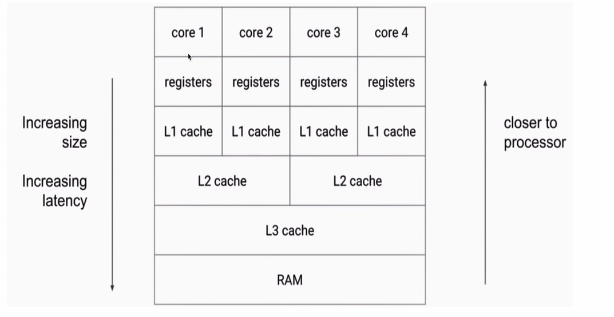

> 介绍 Jave 内存模型

# 相关概念

## Java 概念

### Java 虚拟机结构

Java 虚拟机的运行时区域有关

- 类加载器... 加载 class 文件
- 堆... 各种 `new` 对象
- 方法区.. 各种静态类, 变量, 字符串, 永久引用
- Java栈, 运行时每一个桢的变量, 栈计算, 引用地址等..
- 本地方法区.. 各种 `native` 方法
- 程序计数器. 保存线程执行的栈行信息
- 执行接口..
- 本地接口
- 本地库

### Java 对象模型

Java 对象在虚拟机中的表现形式有关..

- 栈.. 负责运行, 方法调用的具体执行单元.
- 堆.. 负责存储, 每一个  `new` 出的实例信息
- 方法区.. 加载后保存 `class` 文件

### Java 内存模型

`Java Memory Model`, 内存中 java 的使用, Java 并发编程有关, 一组规范, 各个虚拟机实现相应规范..

`volatile` , `synchronized` , `Lock` 等的原理等都是 JMM

包括内容: 重排序, 可见性, 原子性

## Java 内存模型

### 指令重排序

`Java` 中代码的执行顺序与实际执行的顺序不同, 好处可以减少程序处理速度..

#### 编译器优化

-  `JVM` 编译器, `JIT` 编译器
- CPU 指令重排
- ~~内存重排序~~, 由于线程内存和主内存的值不同步, 导致不同线程之间的线程内存的值不可见, 因此发生了重排序后, 程序执行错误...

### 内存可见性

线程之间, 彼此看不到线程变量..
主内存和工作内存之间彼此看不到变量...

#### volatile 关键字

`volatile` 修饰的变量, 在变量使用时, 要求必须将其他线程修改的变量值刷回主内存中. 禁止指令的重排序和保证了内存的可见性

#### 原理

多核 CPU 中, 不同的工作内核用到的高速缓存不同, 导致修改后的工作内存不会迅速写入到主内存中, 导致多个核心看到的内存数据不同..
所以由于多层缓存不一致问题, 导致了线程间共享变量的可见性问题....

#### 主内存和本地内存

主内存:  抽象对象, 代指 存放主要数据变量的内存...

本地内存: 抽象对象, 通指 线程寄存器 / CUP一级缓存 / CPU二级缓存 等...

#### 内存模型规范

1. 所有的变量都存储在主内存中, 同时每个线程也有自己独立的工作内存, 工作内存中的变量内容是主内存中的拷贝
2. 线程不能直接读写主内存中的变量, 而是只能操作自己工作内存中的变量, 然后再同步到主内存中
3. 主内存是多个线程共享的, 但线程间不共享工作内存, 如果线程间需要通信, 必须借助主内存中转来完成
4. 所有的共享变量存在于主内存中, 每个线程有自己的本地内存, 而且线程读写共享数据也是通过本地内存交换的, 所以才导致了可见性问题。

####  Hapens-Before 原则

- `happens-before` 规则是用来解决可见性问题

  在时间上, 动作A发生在动作B之前, B保证能看见A的所有动作, 这就是 `happens-before`

- 两个操作可以用 `happens-before`来确定它们的执行顺序

  如果一个操作 `happens-before` 于另一个操作, 那么我们说第一个操作对于第二个操作是可见的

#### 满足 Hapens-Before 的场景

1. 单线程原则, 一个线程内的所有变量可以看到相互可见

2. 锁操作, `synchronized` 关键字和 `Lock` 类中, 对加锁内的代码块执行, 后一个刚获得锁的线程中的变量可以看到前一个释放锁的线程变量的可见.

3. `volatile` 关键字修饰的变量, 在写入完成后, 每次读都会获得前一个写线程的所有操作(禁止重排序和内存可见)

4. 线程启动, 子线程执行的所有语句, 都可以看到父线程的所有操作

5. `Thread.join` 操作, 禁止排序, 并且 `join` 后面的语句可以看到 `join` 等待之前的语句执行结果

6. 传递性, 如果多个操作彼此遵循 Hapens-Before 原则, 那么整体也遵循

7. 中断, 如果一个线程被其他线程 `interrupt` 后, 那么检测 `isInterrupted` 或者 抛出异常一定会看到..

8. 构造方法, 对象构造方法的最后一行指令 `happens-before` 于 `finalize` 方法的第一行指令

9. 工具类场景要求:

   1. 线程安全的容器 `get` 一定要看到 `pet` 等存入的动作
   2. `CountDownLatch` 中, `latch.countDown()` 放行动作完成后, `latch.await()`  等待过程必须结束, 并看到 `latch.countDown()` 时的操作
   3. `Semaphore` 信号量, 获取许可之前, 必须要先释放..
   4. `CyclicBarrier` 循环计算器, 在放行之前必须获得统计数量
   5. `Future` , 在获取执行结果之前, 必须看到执行结果
   6. 线程池, 提交任务时, 必须看到提交之前的程序动作

### 操作原子性

一系列操作, 要么全部成功, 要么全部失败...

#### 原子操作

- 除了 `long` 和 `double` 以外的基本类型的 (`int`, `byte`, `boolean`, `short`, `char`, `float`) 赋值操作
  因为 `long` 和 `double` 需要64位, 在32位机器上操作时被视为两次写入(先写入高32位, 再写入低32位), 因此操作不是原子性..除非,对变量进行 `volatile` 关键字修饰 (商用虚拟机不会出现这类问题, 一般不考虑)
- 所有引用 `reference` 的赋值操作, 将一个对象赋值给另一个变量...
- `java.concurrent.Atomic.*` 包中所有类的原子类的操作, 利用了 `CAS` 实现

### volatile 关键字

- `volatile` 是一种同步机制, 比 `synchronized` 或者 `Lock` 相关类更轻量, 因为使用 `volatile` 并不会发生上下文切换等开销很大的行为..
- 如果一个变量别修饰成 `volatile`, 那么 `JVM` 就知道了这个变量可能会被并发修改
- 开销小, 相应的能力也小, 虽然说 `volatile` 是用来同步的保证线程安全的, 但是 `volatile` 做不到 `synchronized` 那样的原子保护，`volatile` 仅在很有限的场景下才能发挥作用

#### 适用场景

不适用场景

- `a++` 场景, `volatile` 仅能保证读取的原子性, 但是不能保证自加操作的原子性..

适用场景

- `boolean flag` 场景, 如果一个共享变量只有被赋值动作, 不会进行其他操作, 那么可以用 `volatile` 代替 `synchronized` 或者原子变量.
  因为赋值动作本身具有原子性, 而 `volatile` 又保证了可见性, 所以线程安全.
- `boolean condition` 作为触发器的条件, 比如 `while(条件)` 中的条件.
- 对 `long` 和 `double` 类型的赋值使其成为原子操作

#### 两点作用

- 可见性
  读取 `volatile` 变量之前, 需要先将当前 CPU 的本地内存失效, 从主内存读取最新的值;
  写入 `volatile` 变量之后, 需要立即将值写入到主内存中
  任何一个线程对其的做出的修改, 其他线程立即可见.. 保证了 `happens-before` 原则

- 禁止指令重排序

  只能作用于对象属性, 被 `volatile` 修饰的属性, 编译时对其不会进行重排序
  解决单例双重锁乱序的问题.

####　`volatile` 和 `synchronized` 的关系

`volatile` 在这方面可以看做是轻量版的 `synchronized` , 如果一个共享变量自始至终只被各个线程赋值, 而没有其他的操作, 那么就可以用 `volatile` 来代替`synchronized` 或者代替原子变量, 因为赋值自身是有原子性的, 而volatile又保证了可见性. 所以就足以保证线程安全...

`synchronized` 即保证了可见性, 又保证了原子性; 每一个线程处理完成后, 下一个线程对其所做的修改可见
`synchronized` 包裹的代码在执行完成之后, 后一个线程不仅能看到包裹中的代码执行结果, 连带 `synchronized` 包裹之前的代码都可以看到..

